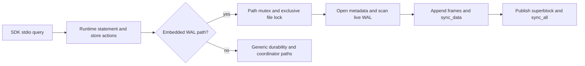

# RedDB × SurrealDB: competitive audit and implementation roadmap

Date: 2026-09-07. Query: investigate #2270 and learn from SurrealDB across
foundations/maturity, product/DX and multimodel capabilities, targeting
leadership across the entire comparable matrix.

Scope: executable diagnostic tools, release/current-source distinction,
semantic journeys, recovery experiments, official-source architecture audit
and ranked implementation proposals. This delivery establishes a baseline
and a program; it does not assert that RedDB has already overtaken SurrealDB.
No storage, isolation or transport rewrite was selected without an experiment.

## Executive summary

1. **The single-row application path has a real cost problem.** The final ten-run
   release pass, after the audit build ended, has a median of run means of
   **2.817 ms/write** on ext4, **1.376 ms** on tmpfs, versus **0.956 ms** for
   SQLite WAL/FULL on disk. Earlier compilation-overlapped runs were slower. SQLite
   WAL/NORMAL is a different durability class. The host was shared, so these
   are diagnostic observations, not a replacement for the issue author's
   measurements or an official performance verdict.
2. **Two independent surface defects explain why concurrency measurements
   were untrustworthy.** Released CLI `query --bind` opens a local ephemeral
   runtime instead of contacting the server. Published Bun wire queries
   without parameters request a summary-only result. The CLI routing fix passes on the freshly built audit base; these are not evidence that server
   writes disappear. Their exact failure shapes must remain distinct.
3. **SurrealDB offers mechanisms worth adopting:** a language test corpus
   that doubles as a performance corpus, operator-level query metrics,
   index analysis, native SDK engines with explicit backends, and composable
   queries/live subscriptions. This is stronger evidence than feature counts.
   Its documentation also explicitly limits LIVE SELECT to single-node and
   labels SurrealKV beta; distributed/product maturity cannot be inferred
   from a README or cloud marketing.
4. **RedDB has assets to build on:** seven of eight small published SQL
   quickstarts match expected answers on the released SDK; the spatial
   search returns plausible distances but omits the names its example
   promises. Current RedDB also has a documented seeded storage-fault lane,
   explicit transaction/fault ADRs and multiple common API surfaces. These
   are starting points, not universal ACID or performance proofs.
5. **Logical backup fidelity is a concrete RedDB gap.** The release preserves
   200 acknowledged writes across process SIGKILL, but its dump emits SQL-display
   quotes inside JSON strings (`k194` becomes `'k194'`). Restore retains 200 rows
   while changing keys and values. Current source still wraps `v.to_string()`
   in a JSON string in the dump loop. SurrealDB 3.2.4 passed both the process-kill
   readback and export/import into a fresh store for the same 200-key fixture.
   This does not establish schema/auth fidelity or power-loss durability.
6. **Policy is now explicit.** [ADR 0076](../adr/0076-competitive-leadership-evidence-gate.md)
   supersedes ADR 0009. Every comparable cell stays visible. A performance
   lead needs a preselected metric, equivalent guarantees, a 20% margin and
   a qualifying run-level 95% confidence interval on a reserved host.

## Evidence and version ledger

| Artifact | Pin / boundary | Evidence class |
|---|---|---|
| RedDB release | v1.23.2; commit `3ee5e83e72dd9abc678a9bfe872b5e534b4a33b9`; official Linux static asset, verified accompanying SHA256 | Executed |
| RedDB audit base | `85153296d8beba3bfa5ded2dfa719f416f50393d`; Cargo still says 1.23.2 | Source and separately identified current-build probes |
| Published JS packages | `@reddb-io/sdk` and `@reddb-io/client-bun` 1.23.2 | Executed in Bun 1.4.1 |
| SurrealDB server | 3.2.4, `93ab219d69f09d8f999851b0359c80ebe6726102`, RocksDB | Executed HTTP/WebSocket; pinned source |
| SurrealDB native JS | `surrealdb` 2.0.8 + `@surrealdb/node` 3.0.3; addon reports **engine 3.0.2** | Executed; not the 3.2.4 server |
| Surreal official docs | `06f4d79e420c204777eafa4c9b68464d2497818f` | Documentation snapshot, not runtime certification |
| Benchmark base | `reddb-io/reddb-benchmark`, `834c935dc938613d4def6db28943579fa0ebcc6a` | Direct Bun tooling added separately |
| Host | i7-1065G7, 8 logical CPUs, 15 GiB RAM, NVMe ext4, Linux 7.0.0-28-generic | Shared diagnostic host; other work and builds occurred |

The checked-in [evidence bundle](evidence/2026-09-07/README.md) contains raw
run samples, failure records, pins, selected probe outputs and reproduction
commands. The runner records per-call latency, per-run throughput, client
CPU/RSS, cold open, complete values, reopen and directory size. Client RSS
excludes RedDB's subprocess; comparing it to Surreal's native RSS would be
misleading. Memory/tmpfs is not persistent storage with equivalent guarantees.

## #2270: reproduction, findings and hypotheses

The issue asks about ~1 ms without disk, ~2.5 ms on disk, the 20× bulk
advantage and whether concurrent writers amortize commit cost. We reproduced
the qualitative slow sequential SDK path and the CLI's missing readback,
with valid key/value readback in the corrected embedded harness.

### What the original snippet proves

`db.query()` returns `{ affected, columns, rows, statement }`. Its `.length`
is undefined; use `.rows.length`, then compare every key and payload. This
is a defect in the published snippet, not grounds to dismiss the author's
separately reported checks. The new harness detects missing, duplicate and
corrupt values and closes/reopens persistent stores before marking a run valid.

### Final release recheck after the audit build ended

The same 200-row fixture was repeated sequentially with ten measured runs and
one warmup per engine/filesystem, with exact artifact checksums and runner
source hashes. Primary metric remains latency. The host is still not reserved.

| Released application path | ext4 median µs/row | tmpfs median µs/row |
|---|---:|---:|
| RedDB SDK → verified v1.23.2 static asset | 2,816.69 | 1,375.55 |
| SQLite Bun in-process WAL/FULL | 956.45 | 16.50 |

The descriptive disk ratio is 2.94, run-bootstrap 95% interval [2.80, 3.39].
Tmpfs is a diagnostic filesystem, not a power-loss durability comparison.
These values are consistent with the issue's concern and show that the earlier
5.9 ms figure included substantial host/run variation. None is an official
lead/loss ratio under certified equivalent isolation and execution boundaries.

### Initial diagnostic baseline (compilation-overlapped)

200 unique primary keys, JSON payload containing 400 text bytes, one awaited
bound INSERT per key, one fresh-database warmup and ten fresh measured runs.
Primary metric: latency (median of the ten run-level mean µs/row values).

| Path | Median µs/row | Interpretation |
|---|---:|---|
| RedDB SDK subprocess, ext4 | 5,933.20 | Real application boundary; default durability |
| RedDB SDK subprocess, tmpfs | 3,492.75 | Removes physical disk effects, not syscalls, scheduling or storage code |
| SQLite Bun in-process, WAL/FULL, ext4 | 1,699.24 | More relevant sync class than NORMAL, but execution/isolation still differ |
| SQLite Bun in-process, WAL/NORMAL, ext4 | 38.34 | Weaker power-loss durability; separate class |

The descriptive RedDB/SQLite FULL latency ratio is **3.49**, bootstrap 95%
interval **[2.87, 3.90]**. This does not certify causality or an official loss
ratio under equivalent guarantees. Per-operation samples are correlated;
the bootstrap resamples independent runs. See `analyze.py` and raw artifacts.

Subtracting tmpfs from ext4 suggests a storage contribution, but the residual
cannot be labeled IPC overhead. tmpfs still executes WAL/pager work and
synchronization calls. Separate binaries, compilation load and instrumentation
also change timing. The expanded suite and native reference preserve these
boundaries instead of mixing them into one score.

### Expanded direct-SDK cells

A second diagnostic pass kept 200 rows, one warmup and ten measured runs.
Values are medians of run-level means; the absolute shift from the initial
pass is host/run variation, not an engine fix. All RedDB/SQLite rows below
passed complete readback and reopen.

| Scenario | RedDB SDK µs/row | SQLite WAL/FULL µs/row | Boundary caveat |
|---|---:|---:|---|
| Awaited sequential insert | 4,727.28 | 1,356.41 | Default durability/isolation and IPC still differ |
| Bulk 200 rows | 139.98 | 12.27 | One bulk call vs SQLite transaction; atomic equivalence not certified |
| Indexed point read | 1,160.41 | 10.24 | Per-call latency excludes assertion; elapsed throughput includes validation |
| Seeded random update | 5,368.25 | 1,569.20 | Changed values verified after reopen |

The same RedDB SDK's bulk per-row result is much lower than its awaited
single-row result, reproducing the issue's workload-shape concern. It is
not a solution for an application that must durably admit each event before
continuing. Native SurrealDB 3.0.2 (RocksDB and SurrealKV) completed initial
writes/readback but repeatedly stalled at same-process reopen; those cells
are invalid. One separate 20-row SurrealKV run passed. This bounds the
observation to the pinned SDK/addon/Bun setup; it does not diagnose a general
SurrealDB storage defect or measure server 3.2.4's performance. A minimized
200-row SurrealKV lifecycle probe reproduces the boundary without the benchmark
framework: Node exits 13 while awaiting reopen; Bun times out at reopen after
25 seconds. Both had completed full readback and returned from close first.
The retained stage records narrow the investigation to the pinned native
SDK/addon lifecycle; the standalone server's recovery fixture passes.

### Surface results

| Case | Executed release result | Current-source interpretation / proving check |
|---|---|---|
| `red query ... --bind HOST` | CREATE/INSERT report success; next CLI SELECT says not found; HTTP sees no table; strace records no connection to requested server | Release routes to `open_local_runtime`. Commit `9f36ed90d` introduces `run_data_command`/`data_connection_uri`. Fresh build now passes CREATE/INSERT/SELECT and HTTP sees the same row; CLI affected/statement summary metadata still differs |
| Bun wire plain SELECT | Summary `{ok:true, affected:0, statement:"select"}` without rows | `drivers/bun/index.ts` selects `MSG_QUERY` without params; server defines that frame as summary-only. HTTP and bound SELECT see the written row |
| Bun wire bound SELECT | Full envelope contains correct row | This is envelope/API inconsistency, not a reproduction of the author's exact Bun `not found` |
| SQL double-quoted identifiers | Parse error: string token where identifier expected | Quotes/reserved-word contract blocks common generated SQL; compatibility proposal P2 |
| `CREATE TABLE data` | DATA reserved token rejected; quoting also fails | Same escaping problem, not a reason to remove every reserved word |
| Public SDK `db.tx()` helper write | Own write visible; rollback removes it | Do not generalize comments about raw stdio `tx.begin` to the public SQL transaction helper |
| Spatial quickstart | Two nearest IDs at ~1.157 and ~3.413 km; no `name` fields | Example promises Louvre and Sacre-Coeur names. Retrieval/projection/documentation contract needs reconciliation |
| Released `red ui` | Attempts bundle `v0.0.0-dev`, receives 404 | Distribution pin problem; local embed-host override starts but gets an `Illegal invocation` fetch error loading collections |
| Dump/restore fidelity | Process-kill recovery preserves all values; dump adds SQL-display quotes to JSON strings; restored table has 200 rows with wrong keys/values | Current `src/bin/red.rs` dump loop serializes every named value with `Value::String(v.to_string())`; P4 starts with lossless typed serialization and failure exit status |
| Surreal Studio | Navigates to official login page | No authenticated editor operation; no comparative UI-completion score assigned |

Fresh current-build probes reproduce the unbound wire summary, quote failures,
SDK rollback success and spatial output mismatch. The CLI routing failure is
absent on that build, so it needs release verification rather than another
routing rewrite. `surface-main.json` retains exact outputs, including the
CLI's remaining affected/statement metadata discrepancy.

The local Red UI override is a development embed host, not an audited released
UI. The table does not attribute that local fetch defect to every Red UI build.

### Falsifiable performance hypotheses and next discriminating tests

| Rank | Hypothesis / prediction | Evidence so far | Decision gate |
|---|---|---|---|
| H1 | Durable commit/pager work contributes materially: same payload is faster on tmpfs, bulk reduces per-row work | Observed ext4/tmpfs gap; initial trace sees many sync calls | Isolate INSERT-window sync counts and WAL bytes, then compare durable native path; retain ACK-after-durability invariant |
| H2 | The per-statement runtime path, beyond framing, sets a floor: constant SQL costs more than a version RPC | Instrumented stdio phase comparison supports this; trace perturbs scheduling | Repeat without tracing; native bound INSERT vs SDK, same build/profile/data |
| H3 | JS subprocess transport is material: native invocation should remove a large part of the residual | SDK definitely launches a child; no causal percentage assigned | Prototype only if native/IPC experiment shows a material difference; include open/RSS/error lifecycle |
| H4 | Commit contention dominates concurrency: throughput plateaus while lock/wait queues grow | Existing group coordinator is source evidence, not proof this application path reaches an efficient grouping point | 1/2/4/8/16 real connections, complete readback, sync/batch counters and same guarantees |
| H5 | Build/target settings materially affect this workload: a controlled same-revision A/B changes latency | The optional `release-static` profile uses `z`, but the **tagged release workflow invokes `--release`**, not that profile. Size optimization is therefore not established as a release bottleneck | A/B the **same revision and target** before any profile change. Current main native-target vs old static release confounds code/target and cannot prove a cause |

The initial child-only strace summary counted 321 fdatasync and 319 fsync calls
across startup, DDL, all phases and shutdown. Futex represented ~94% of traced
syscall time, including idle waits across threads; it is **not** proof that
locks consume 94% of INSERT latency. Do not divide lifetime counts by 200 and
call that fsyncs per insert. Phase-window tooling exists for the next check.

### Concurrent writers: verified HTTP sweep

Both binaries ran on fresh owned stores and servers per repetition, with one
persistent HTTP connection per OS writer, 200 total writes, one warmup plus ten
measured runs at each writer count. RedDB's final repetition ran after the audit
build ended. Throughput was selected before measuring.

| Writers | RedDB v1.23.2 median rows/s | SurrealDB 3.2.4 RocksDB median rows/s |
|---:|---:|---:|
| 1 | 259.78 | 308.44 |
| 2 | 335.15 | 677.39 |
| 4 | 501.07 | 863.08 |
| 8 | 506.92 | 553.27 |
| 16 | 488.53 | 310.73 |

Every retained run passed complete readback. In this bounded HTTP workload,
a second RedDB writer improves throughput by about 29%; 8 writers improve it
by about 95% over one. This answers the issue's concurrency question for this
specific surface and dataset, not for all embedded workloads. The native
current-build sweep also passes 1/2/4/8/16 writers but shows modest, nonmonotonic
scaling; the append mechanism below explains why group-commit amortization
cannot be assumed from the presence of a coordinator module.

These curves are **inconclusive for official leadership**: RedDB uses local
no-auth, Surreal uses a root bearer token, default guarantees are not fully
normalized, the host was shared and 200 operations make high-concurrency
results short. Surreal is ahead in the 2/4-writer observations; RedDB is ahead
at 16 in this fixture. Do not promote the favorable cell or omit the others.

Two earlier attempts are preserved but excluded from these curves: accumulating
unique tables confounded database size with writer count; repeated Surreal
Basic authentication confounded password verification with query cost. A
constant query cost ~72.87 ms with Basic per request, and ~1.17 ms with a bearer
token obtained before timing. The final Surreal sweep uses token reuse.

### Located commit mechanism and current-build native reference

The stronger finding is in the **embedded file append path**, not merely in
IPC. `UnifiedStore::finish_paged_write` selects
`append_embedded_store_wal_actions` when `embedded_wal_path` is present,
before the generic durability-mode/coordinator branch. The deferred transaction
commit path also routes embedded actions to this function. It calls
`EmbeddedRdbArtifact::append_wal_payloads` directly.

The inspected file implementation opens a writable handle, reads metadata,
scans and decodes the live WAL to recover sequence/CRC state, appends frames,
`sync_data`s, writes the alternate superblock and `sync_all`s, unlocks and
reopens metadata. The scan allocates payload vectors for already-written
frames. Its work grows with live WAL bytes between checkpoints. Additional single-run
1,000/3,000-row native disk fixtures pass readback/reopen and average 2,365.95 /
4,026.69 µs per row, respectively. They support further scaling investigation;
one run at each size cannot isolate WAL scan cost from checkpoint/materialization. This explains
why the existence of `storage/wal/group_commit.rs` alone does not establish
amortization for this embedded store path.

The phase-bounded trace of **200 current-build INSERTs** counts **202
fdatasync + 201 fsync** starts; constant-query and version phases have zero.
The trace opens/syncs the `.rdb` file and shows repeated live-WAL reads. Counts
include engine background work during the phase and instrumentation overhead;
the near-two-sync pattern is corroborated by the source, not blindly inferred
from the lifetime syscall summary. No claim assigns every microsecond to it.

Same source base, optimized `release` profile, fresh persistent stores, ten
measured runs after one warmup (no audit build running during this pass):

| Current-build path, one writer | ext4 µs/row | tmpfs µs/row |
|---|---:|---:|
| Rust in-process native reference | 1,857.95 | 394.60 |
| Published SDK invoking that same built engine | 2,051.15 | 578.82 |

The tmpfs gap is about 184 µs between boundaries, but a native loop and the
full SDK include more differences than framing alone. The native residual
still matters: a native JS binding would not remove file/WAL work. An
uninstrumented low-level stdio pass measures means of 32.54 µs for version,
91.36 µs for constant SQL and 617.88 µs for INSERT. These are single diagnostic
phase means, not independent-run confidence intervals.

The next optimization experiment should retain the same file format and
acknowledged durability while testing (a) validated append-tail state instead
of rescanning the live WAL on every call and (b) grouping durable publication
for concurrent commits. Validate external-writer ownership, generation changes,
CRC continuity, circular wrap, checkpoint rotation and crash recovery before
retaining cached state. A second fsync cannot simply be removed: it publishes
the recovery boundary after frame durability.

Current-build recovery reproduces the dump/restore value mismatch too. It
also reports one restore error (`system schema is read-only`) while exiting
zero when a whole-store dump includes internal collections. This is a separate
CLI failure-status contract to fix, not an engine recovery failure.

## Full comparison matrix

Legend: **E** = executed fixture; **S** = inspected source/test; **D** = official
documentation; **U** = comparative experiment outstanding. A source capability
is not proof of production maturity. Priority IDs refer to the proposals below.
The [machine-readable matrix](evidence/2026-09-07/matrix.json) assigns stable
cell IDs and decision states. No row currently qualifies as an official
demonstrated performance lead.

### Foundations and operational maturity

| Cell | RedDB evidence | SurrealDB evidence | Learning / acceptance experiment | Priority |
|---|---|---|---|---|
| Sequential durable writes | E: SDK ext4/tmpfs/FULL comparison above | E: native small persistent fixture; remote server available; larger native reopen cells can time out | Same ACK durability, 10 runs at 200/50k/1m keys, native/SDK/remote separately, p99 and resource tree | P0/P1 |
| Batch and concurrent commit | S: WAL group coordinator; bulk API; executable writer sweep | S: RocksDB sync Every and group policy; native bulk API | Atomic batch semantics, 1/2/4/8/16 connections, syncs/commit and conflict rate | P1 |
| Isolation and anomalies | E: SDK own-write/rollback; D: table-row-first history MVCC, partial predicate SSI | E: cancelled transaction leaves no row; S: transactional storage abstraction | Lost update, write skew, phantom, rollback/savepoint and conflict-history checker per model/backend | P3 |
| WAL/crash/corruption | S/D: ADR 0074, seeded torn/lost/misdirected/bitrot fault lane | S/D: backend-dependent persistence and sync policy | Process kill smoke plus acknowledged-commit oracle under seeded power-cut/fault schedule; retain minimized counterexamples | P3 |
| Backup/restore/PITR | E: process-kill passes; logical restore changes string values | E: process-kill and logical restore pass for 200 keys; D: export is not implicit PITR | Fresh-machine restoration, schema/index/auth fidelity, RPO=0 for acknowledged durable writes, measured RTO by size | P4 |
| Planning and execution | S: RedDB EXPLAIN and ADR 0071 prohibits committing analysis | E: indexed EXPLAIN; S: batch-stream execution and metrics | EXPLAIN ANALYZE per-operator rows/time/memory, estimate accuracy, scan→index/compound/range/OR decisions; zero write side effects | P5 |
| Index lifecycle | D/S: index kinds, current-index MVCC recheck; historical index limitation | S/D: compound/range analysis, concurrent indexes, HNSW/BM25 | Build concurrent with writes; cancellation/restart/recovery; stale index and schema-change correctness before speed | P5/P7 |
| Resource boundedness | S: STYLE resource-cost requirement, server surfaces | S: stream/batch executor; metrics opt-in | Cardinality × value width × concurrency memory model; cancellation/backpressure; OOM and slow-reader tests | P5 |
| CI/upgrade assurance | S/D: grouped tests and DST nightly | S: language corpus, storage/SDK/upgrade lanes; PR quick benchmark vs nightly baseline | Real packaged SDK golden corpus + old-store upgrade/downgrade policy + reproducible fault artifacts | P0/P3 |
| Replication/distribution | D: sharding foundations; docs deny production automatic placement and distributed transactions | D: deployment/backend distinctions; LIVE SELECT currently single-node | Partition/leader failover/replica lag tests, ACK provenance, fencing, routing and tenant isolation; edition/backend declared | P9 |
| Observability/operator journeys | D: doctor, inspect, diagnostics | S/D: query metrics and backup runbook | Operator can diagnose slow query, blocked writer, disk-full and restore without reading engine source | P4/P5 |

### Product, developer experience and language

| Cell | RedDB evidence | SurrealDB evidence | Learning / acceptance experiment | Priority |
|---|---|---|---|---|
| Install→first durable write→reopen | E: embedded succeeds; released remote CLI misroutes | E: server HTTP and native small reopen succeed | Automated clean-machine journeys on Linux/macOS/Windows with exact packaged bits and file checksum | P2/P6 |
| SDK return contracts | E: SDK `.rows`; wire summary-vs-full mismatch | E: structured JS query results and native engine selection | Same typed result and error code for empty/nonempty/bound/unbound query over every advertised transport | P2 |
| Embedded architecture | E: JS child/stdio boundary | E: native Node engine addon; actual embedded version differs from server | Measure native binding prototype only after native/stdio floor evidence; lifecycle/threading/cancellation/version support included | P1/P6 |
| Generated SQL and identifiers | E: double quotes and reserved `data` fail | D: SurrealQL is its own language; PostgreSQL syntax parity not assumed | Explicit supported dialect; quoting/escaping/params and ORM contract fixtures; avoid marketing SQL compatibility beyond tested scope | P2 |
| Schema, migrations, types/errors | S/D: typed schemas and multiple adapters | D/S: schemafull/schema-less, record IDs and functions | Versioned migration workflow with rollback, detailed spans, lossless decimal/time/bytes/int64 codec matrix | P2/P6 |
| Docs correctness | E: seven quickstart answers pass, spatial projection diverges; stale perf claims | D/S: rich reference and executable language corpus; README/workflow quick-run discrepancy exists | Generate or execute every promised output against each release; broken-link/API/version checks | P6 |
| UI completion | E: released asset 404; local host collection error | E: Studio login only; authenticated workspace U | Timed install/connect/schema/query/explain/export/error recovery with local mode and no source patching | P6 |
| Auth, tenancy and RLS UX | D/S: documented constraints and surface parity matrix; no adversarial run here | D/S: namespaces/databases, record access/permissions | Unprivileged two-tenant workload across SQL/graph/vector/live/export; denied records never leak through count/rank/timing/result | P3/P8 |
| APIs/functions/events | S/D: RedDB HTTP/MCP/driver surfaces | D: DEFINE API middleware/permissions; E: live single-node delivery | Equivalent application endpoint with auth, validation, cancellation and event after commit; steps/LOC and failure recovery measured | P8 |
| Language/runtime/platform coverage | S: advertised public-surface matrix has gaps; old Bun runner delegates Rust | E: Bun with JS SDK/native addon; other SDKs U | Each supported runtime executes its own client; capability/version matrix generated from conformance tests | P0/P6 |

### Multimodel capability and composition

| Cell | RedDB evidence | SurrealDB evidence | Learning / acceptance experiment | Priority |
|---|---|---|---|---|
| Relational/filter/aggregate | E: quickstart grouped results | E: filtered documents; S: index executor | Equivalent schema, null/numeric semantics, aggregate/join results, indexed and scan plans at scale | P5/P7 |
| Documents/nesting | E: document quickstart expected record | E: create/filter fixture | Nested projection, partial update, type coercion, indexes and atomic concurrent changes | P7 |
| Graph paths/traversals | E: shortest-path quickstart weight/hops | E: graph edge composition returns Bob | Same directed weighted graph, cycles/depth bounds, permission filters, path semantics and degree distribution | P7 |
| Vector exact/ANN/hybrid | E: vector quickstart ordering; no recall evaluation | E: exact distance; D: HNSW/BM25 | Recall@k at fixed ground truth, filtered/tenant top-k, hybrid quality, insertion/deletion/rebuild, latency at equal recall | P7/P3 |
| Spatial | E: H3 radius/KNN IDs and distances; docs result shape mismatch | D: geometry capability; comparable geo fixture U | Coordinate ordering, units, antimeridian/poles/boundaries, result hydration and selectivity; correctness before index timing | P2/P7 |
| Key/value, TTL and types | E: bool/int quickstart values | D: records/functions can model KV; dedicated Redis-equivalent semantics not assumed | Atomic compare/update, expiration/restart clocks, type fidelity; identify any application emulation explicitly | P7 |
| Time series/windows | E: buckets return 15/2 and 30/1 | D: time-series positioning; matching window/retention fixture U | Out-of-order ingest, window edges, late data, retention/rollup recovery; storage growth and query cost | P7 |
| Queues and delivery | E: first job quickstart | U: no certified equivalent durable queue contract | Reserve/ACK/NACK/visibility timeout/dead-letter and duplicate delivery under crash; unsupported is a capability gap, not infinite performance win | P7/P8 |
| Cross-model transaction | D: RedDB table-row-first caveats; tiny journeys are independent | E: graph+document query; full graph/vector txn failure matrix U | One transaction changes document, edge and vector: old/new snapshots, rollback, index visibility, crash and tenant boundaries | P3/P7 |
| Composed application journey | U: graph→vector→document→live under RLS not certified | E: individual composition/live primitives; complete journey U | Same recommendation/retrieval app, equal relevance, no extra database, end-to-end latency/steps/application code | P7/P8 |

Unsupported features remain recorded. Equivalent behavior implemented in an
application is a separate cell with its extra code/operations cost. A queue,
Redis-compatible API or distributed live stream must not be assumed just
because a general-purpose language can imitate part of the behavior.

## Ranked proposals and execution order

Effort labels are relative engineering scope, not delivery-date promises:
S = contained client/tooling change; M = cross-module feature; L = storage or
query program; XL = distributed system program. Every proposal needs a
resource-cost sketch before a data-plane implementation (STYLE.md).

| ID | Concrete deliverable and learned mechanism | Expected benefit / proving criterion | Cost, risk, ADR implications |
|---|---|---|---|
| P0 | Direct SDK baseline and release conformance corpus; promote stable cases into CI, using Surreal's language-corpus pattern | No Rust-delegating runner labeled as Bun evidence; every public claim traces to pins/raw results; failures cannot become fast runs | S/M; harness complexity and flaky host risk; ADR 0076 governs promotion |
| P1 | Deepen embedded append: validate reusable tail state to avoid full live-WAL scan per append; evaluate grouped frame/superblock publication; native-vs-SDK reference and syscall windows prove the boundary | First reach SQLite FULL and Surreal equivalence; final primary latency ratio upper CI <=0.80 or throughput lower CI >=1.20 in every selected cell | M→L; no promised speedup before profile; WAL ACK ordering, MVCC and file format constrained by ADRs 0065/0074 |
| P2 | Repair packaged CLI/SDK query contract, quote handling and spatial result/document mismatch; add end-to-end release fixtures | CREATE→INSERT→SELECT→restart works on each claimed surface; bound and unbound query return same records; SQL generator escaping test passes | S/M; frame compatibility and dialect breaking changes need explicit migration; ADRs 0010/0015/0019 |
| P3 | Executable guarantee matrix for transactions, RLS and failure recovery across models | Zero acknowledged durable write loss in defined fault model; no anomaly outside stated isolation; no unauthorized vector/graph/live leakage | L; strongest correctness prerequisite; reconcile docs against actual resolver adoption; ADRs 0065/0074 |
| P4 | Fix lossless dump/restore and error exit status; operator recovery drill with verifiable backup contents and measured RPO/RTO | Fresh store restores rows, schema, indexes, tenants and permissions; documented recovery objective met at each dataset size | M/L; dump format/version compatibility; do not imply logical export alone provides PITR |
| P5 | Operator metrics and selective index/planner deepening informed by Surreal's executor | Explain shows actual scan/filter/index work without mutation; benchmark compound/range/OR/aggregate cases; bound memory and cancellation | M/L; planner equivalence and EXPLAIN effects, ADR 0071; streaming batches do not require immediate Arrow rewrite |
| P6 | Executable onboarding/docs/UI release contract and generated capability matrix | All eight quickstarts and install/connect/explore/export journeys pass on packaged artifacts; supported runtime/platform versions explicit | M; UI bundle pin and SDK packaging coordination; preserve public APIs or provide migration guide |
| P7 | Versioned multimodel differential corpus plus one composed retrieval application | Same ground-truth answers and recall across relational/doc/graph/vector/spatial/KV/time series/queue; 20% threshold only at equal quality/guarantees | L; model semantics and cross-model history consistency; evolve resolver/index contract before advertising blanket ACID |
| P8 | Event/API composition proposal: transactional events, live reconnect and permission enforcement | Composed app delivers committed changes, handles disconnect/replay/backpressure, and leaks no denied data; compare application code/steps | M/L; delivery guarantees, durable cursor retention, per-subscriber memory; existing wire adapter policy remains authoritative |
| P9 | Distribution design validated by fault histories and explicit backend/edition capability ledger | Demonstrate failover, fencing, bounded staleness, placement and tenant invariants before claiming distributed parity/lead | XL; largest compatibility/operational cost; requires dedicated ADR/Spec, not an incidental WAL refactor |

Sequence: P0, reproducible P2 defects and P4 backup fidelity first; P1 measurements determine the
first engine optimization. P3 supplies the correctness gate for P1/P5/P7.
P4/P6 are independent product completeness work. P7's composed journey feeds
P8 requirements. P9 stays visible and needs a separate design and fault model;
its cost does not remove it from the leadership objective. Revisit priorities
using measured user impact and experiment results, not feature count.

### Architecture choices deliberately left conditional

- **Native JS binding:** only after same-build native/stdio measurements show
  transport dominates enough to justify ABI, allocator, cancellation, packaging
  and lifecycle complexity. Prototype one bounded insert/query/close surface;
  do not replace every SDK at once.
- **WAL sharding or a new storage backend:** requires a demonstrated log/lock
  bottleneck plus migration/recovery design. Reduced fsync frequency alone is
  not an improvement if it weakens acknowledged durability.
- **Columnar execution:** learn streaming operator boundaries and metrics first.
  Surreal's pinned executor represents batches; its Arrow variant is a future
  example in source comments, not proof it already uses Arrow throughout.
- **Uniform multimodel MVCC:** expand actual read/write resolver coverage with
  anomaly and crash histories; documentation cleanup cannot manufacture the
  guarantee. Historical indexes are a separate performance optimization.

## Official sources and hotlinks

- [Issue #2270](https://github.com/reddb-io/reddb/issues/2270) — primary workload and report; remains open, not “fixed” by this audit.
- [RedDB released CLI](https://github.com/reddb-io/reddb/blob/3ee5e83e72dd9abc678a9bfe872b5e534b4a33b9/src/bin/red.rs) — ephemeral local routing in the released query branch.
- [Tagged release workflow](https://github.com/reddb-io/reddb/blob/3ee5e83e72dd9abc678a9bfe872b5e534b4a33b9/.github/workflows/release.yml) — uses `cargo build --release`; an optional Cargo profile name does not establish how the published binary was built.
- [Current CLI source](https://github.com/reddb-io/reddb/blob/85153296d8beba3bfa5ded2dfa719f416f50393d/src/bin/red.rs) — `run_data_command` and endpoint resolution.
- [Current Bun wire driver](https://github.com/reddb-io/reddb/blob/85153296d8beba3bfa5ded2dfa719f416f50393d/drivers/bun/index.ts) — message selection; reproduce with the published package.
- [Embedded store dispatch](https://github.com/reddb-io/reddb/blob/85153296d8beba3bfa5ded2dfa719f416f50393d/crates/reddb-server/src/storage/unified/store/commit.rs), [file append/scan](https://github.com/reddb-io/reddb/blob/85153296d8beba3bfa5ded2dfa719f416f50393d/crates/reddb-file/src/embedded.rs) — direct embedded path, live-WAL scan, locking and two-stage durable publication.
- [RedDB limitations](../../docs/reference/limitations.md), [storage fault lane](../../docs/testing/dst-storage-fault-lane.md), [transaction ADR](../adr/0065-transaction-manager-v2-rewrite.md), [fault model ADR](../adr/0074-storage-fault-model.md) — declared guarantees and test machinery. The limitations page's “v0.1 Beta” heading is stale; read its specific current caveats, then verify code.
- [Surreal executor](https://github.com/surrealdb/surrealdb/blob/93ab219d69f09d8f999851b0359c80ebe6726102/surrealdb/core/src/exec/mod.rs), [metrics](https://github.com/surrealdb/surrealdb/blob/93ab219d69f09d8f999851b0359c80ebe6726102/surrealdb/core/src/exec/metrics.rs), [index analysis](https://github.com/surrealdb/surrealdb/blob/93ab219d69f09d8f999851b0359c80ebe6726102/surrealdb/core/src/exec/index/analysis.rs) — implementation mechanisms to study.
- [RocksDB config](https://github.com/surrealdb/surrealdb/blob/93ab219d69f09d8f999851b0359c80ebe6726102/surrealdb/core/src/kvs/rocksdb/cnf.rs) — default sync Every in server 3.2.4; not automatic evidence of the native 3.0.2 addon's effective policy.
- [Language tests](https://github.com/surrealdb/surrealdb/blob/93ab219d69f09d8f999851b0359c80ebe6726102/language-tests/README.md), [actual PR benchmark workflow](https://github.com/surrealdb/surrealdb/blob/93ab219d69f09d8f999851b0359c80ebe6726102/.github/workflows/language-bench-quick.yml), [CI](https://github.com/surrealdb/surrealdb/blob/93ab219d69f09d8f999851b0359c80ebe6726102/.github/workflows/ci.yml) — query corpus, profiler and release-validation pattern. Workflow uses `--quick`; README wording is not authoritative for its current timing profile.
- [LIVE SELECT limits](https://github.com/surrealdb/docs.surrealdb.com/blob/06f4d79e420c204777eafa4c9b68464d2497818f/src/content/reference/query-language/statements/live-select.mdx), [DEFINE API](https://github.com/surrealdb/docs.surrealdb.com/blob/06f4d79e420c204777eafa4c9b68464d2497818f/src/content/reference/query-language/statements/define/api.mdx) — documented scope and middleware/permissions.
- [Storage engine choices](https://github.com/surrealdb/docs.surrealdb.com/blob/06f4d79e420c204777eafa4c9b68464d2497818f/src/content/build/embedding/storage-engines.mdx), [backup/recovery](https://github.com/surrealdb/docs.surrealdb.com/blob/06f4d79e420c204777eafa4c9b68464d2497818f/src/content/manage/self-hosted/backups-and-recovery.mdx) — backend tradeoffs, SurrealKV beta, export/import and PITR caveat.
- [SQLite synchronous pragma](https://www.sqlite.org/pragma.html#pragma_synchronous) — WAL/FULL syncs each commit; NORMAL omits most transaction syncs and can lose recent commits on power loss.

## Open questions and completion boundary

The full performance matrix, authenticated UI journeys, scale/ANN recall,
adversarial isolation/security, power-loss campaign, schema/auth backup
fidelity and distributed fault histories still require the proposed experiments.
Timeouts and unmeasured cells are retained in the evidence ledger. There is no
claim of complete competitor leadership, a claim that the located embedded append mechanism explains all
latency, or a repaired database engine in this delivery. The concrete outcome
is the accepted policy, runnable experiments, observed gaps and reviewable
engineering program that can establish those claims honestly.
