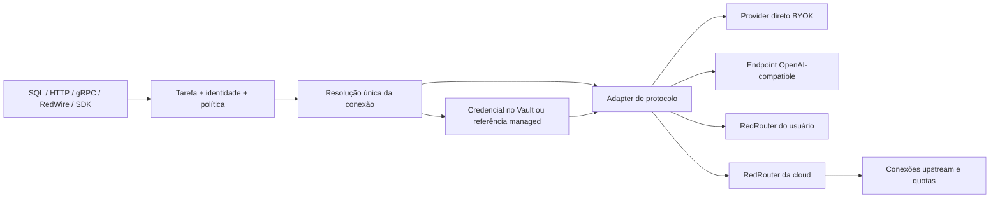

# RedDB AI providers, BYOK e integração com RedRouter

Date: 2026-10-04
Query: avaliar toda a integração de AI do RedDB; estudar reddb-io/red-router; definir providers para inferência, embeddings e decisões; aceitar BYOK direto, OpenAI-compatible e RedRouter próprio; oferecer credencial da plataforma somente na cloud quando não houver configuração do usuário; iniciar o open source sem credenciais.
Scope: investigação do código, documentação, ADRs, contratos e testes relevantes dos dois projetos, pesquisa em documentação oficial e provas locais isoladas. Este relatório propõe implementação; não implementa providers, provisionamento, cobrança ou mudanças de segurança.

## Executive Summary

O modelo de produto descrito pelo mantenedor é viável. A implementação deve preservar três escolhas independentes: **quem fornece a AI, qual tarefa será executada e de quem é a credencial**. RedRouter pode atender chat, embeddings e decisões, mas cada operação tem um contrato próprio. O RedDB deve aceitar acesso direto e acesso via router pela mesma resolução de configuração, sem tornar o router obrigatório.

A base existente é útil: providers conhecidos, adapters OpenAI-compatible e Anthropic, task pointers de inferência/embeddings, Vault e aliases, transporte com retries, ASK com planejamento, RLS e validação, além de políticas declarativas de coleção. Porém, a resolução está espalhada e apresenta inconsistências concretas. Acrescentar apenas uma variante `RedRouter` ao enum não completa a integração. [D1–D8]

Antes da cloud compartilhada, os pontos prioritários são: resolução única de destino e credencial; identidade e autorização por tenant; ligação dos caminhos remotos de enriquecimento; integração nativa de decisões; consistência da matriz de capacidades; contabilidade por tarefa. No router, a seleção de credenciais de embeddings precisa receber o escopo de conexões autorizado pela chave. [D1, D3–D7, R3–R6]

**Regra proposta para defaults:** provisionar o nosso RedRouter somente na cloud e somente para uma tarefa sem escolha do usuário. Uma configuração BYOK existente com chave inválida, indisponível ou expirada é um erro explícito; não deve consumir silenciosamente a credencial da plataforma. O open source não recebe chave, conta, endpoint remoto ativo ou consumo da plataforma por bootstrap. Um endpoint local sem autenticação continua sendo uma configuração válida, quando escolhido pelo operador.

Recomendo chaves do nosso router por organização/projeto, com autorização e orçamento próprios. Essas são credenciais de cliente do gateway; as chaves reais dos providers upstream permanecem no gateway. Não recomendo copiar uma chave irrestrita da plataforma para todos os tenants.

## Official Sources

Os links abaixo usam snapshots imutáveis para permitir reprodução. As afirmações de implementação têm precedência sobre comentários e documentação antiga.

### RedDB — snapshot `77404848aac34542577c09695bbfb68eed87e88d`

- **D1 — [AI primitives e resolução](https://github.com/reddb-io/reddb/blob/77404848aac34542577c09695bbfb68eed87e88d/crates/reddb-server/src/ai.rs)**: enum, protocolo, defaults, URLs, credenciais, payloads e parsers.
- **D2 — [Capabilities](https://github.com/reddb-io/reddb/blob/77404848aac34542577c09695bbfb68eed87e88d/crates/reddb-server/src/runtime/ai/provider_capabilities.rs)**: modalidades, capabilities e validação no DDL.
- **D3 — [HTTP handlers](https://github.com/reddb-io/reddb/blob/77404848aac34542577c09695bbfb68eed87e88d/crates/reddb-server/src/server/handlers_ai.rs)** e [rotas AI](https://github.com/reddb-io/reddb/blob/77404848aac34542577c09695bbfb68eed87e88d/crates/reddb-server/src/server/routes/ai.route.rs): endpoints, escrita de credenciais, defaults e autorização administrativa.
- **D4 — [ASK runtime](https://github.com/reddb-io/reddb/blob/77404848aac34542577c09695bbfb68eed87e88d/crates/reddb-server/src/runtime/impl_search.rs)** e [planner](https://github.com/reddb-io/reddb/blob/77404848aac34542577c09695bbfb68eed87e88d/crates/reddb-server/src/runtime/ai/ask_planner.rs): planejamento, síntese, seleção de URL e estimativa de custo.
- **D5 — [Batch client](https://github.com/reddb-io/reddb/blob/77404848aac34542577c09695bbfb68eed87e88d/crates/reddb-server/src/runtime/ai/batch_client.rs)**, [dedup](https://github.com/reddb-io/reddb/blob/77404848aac34542577c09695bbfb68eed87e88d/crates/reddb-server/src/runtime/ai/dedup_cache.rs) e [transport](https://github.com/reddb-io/reddb/blob/77404848aac34542577c09695bbfb68eed87e88d/crates/reddb-server/src/runtime/ai/transport.rs): batching, chave do cache, pools e retry.
- **D6 — [CDC enrichment](https://github.com/reddb-io/reddb/blob/77404848aac34542577c09695bbfb68eed87e88d/crates/reddb-server/src/runtime/ai/cdc_enrichment.rs)**, [moderation](https://github.com/reddb-io/reddb/blob/77404848aac34542577c09695bbfb68eed87e88d/crates/reddb-server/src/runtime/ai/moderation.rs), [vision](https://github.com/reddb-io/reddb/blob/77404848aac34542577c09695bbfb68eed87e88d/crates/reddb-server/src/runtime/ai/vision.rs) e [local embeddings](https://github.com/reddb-io/reddb/blob/77404848aac34542577c09695bbfb68eed87e88d/crates/reddb-server/src/runtime/ai/local_embedding.rs): implementação efetiva das políticas.
- **D7 — [Provider gate](https://github.com/reddb-io/reddb/blob/77404848aac34542577c09695bbfb68eed87e88d/crates/reddb-server/src/runtime/ai/provider_gate.rs)**, [secret runtime](https://github.com/reddb-io/reddb/blob/77404848aac34542577c09695bbfb68eed87e88d/crates/reddb-server/src/runtime/impl_config_secret.rs) e [AuthStore](https://github.com/reddb-io/reddb/blob/77404848aac34542577c09695bbfb68eed87e88d/crates/reddb-server/src/auth/store.rs): limites de autorização, armazenamento e leitura de tokens.
- **D8 — [ADR 0057](https://github.com/reddb-io/reddb/blob/77404848aac34542577c09695bbfb68eed87e88d/.red/adr/0057-ai-multi-modality-architectural-spine.md)** e [ADR 0068](https://github.com/reddb-io/reddb/blob/77404848aac34542577c09695bbfb68eed87e88d/.red/adr/0068-ask-planner-first-redesign.md): modalidades, semântica de commit, ASK, namespace e postura cloud anterior.
- **D9 — [Guia de providers](https://github.com/reddb-io/reddb/blob/77404848aac34542577c09695bbfb68eed87e88d/docs/guides/ai-providers.md)**, [provider modes](https://github.com/reddb-io/reddb/blob/77404848aac34542577c09695bbfb68eed87e88d/docs/api/ai-provider-modes.md) e [AI policy](https://github.com/reddb-io/reddb/blob/77404848aac34542577c09695bbfb68eed87e88d/docs/query/ai-policy.md): contrato publicado e divergências encontradas.
- **D10 — [Multi-provider tests](https://github.com/reddb-io/reddb/blob/77404848aac34542577c09695bbfb68eed87e88d/tests/grouped/ai_provider_contracts/integration_ai_multi_provider.rs)**: cobertura de parsing, modalidades e entrada nos caminhos de transporte; não estabelece sucesso com todos os providers reais.

### RedRouter — snapshot `4786aca3fd83fd3088c65da7a5e3b25472a4c214`

- **R1 — [README](https://github.com/reddb-io/red-router/blob/4786aca3fd83fd3088c65da7a5e3b25472a4c214/README.md)** e [package.json](https://github.com/reddb-io/red-router/blob/4786aca3fd83fd3088c65da7a5e3b25472a4c214/package.json): identidade do produto, versão, interfaces e limitações de integração.
- **R2 — [Arquitetura open-sse](https://github.com/reddb-io/red-router/blob/4786aca3fd83fd3088c65da7a5e3b25472a4c214/docs/frameworks/OPEN_SSE_ARCHITECTURE.md)**: mapa do gateway; verificar detalhes no código atual porque a documentação tem data anterior ao snapshot.
- **R3 — [Embeddings route](https://github.com/reddb-io/red-router/blob/4786aca3fd83fd3088c65da7a5e3b25472a4c214/src/app/api/v1/embeddings/route.ts)** e [service](https://github.com/reddb-io/red-router/blob/4786aca3fd83fd3088c65da7a5e3b25472a4c214/src/lib/embeddings/service.ts): política da chave, resolução de provider/conexão e dispatch.
- **R4 — [Embedding registry](https://github.com/reddb-io/red-router/blob/4786aca3fd83fd3088c65da7a5e3b25472a4c214/open-sse/config/embeddingRegistry.ts)** e [family guard](https://github.com/reddb-io/red-router/blob/4786aca3fd83fd3088c65da7a5e3b25472a4c214/src/lib/embeddings/familyGuard.ts): adapters especializados e verificação de dimensões.
- **R5 — [System One handler](https://github.com/reddb-io/red-router/blob/4786aca3fd83fd3088c65da7a5e3b25472a4c214/src/sse/handlers/systemOne.ts)**, [core](https://github.com/reddb-io/red-router/blob/4786aca3fd83fd3088c65da7a5e3b25472a4c214/open-sse/handlers/systemOneCore.ts), [dispatch](https://github.com/reddb-io/red-router/blob/4786aca3fd83fd3088c65da7a5e3b25472a4c214/src/sse/services/systemOneDispatch.ts) e [dual discovery](https://github.com/reddb-io/red-router/blob/4786aca3fd83fd3088c65da7a5e3b25472a4c214/docs/guides/DUAL_DISCOVERY.md): protocolo nativo de decisões, diagnóstico, autorização, accounting e federação.
- **R6 — [Key policy](https://github.com/reddb-io/red-router/blob/4786aca3fd83fd3088c65da7a5e3b25472a4c214/src/shared/utils/apiKeyPolicy.ts)**, [tenant scope](https://github.com/reddb-io/red-router/blob/4786aca3fd83fd3088c65da7a5e3b25472a4c214/src/lib/db/tenantScope.ts) e [credential selection](https://github.com/reddb-io/red-router/blob/4786aca3fd83fd3088c65da7a5e3b25472a4c214/src/sse/services/auth.ts): fronteiras de tenant e seleção de contas.
- **R7 — [Catalog capabilities](https://github.com/reddb-io/red-router/blob/4786aca3fd83fd3088c65da7a5e3b25472a4c214/src/app/api/v1/models/catalogCapabilities.ts)** e [remote URL helper](https://github.com/reddb-io/red-router/blob/4786aca3fd83fd3088c65da7a5e3b25472a4c214/open-sse/config/redRouter.ts): descoberta e normalização de endpoints.
- **R8 — [Memory](https://github.com/reddb-io/red-router/blob/4786aca3fd83fd3088c65da7a5e3b25472a4c214/docs/frameworks/MEMORY.md)**, [compression](https://github.com/reddb-io/red-router/blob/4786aca3fd83fd3088c65da7a5e3b25472a4c214/docs/compression/COMPRESSION_ENGINES.md) e [key configuration](https://github.com/reddb-io/red-router/blob/4786aca3fd83fd3088c65da7a5e3b25472a4c214/src/lib/db/apiKeys.ts): transformações e controles que precisam de um perfil próprio para consumidores de banco de dados.

### APIs externas — documentação oficial consultada nesta data

- **E1 — [OpenAI Responses migration](https://developers.openai.com/api/docs/guides/migrate-to-responses)** e [Structured Outputs](https://developers.openai.com/api/docs/guides/structured-outputs): contratos distintos de geração e saída estruturada.
- **E2 — [Anthropic embeddings](https://platform.claude.com/docs/en/build-with-claude/embeddings)**: ausência de modelo de embeddings próprio e uso de um fornecedor específico para essa etapa.
- **E3 — [Gemini OpenAI compatibility](https://ai.google.dev/gemini-api/docs/openai)**: geração e embeddings via compatibilidade OpenAI.
- **E4 — [Ollama compatibility](https://docs.ollama.com/api/openai-compatibility)**: runtime local com interfaces compatíveis, sujeito aos recursos do modelo e às limitações documentadas.
- **E5 — [OpenRouter System One](https://openrouter.ai/docs/api/api-reference/systemone/submit-a-system-one-request)** e [Alpha Decisions](https://openrouter.ai/docs/api/api-reference/alphadecisions/submit-a-decisions-request): destinos upstream diferentes.
- **E6 — [OpenRouter embeddings](https://openrouter.ai/docs/api/api-reference/embeddings/submit-an-embedding-request)**: API disponível e parâmetros de input, dimensões e roteamento.
- **E7 — [Voyage embeddings](https://docs.voyageai.com/docs/embeddings)**: tarefa query/document e metadados de saída; compatibilidade de espaço só pode ser aceita quando estabelecida pelo fornecedor.
- **E8 — [Cohere embeddings](https://docs.cohere.com/v2/docs/embeddings)**: contrato específico de embeddings, input type e tipos/dimensões de saída.
- **E9 — [Mistral embeddings](https://docs.mistral.ai/api/endpoint/embeddings)**: destino de embeddings e resposta documentada.
- **E10 — [Azure OpenAI Responses](https://learn.microsoft.com/en-us/rest/api/aifoundry/azureopenai/responses)** e [Bedrock Converse](https://docs.aws.amazon.com/bedrock/latest/APIReference/API_runtime_Converse.html): superfícies específicas que devem ser validadas separadamente de um preset genérico.

## Hotlinks

Para implementar, começar por `AiProvider`, `resolve_default_provider`, `resolve_api_key`, `provider_mode_to_provider` em D1; `handle_ai_credentials` em D3; `embed_batch` em D5; `embed_one` em D6; `createEmbeddingResponse` em R3; `dispatchSystemOne` em R5; `applyTenantScope` e `getProviderCredentials` em R6.

## Key Findings

### 1. Mapa do RedDB atual

| Área | O que existe | Limite observado |
| --- | --- | --- |
| Providers | OpenAI, Anthropic, Groq, OpenRouter, Together, Venice, Ollama, DeepSeek, MiniMax, HuggingFace, Local e URL custom | Não há identidade nomeada `red-router`, `gemini`, `mistral`, `cohere` ou `voyage`; URL custom funciona como identidade e destino ao mesmo tempo |
| Inferência | OpenAI chat, Anthropic Messages e caminho dedicado HF em determinados handlers | O dispatcher de ASK distingue Anthropic e trata os demais como OpenAI chat; suporte num handler não significa suporte uniforme |
| Embeddings | HTTP/gRPC/query, batches, adapters HF e local | Capacidade declarada e seleção de defaults discordam; parâmetros específicos são limitados |
| ASK | Grounding, planner, execução read-only, sugestões, síntese, citações, cache e limites | Seleção de provider/base/modelo/credencial ainda aparece em vários locais |
| Políticas da coleção | EMBED, VISION e MODERATE persistidos e validados no DDL | Consumidor CDC de embeddings/vision executa apenas local; moderação chama o backend local |
| Credenciais | Vault, aliases, secret references e env fallback | O resolver mostrado não recebe tenant nem autorização da conexão; escopo precisa ser estabelecido pelo chamador/deployment |
| Decisions | Planejamento de ASK usa LLM e plano tipado | Não há adapter nativo System One nem modalidade de decisões na matriz |

Fontes: D1–D7. Distingo planejamento interno do ASK de uma API de avaliação de decisões disponível ao usuário: o primeiro não implementa automaticamente a segunda.

### 2. Lacunas do RedDB que afetam este produto

**F1 — Identidade do provider substituída pelo modo de protocolo.** `resolve_default_provider` consulta o modo antes do provider. `openai-compat` vira `Custom("")`. Com o pointer apontando para Groq, a configuração explícita do modo produz identidade vazia, caminho `red.secret.ai.providers..tokens.default` e base padrão vazia. O resultado foi reproduzido executando as funções extraídas sem alterar sua lógica. Isso deve virar um campo do destino resolvido, mantendo a identidade da conexão. [D1]

**F2 — URL configurada é ignorada por vários caminhos.** O endpoint de credenciais grava `red.config.ai.providers.<p>.base_url`, mas HTTP embeddings/prompt, planner de ASK e batch client usam resolução env/default em caminhos inspecionados. Há uma função de resolução com KV, usada em outro caminho de expressão. Um teste do helper ou um endpoint que funciona não prova comportamento idêntico em SQL, HTTP, gRPC e CDC. [D1, D3–D5]

**F3 — Duas respostas diferentes para capacidade de embeddings.** `AiProvider::supports_embeddings` permite todos exceto Anthropic. A matriz de modalidades recusa embeddings para Groq, OpenRouter, Venice e DeepSeek. `default: true` no endpoint de credenciais usa o primeiro método e pode apontar embeddings para um provider que o DDL recusa. Além disso, a API oficial atual do OpenRouter oferece embeddings: sua antiga linha na matriz precisa ser revista com modelo/endpoints corretos. [D1–D3, E6]

**F4 — `secret_ref` recebe validação diferente no alias default.** Aliases nomeados exigem referência sob `red.secret.ai.*`; o caminho implícito `default` não repete essa validação. Uma prova isolada com valores sintéticos demonstrou aceitação de `red.secret.aes_key` pelo default e rejeição pelo alias nomeado. Isso estabelece a inconsistência no resolver, não uma exploração remota completa. Corrigir ambos pelo mesmo caminho e restringir a resolução ao proprietário e à conexão autorizados. [D1, D7]

**F5 — Provider, URL e chave não formam ainda uma unidade de autorização.** Negar leitura de uma chave não basta se o consumidor pode trocar o destino que receberá a chave. A resolução usa provider/alias e reads de sistema; a base pode vir de config ou env. Para a credencial managed, bloquear a alteração do endpoint, referências e seleção de conexão é tão necessário quanto impedir leitura do valor. A prova de isolamento precisa cobrir uso indireto. [D1, D3, D7]

**F6 — BYOK de tenant não é um CRUD administrativo genérico.** `/ai/credentials` exige role administrativa, grava paths por provider/alias e altera pointers globais da configuração usada. O resolver e o Vault KV mostrado não acrescentam tenant automaticamente ao path. Em instâncias dedicadas isso pode ser suficiente; em runtime compartilhado requer identidade e storage scope próprios. Não autorizar o tenant a usar essa rota como admin da instância para resolver onboarding. [D1, D3, D7]

**F7 — Alias selecionado não acompanha automaticamente o default.** O endpoint aceita alias não default, mas `default: true` grava provider/modelo e não um binding da tarefa com aquele alias. Chamadas que resolvem `None` procuram `default`, não necessariamente a chave que o usuário acabou de cadastrar. Selecionar uma conexão deve selecionar credencial e endpoint juntos. [D1, D3]

**F8 — Políticas declarativas remotas não completam enriquecimento real.** `embed_one` do consumidor CDC rejeita providers distintos de `local`; vision faz o mesmo; moderação síncrona chama `moderate_local` sem dispatch pelo provider da política. A busca no código de produção inspecionado não encontrou um scheduler que instancie `CdcEnrichmentConsumer`; os testes o instanciam e chamam manualmente. Isto é evidência de ligação incompleta, não garantia operacional do ciclo automático. [D6]

**F9 — Backends locais de prova não são execução dos pesos.** Com `local-models` e sem engine instalado, local embeddings instala `DeterministicFakeBackend`; vision tem fake semelhante. Download/registro de artefatos não demonstra inferência semântica real. Para o produto inicial, priorizar Ollama ou servidor compatible explicitamente configurado. [D6, D8, E4]

**F10 — Cache e accounting precisam acompanhar o destino.** Embedding dedup é indexado por hash do texto, sem modelo, dimensão, input type ou tenant. Se a mesma instância de cache atender configurações diferentes, pode reutilizar um vetor de outro espaço. ASK tem chave tenant/user/provider/model mais completa; ainda precisará de identidade/revisão da conexão. A estimativa de ASK usa total de tokens dividido por um milhão, sem preço do modelo, e o spend diário está em memória: é um limite aproximado, inadequado como ledger financeiro da cloud. [D4, D5]

**F11 — Defaults inválidos podem desaparecer na resolução.** Na inferência, parse errors de determinados valores configurados são ignorados e a seleção pode cair no OpenAI padrão; embeddings tem erro explícito em fontes específicas. Configuração explícita inválida deve falhar antes de escolher outro fornecedor. Env vars do processo também precedem config: num runtime compartilhado, devem ser defaults administrativos deliberados, sem substituir BYOK de tenants silenciosamente. [D1]

**F12 — URL custom é convertida inteira para lowercase.** `parse_provider` normaliza o input antes de aceitar uma URL; isso altera paths sensíveis a caixa. Normalizar apenas tokens/preset e hostname quando apropriado; preservar path, IDs de modelo e demais componentes válidos do endpoint escolhido. Recusar credentials/query inesperadas na URL, em vez de tentar interpretá-las como identificação do provider. [D1]

**F13 — Gate de provider tem default allow deliberado.** `provider_gate::enforce` permite `Decision::DefaultDeny` por compatibilidade, além de chamadas sem identidade/auth store. Uma política cloud que pressupõe allowlist obrigatória não fica estabelecida por esse helper. O modo managed precisa de autorização explícita da tarefa/conexão/entitlement em todas as entradas e workers, com identidade propagada; não tornar a ausência de contexto de tenant uma permissão de sistema implícita. [D7]

### 3. O que o RedRouter realmente oferece

O snapshot estudado declara pacote `@reddb-io/red-router` versão `0.58.3`, CLI `red-router`, porta local 25050 e binding loopback por padrão. É gateway e dashboard: rotas Next.js, serviços de autenticação/configuração/estado, núcleo open-sse de tradução e dispatch, conexões upstream, combos e accounting. Há código para chat, Responses, Anthropic Messages, embeddings, decisões, moderação e outras modalidades. Os providers podem ter contratos de autenticação e transporte diferentes, incluindo API keys e OAuth. [R1, R2, R3, R5, R6]

O README atual explicitamente não estabelece paridade completa com o baseline RedRouter v0.33.0 ou LiteLLM. Números antigos de providers/executors não devem virar compromisso de suporte do RedDB. SQLite é o backend local inicial; coordenação opcional em Redis não estabelece segurança de uma implantação com múltiplas réplicas. A implantação cloud precisa de evidência própria para budgets, leases, accounting idempotente e migrações. [R1]

| Operação do RedDB | Interface do router | Observação de contrato |
| --- | --- | --- |
| Geração/ASK | `POST /v1/chat/completions` | Primeiro caminho para aproveitar o cliente existente |
| Geração com outro protocolo | `POST /v1/responses`, `POST /v1/messages` | Precisam de adapter e parser correspondentes |
| Embeddings | `POST /v1/embeddings` | Modelos/prefixos e parâmetros próprios da conexão; não usar o modelo de chat |
| Decisões nativas | `POST /v1/systemone` ou `/v1/decisions` | Ambos usam o mesmo handler; payload state/questions |
| Descoberta | `GET /v1/models`, `/v1/catalog`, `/v1/capabilities` | Ler com a mesma chave usada no dispatch; presença não comprova disponibilidade |
| Lista de embeddings | `GET /v1/embeddings` | Route especializada de modelos; o filtro geral de capabilities atual não aceita `embedding` |
| Moderação | `POST /v1/moderations` | Existência no router não liga automaticamente a política do RedDB |

Fontes: R1, R3, R5, R7 e rota de moderação inspecionada. Preservar IDs completos devolvidos pelo catálogo como valores opacos; não fazer lowercase, remover slash nem inferir capabilities pelo nome.

**Federação:** o router pode conectar a outro router. IDs ganham um prefixo `red/` por hop, e o dispatch retira exatamente um prefixo. Catálogo remoto é ligado a URL e credencial; uma edição invalida esse cache. Decisões conservam state/questions/extensões, e a conexão deve anunciar a decisão no catálogo salvo. Para RedDB falando diretamente com o router do usuário, usar o ID anunciado por esse destino, sem inventar um hop adicional. [R1, R5, R7]

**Capabilities:** `/v1/models?capabilities=chat` e `...?capabilities=decision` separam geração e decisões. Para S1, o código anuncia `supported_endpoints: ["systemone", "decisions"]`, `capabilities.decision: true` e `availability: "not_probed"`. Essa informação orienta dispatch; não autoriza chamadas fora do escopo nem substitui um probe explícito. [R5, R7]

### 4. Lacunas do router relevantes para RedDB cloud

**RF1 — Seleção de conexões em embeddings perde o escopo.** A rota aplica `enforceApiKeyPolicy`, mas passa ao serviço identidade da key e não sua lista de `allowedConnections`. O serviço chama `getProviderCredentials(..., null, null, ...)`, inclusive num caminho cujo comentário reconhece essa ausência. A seleção busca conexões raw e só filtra por allowlist quando ela é recebida. `applyTenantScope` calcula a restrição, mas isso não basta se o consumidor não a transmite. Tratar como bloqueador de isolamento do uso de credenciais em um router compartilhado; ainda falta reprodução HTTP com dois tenants para validar o impacto completo. [R3, R6]

**RF2 — Family guard verifica dimensões conhecidas.** `detectEmbeddingDimensionConflict` reprova dimensões distintas, mas permite modelos distintos com a mesma dimensão e ignora dimensões desconhecidas. Prova local: `mistral/mistral-embed` e `together/BAAI/bge-large-en-v1.5`, ambos 1024, são aceitos juntos. Mesma dimensão não estabelece comparabilidade semântica. Para índices persistentes, fixar o mesmo espaço ou uma família cuja compatibilidade seja comprovada pelo fornecedor. Não proibir famílias legitimamente compatíveis apenas por terem IDs distintos. [R4, E7]

**RF3 — Transformações de chat precisam de perfil de integração.** Router tem memória, compressão, guardrails e caches. RedDB já monta grounding e exige referências válidas. Não deixar transformações destinadas a coding alterar URNs, trechos de evidência ou schemas de decisão sem avaliação. Recomendo key com compression disabled, cache bypass, payload logging desativado e opt-out documentado `x-omniroute-no-memory: true`, verificando essas opções em cada caminho. Embeddings tem handler separado e a documentação afirma que não passa pela compressão de chat. [R8]

**RF4 — Multi-replica não está estabelecido.** O próprio README limita a alegação de escala. Antes de autoscaling do gateway, verificar storage compartilhado, reservations atômicas, ownership de migrações e contabilização exatamente uma vez por request. Não inferir readiness a partir de flags Redis ou compose. [R1]

## API / CLI / Config Details

### Arquitetura proposta

Manter uma registry de providers/capabilities e um único ponto de resolução. Os adapters são famílias de protocolo dentro dessa arquitetura. Isto preserva a intenção da ADR 0057 de evitar registries independentes por modalidade. [D8]



Uma conexão resolvida precisa carregar: ID estável e owner scope; provider/preset; base URL validada; protocolo por operação; modelo e revisão de capabilities; credential reference/alias; origem user ou platform; budget/deadline; restrições de egress e de uso. Não criar framework de plugins dinâmicos ou uma SDK inteira para cada vendor: começar reutilizando os clientes existentes e substituindo a resolução duplicada.

A separação entre **configuração de conexão** e **política de coleção** é necessária: a primeira descreve onde falar e como autenticar; a segunda descreve qual transformação aplica aos campos. A regra de coleção continua no catálogo, sem copiar secrets ou introduzir uma segunda política global que a contradiga.

### Contratos por tarefa

| Tarefa | Entrada mínima | Saída mínima | Regras |
| --- | --- | --- | --- |
| Generate | mensagens/instruções, modelo, limites, schema opcional | texto/itens, finish reason, usage, modelo efetivo | Adapter separado para Chat, Responses ou Messages |
| Embed | inputs, modelo, input type, dimensão/encoding aceitos | vetor por input, índices, modelo/space ID, usage | Validar quantidade, índices únicos, valores finitos e dimensão |
| Decide | state, questions tipadas, modelo, política versionada | answers por ID, método, modelo efetivo, usage | Noul/score/choice são valores de avaliação; aplicação decide threshold/ação |
| Moderate | conteúdo e política de categorias | resultado normalizado e diagnóstico | Resultado indisponível é distinto de aprovação |
| Vision | conteúdo/referência e outputs | caption/tags/detections ou embedding conforme modelo | Não prometer bbox para todo modelo de visão |

As saídas são propostas internas. Não alterar envelopes públicos existentes sem plano de compatibilidade. Adicionar `decide` à registry e usar `structured_output`, tools, streaming, seed, temperature e limites como capabilities de modelo/deployment. `can_serve` hoje ignora o modelo; precisa passar a considerar o modelo selecionado. [D2, E1–E4, R5]

### Providers a oferecer

| Opção | Implementação recomendada | Embeddings | Decisions |
| --- | --- | --- | --- |
| OpenAI direto | Preset + adapter Chat atual; Responses quando necessário | Adapter existente, com validações completas | Adapter explícito de saída estruturada; não declarar System One nativo |
| Anthropic direto | Adapter Messages | Outro provider escolhido; não oferece modelo próprio | Saída estruturada quando comprovada; contrato diferente de S1 |
| Gemini direto | Preset compatible inicial; native quando houver necessidade concreta | Endpoint compatible e modelo de embeddings | Saída estruturada conforme capability verificada |
| Mistral, Together, DeepSeek, Groq e outros compatible | Presets sobre cliente comum | Somente modelos/endpoints de embedding existentes e verificados | Adapter estruturado opt-in por modelo |
| Voyage/Cohere | Adapter específico ou delegação ao router | Input type e parâmetros próprios; integração prioritária para retrieval | Não inferir capacidade de decisões pela existência de embeddings |
| Ollama/vLLM/LM Studio/outro servidor | Conexão compatible configurável, auth opcional declarada | Conforme modelo servido | Conforme capacidade real de schema; sem chave obrigatória para endpoint sem auth |
| RedRouter do usuário | Preset com URL, key opcional conforme auth, descoberta e adapters por tarefa | Endpoint e modelo fixados | Native System One quando anunciado |
| RedRouter managed | Mesmo cliente e protocolos, credencial provisionada pela cloud | Modelo/space pin e quota | Native S1 ou método escolhido explicitamente |
| Azure/Bedrock | Adapter/identidade específicos ou router comprovadamente compatível | Conforme serviço e modelo | Não tratar toda configuração empresarial como URL+Bearer genéricos |

Fontes para possibilidades de API: E1–E10 e R3–R5. Esta tabela é um plano, não uma matriz de suporte implementado no RedDB. Não selecionar modelos ou preços “latest” implicitamente; o catálogo autorizado e uma versão validada definem a oferta. Atualizar um preset não pode trocar silenciosamente o espaço de embeddings.

### Configuração: preservar namespace e selecionar a conexão completa

Hoje existem os pointers e o namespace de Vault seguintes. A configuração abaixo ilustra o contrato atual para vendors conhecidos; **não comprova que todos os chamadores respeitam a base** devido a F2. [D1, D3, D8]

```sql
SET CONFIG red.config.ai.inference.provider = 'anthropic';
SET CONFIG red.config.ai.embeddings.provider = 'openai';
SET CONFIG red.config.ai.providers.openai.models.embeddings = 'text-embedding-3-small';
```

```text
red.secret.ai.providers.<provider>.tokens.<alias>
red.config.ai.providers.<provider>.base_url
red.config.ai.providers.<provider>.models.{inference,embeddings}
red.config.ai.ask.{provider,model,planner_model,effort,max_plan_steps,...}
```

**Evolução proposta, ainda não suportada:** permitir IDs estáveis como `red-router`, `router-pessoal` e `openai-trabalho` no provider registry, cada um representando uma conexão autorizada. Preservar providers conhecidos como conexões padrão. Acrescentar seleção de credential alias/connection por tarefa e o pointer `red.config.ai.decisions.provider`; modelo de decisions fica no bloco correspondente. Se houver necessidade de vários destinos do mesmo vendor, dar ID próprio a cada conexão, evitando sobrecarregar alias de token com URL/protocolo.

Um input de onboarding para router do usuário deve conter provider/preset, URL, key ou auth none explícito, modelos/seleções por tarefa. A UI retorna status, capabilities e identidade pública da conexão. Não retornar token, upstream keys, body de erro não sanitizado ou secrets na exportação.

A precedência proposta é: seleção explícita na operação → override de ASK da tarefa relevante → conexão escolhida pelo usuário para a tarefa → default managed provisionado quando ausente → unavailable. Env vars servem à instalação administrada e ao bootstrap single-tenant. O resolver deve produzir erro para configuração explícita inválida, não reinterpretá-la como ausência.

### Cloud e open source

| Situação | Cloud reddb.io | Open source/self-hosted |
| --- | --- | --- |
| Sem configuração | Provisionar conexão managed com credencial limitada e modelos de cada tarefa | AI remota unavailable; nenhuma chave ou assinatura automática |
| BYOK direto | Usar conexão do usuário | Usar conexão do usuário |
| Endpoint compatible | Usar URL/auth/modelo escolhido | Mesmo contrato, inclusive auth none explícito |
| RedRouter próprio | Usar destino e catálogo do usuário | Mesmo contrato |
| BYOK inválido ou revogado | Erro, sem passar a cobrar managed | Erro |
| Só inferência configurada | Managed pode preencher embeddings/decisions ausentes, com origem visível | Pedir/configurar as tarefas ausentes |
| Tenant desativa AI managed | Não reinjetar chave em restart/reconcile | Sem efeito sobre conta da plataforma |

O preenchimento por tarefa é uma recomendação para o caso de configuração parcial; a instrução original só fixa o comportamento quando nenhuma opção é dada. Preservar políticas de coleção e índices existentes: não mudar sua escolha de embedding quando a configuração default muda.

Provisionamento recomendado: criar/associar identidade de cliente no router; emitir key scoped; gravar referência/credencial protegida no destino correspondente do RedDB; registrar origem managed; definir pointers somente se ainda ausentes; reconciliar de forma idempotente; rotacionar/revogar em ambos os lados. O banco não precisa conhecer as chaves upstream.

Esse provisionamento pertence ao control plane da cloud. Não identifiquei sua implementação nesta investigação do engine/router; não declaro que a cloud atual já faz isso. O engine não deve inferir modo cloud por hostname, falta de chave ou chamada à internet. A mesma distribuição pode ter feature/API disponível sem possuir entitlement ou credencial.

### Decisions: protocolo nativo e avaliação com LLM

Para S1 anunciado pelo router, enviar `state` e `questions` diretamente ao endpoint anunciado. Exemplo ilustrativo conforme o contrato nativo: [R5, E5]

```json
{
  "model": "openrouter/typesafe/jev-1.13",
  "state": {"ticket": "Checkout falha ao pagar"},
  "questions": {
    "is_bug": {
      "type": "noul",
      "instructions": "O relato descreve comportamento quebrado?",
      "criteria": {"true": "Falha do produto", "false": "Pergunta ou pedido"}
    }
  }
}
```

O modelo acima é exemplo de rota, não garantia de disponibilidade ou escolha de produção. O OpenRouter upstream documenta `/api/v1/systemone`; seu endpoint alpha de decisões fica em `/api/alpha/decisions`. A rota pública `/v1/decisions` do RedRouter é alias local de System One e não implica troca do destino upstream. [R5, E5]

Validar presença dos IDs pedidos, tipo, números finitos, Noul em 0–1 e choice pertencente às opções declaradas. O core do router já verifica vários desses pontos, mas o RedDB deve preservar seu contrato tipado. Uma probability não é um boolean definitivo: threshold e consequência pertencem à política versionada da aplicação. [R5]

Para providers sem S1, oferecer método **explicitamente selecionado** de structured generation, com schema e validação local. Não apresentar a resposta como JEV nem fabricar confidence/calibração. Falha do S1 não vira chat silenciosamente. Para engines sem schema garantido, retornar unsupported ou um modo best-effort identificado, se esse modo for de fato implementado e escolhido. [E1, R5]

Escolher uma primeira superfície mínima de avaliação, compartilhada pelos transports, antes de introduzir sintaxe SQL nova extensa. S1 pode futuramente ajudar no roteamento de intent/classificação; não substitui o planner que compõe RQL, nem o parser/autorização que valida e executa a consulta. [D4, D8]

### Embeddings e semântica do banco

Fixar por índice/coleção o space ID: modelo/revisão ou família comprovada, dimensão, normalização, tarefa query/document, preprocessing e métrica. A conexão pode mudar entre contas que servem o mesmo espaço. Trocar de modelo/space exige novo índice/re-embedding e cutover explícito; tamanho igual não autoriza mistura. [D5, R4, E7–E9]

Ingestão usa modo document; busca textual usa modo query quando o provider distingue essas tarefas. O client deve suportar esses campos normalizados sem exigir do usuário nomes diferentes de wire API. Batch size considera tokens e limites do endpoint, além do número de itens. Não aceitar duplicate/missing indices, vetor vazio, overflow para infinity ou dimensão errada como sucesso parcial.

No caminho assíncrono: processar apenas dados committed; persistir cursor/pending/DLQ; deduplicar por tenant, coleção, RID lógico, versão da fonte e revisão da política; condicionar writeback à versão ainda válida; ligar vetor à linha; invalidar/remover enriquecimento antigo; evitar ciclos de CDC e replays duplicados. O consumidor inspecionado mantém cursor/pending/DLQ em memória e cria vetor sem `link_row`; não basta ampliar `embed_one` para HTTP para estabelecer essas garantias. [D6]

Moderação e decisões com efeito de gate precisam de semântica explícita. Moderation pre-commit deve respeitar a ADR: indisponibilidade resulta em erro fail-closed ou commit com quarentena invisível. Decisão informativa pode ser avaliada fora do commit; decisão que controla um write exige revalidação da versão observada antes de aplicar. Não sustentar locks de armazenamento durante HTTP externo e não alegar atomicidade entre cobrança remota e commit local. [D8]

### Operação e proteção dos contratos

O router pode fazer retry/fallback entre upstreams; o RedDB deve limitar a deadline total e tentativas no transporte, evitando multiplicação de retries. Erros de autorização, schema, unsupported task e conteúdo recusado permanecem erros; não abrem fallback pago da plataforma. Embeddings só fazem failover dentro do espaço compatível. Streaming iniciado não deve ser substituído por outro modelo sem um contrato explícito. [D5, R1, R5]

Registrar request ID, tenant/projeto, tarefa, conexão selecionada, modelo efetivo quando disponível, política/revisão, origem da credencial, latency, attempts, usage e custo observado/estimado identificado. Não usar o provider tag `openai` do parser compatible como prova do fornecedor real: o parser atual normaliza esse tag mesmo quando o destino é outro. Custo desconhecido fica unknown, não zero garantido. [D1, D4, R5]

Egress deve validar o endpoint final junto da autorização da credencial, incluindo resolução DNS e redirects. O guard custom atual verifica literal IP/HTTPS, mas não demonstra proteção completa contra DNS/rebinding; overrides de vendors conhecidos também precisam da política. Em self-hosted, liberar rede privada deve ser escolha explícita do operador. Em cloud, uma key managed só pode ir ao nosso destino imutável autorizado. [D1, D7]

## Version Notes

- RedDB avaliado no commit indicado; o código principal reside em `crates/reddb-server`, apesar de parte das instruções/comentários citar `src/runtime` antigo.
- RedRouter avaliado no commit indicado, datado pelo GitHub em 2026-10-03; versão declarada 0.58.3. Não consultei a instalação publicada nem afirmei paridade dela com esse source snapshot. [R1]
- ADR 0068 e glossary de governança ainda descrevem credencial cloud OpenRouter. A orientação desta sessão determina **nosso RedRouter**. Recomendo registrar essa mudança e seu escopo de tenancy em uma revisão arquitetural separada, mantendo o histórico. [D8]
- `ai-provider-modes.md` cita defaults/paths removidos por ADR 0068. Documentos de políticas dizem que moderação não está ativa, enquanto o código tem gate local; a matriz publicada de local também ficou atrás do código. Corrigir documentação a partir de contratos executados, sem declarar capacidades remotas apenas pela linha da matriz. [D1, D2, D6, D9]

## Gotchas

- **RedRouter** (`reddb-io/red-router`) e **OpenRouter** (`openrouter.ai`) são destinos diferentes. O nosso pode usar OpenRouter upstream, mas uma chave de cliente nossa não é uma chave upstream.
- Model selection por tarefa é independente. A key de um router pode autorizar três tarefas; a key de um vendor pode não oferecer todas.
- “Sem key” inclui endpoint local auth none explicitamente configurado; não deve ser interpretado automaticamente como “injetar platform key”.
- Um catálogo válido pode conter modelo indisponível. DDL valida capability; probe credenciado verifica disponibilidade no instante; runtime revalida autorização/capability.
- Seed/temperature zero e nome estável de combo não provam resposta determinística se o router muda upstream/modelo. Persistir avaliações quando o resultado precisa ser reprodutível.
- Arquivos fake de backend e testes que chegam ao transporte são evidência de contrato parcial, não de qualidade semântica ou execução real de modelos.

## Open Questions

As questões abaixo não impedem esta recomendação e precisam ser decididas antes da implementação correspondente:

1. Cloud usa runtime/DB dedicado por projeto, compartilhamento multi-tenant, ou ambos? A topologia define onde a conexão/secret scope precisa ser materializada.
2. Para configuração parcial, managed preenche tarefas ausentes por default visível ou fica inteiramente desligado quando qualquer BYOK é fornecido? Recomendo preenchimento por tarefa, com opção explícita de desligar.
3. A chave managed pertence à organização, ao projeto ou a ambos com subquota? Recomendo uma key por projeto vinculada à organização para atribuição e revogação.
4. Quais providers/modelos entram na oferta validada inicial e quais classes de decisions terão avaliação de qualidade/calibração? Não há evidência suficiente aqui para fixar preço, SLA ou modelo de produção.
5. Qual superfície pública mínima vai expor decisions? HTTP + runtime shared primeiro reduz duplicação; sintaxe RQL e SDK helpers devem derivar de um mesmo contrato.
6. A cloud compartilha uma instância RedRouter ou oferece células isoladas? Enquanto RF1 não for corrigido/verificado, não declarar isolamento de embeddings em router compartilhado.

## Source-by-Source Notes

| Evidência | O que estabelece | O que não estabelece |
| --- | --- | --- |
| D1–D5 | Implementação dos adapters/resolvers/ASK/batching e inconsistências descritas | Disponibilidade real de todos os vendors, compatibilidade completa entre transports |
| D6 | Kernels de enriquecimento/moderação, backends locais e estado em memória | Worker durable automaticamente ativo ou multimodal remoto funcionando |
| D7–D8 | Fronteiras existentes de Vault/policy e intenção arquitetural | Provisionamento cloud atual e isolamento estrutural de todas as chaves por tenant |
| D9–D10 | Contrato publicado e testes disponíveis | Documentação uniformemente atual ou calls reais com todos os providers |
| R1–R2 | Mapa do gateway e limitações declaradas | Paridade de upstreams ou cluster pronto |
| R3–R4 | Embeddings dispatch e dimensão guard | Allowlist de conexões repassada, compatibilidade semântica de modelos de dimensão igual |
| R5–R7 | Decisions protocol, descoberta, accounting específico e tenant policy | Sucesso credenciado com JEV ou proteção efetiva em todo endpoint do router |
| R8 | Configurações de transformação/memória/logging | Preservação de citações/grounding do RedDB sem avaliação |
| E1–E10 | Contratos documentados pelos fornecedores | Implementação desses contratos já disponível no RedDB |

### Verificação realizada

- Leitura direta dos source snapshots e testes indicados; nenhuma credencial real consultada ou chamada de inferência paga efetuada.
- Prova Rust isolada: extraí as funções atuais de D1 para um harness com tipos mínimos de erro e constants originais; compilei com `rustc --edition=2021` e executei assertions. Validou F1, diferença de resolução URL de F2, validação assimétrica de F4 e retorno positivo de `supports_embeddings` para Groq de F3. Não é um teste do server integrado; o getter usa fixtures e nenhum segredo real.
- Provas Node importando diretamente `embeddingRegistry.ts` e `redRouter.ts`: conflito 1536/3072 rejeitado; modelos distintos conhecidos em 1024 aceitos; modelo de dimensão desconhecida ignorado; normalização de URL de chat para `/v1/systemone` confirmada. Sem upstream calls.
- Tentativa de `node --test tests/redrouter/native/systemone-upstream-diagnostics.test.ts` não executou assertions: o clone sem ambiente de dependências/loader falhou resolvendo alias `@/shared`. A suíte não foi marcada como aprovada. Não instalei o stack completo para produzir uma alegação mais ampla.
- Não rodei `cargo check` ou a suíte completa: mudanças deste trabalho são somente relatório. Não há alteração de Rust/TypeScript de produção. A implementação futura precisa das verificações abaixo.
- Contexto: AGENTS, glossary map/governança/data-model e ADRs 0057/0068 consultados; não havia bloco de Memory configurado nem wiki inicializada nos paths verificados. Não alterei Memory, wiki ou ADRs durante esta análise.

## Recommended Next Steps

| Ordem | Entrega | Critério de aceitação |
| --- | --- | --- |
| 1 | Resolver único de conexão e correções F1–F4/F7/F11 | Fixtures locais provam que provider, protocolo, modelo, alias e URL permanecem iguais em SQL/HTTP/gRPC; erro de config e secret_ref inválido falham antes da rede |
| 2 | Conexões/credenciais por owner scope + RF1 no router | Dois tenants com mesmo vendor não selecionam conexão nem key um do outro; tenant sem conexão não herda global; key managed não pode ser lida, sobrescrita ou enviada a URL arbitrária |
| 3 | Presets e descoberta RedRouter/compatible | Router próprio e local auth none funcionam; IDs completos e capabilities são preservados; catálogo de outro token não vaza; teste real credenciado separado de fixtures |
| 4 | Matriz única e contrato decisions | Modelo sem tarefa recusa DDL/call; S1 passa state/questions/extensões; answers inválidos falham; structured adapter é identificado e não aciona fallback de método implícito |
| 5 | Embeddings por espaço + worker CDC durable | Insert/update/delete/restart/replay e rollback não duplicam nem deixam vetor antigo pesquisável; doc/query input type correto; cache não mistura modelo/tenant; dimensão igual de espaços distintos não autoriza fallback |
| 6 | Provisionamento managed cloud | Instalação nova recebe key scoped só quando permitido; BYOK não é substituído; partial config e disable têm semântica explícita; rotação/revogação preservam pointers e audit |
| 7 | Accounting e validação de deployment | Budgets concorrentes e restart não resetam spend; cancel/timeout/retry não duplicam charge; limite total atravessa DB/router; payloads e secrets não aparecem em logs/exports |
| 8 | Documentação, SDKs e validação de oferta | Guias/ADR/contract matrix correspondem aos testes; OSS sem secrets não contacta platform; cloud sem BYOK usa managed; falha BYOK não consome managed |

Na implementação, rodar `make check`/`cargo check`, testes locais de resolver e fixtures HTTP, as suites multi-provider/moderation/vision/CDC relevantes e testes persistentes de enriquecimento. Depois executar smoke credenciado no router real da oferta, com projeto de teste e quota limitada, incluindo uma prova de cada tarefa e cada topologia publicada.

O primeiro lote deve corrigir e centralizar resolução. O segundo deve validar isolamento de credenciais. Essa ordem evita multiplicar caminhos inconsistentes enquanto se acrescenta RedRouter e decisions.
