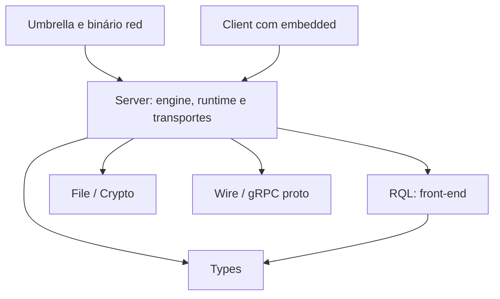

# Complexidade e custo do desenvolvimento Rust no RedDB

Data: 2026-10-04. Base auditada: `77404848aac34542577c09695bbfb68eed87e88d`.
Escopo: ambiente desta máquina, comandos locais, artefatos existentes e arquitetura
do workspace. Estudo, sem alteração de configuração ou limpeza de caches.

## Resumo executivo

Existe desperdício evitável. O problema combina pressão do host, seleção incorreta
de testes, variação da configuração de build, retenção de artefatos e uma unidade
Cargo muito grande. Comprar mais RAM não corrige esses multiplicadores.

Os achados com maior confiança são:

1. O **C: do Windows tem aproximadamente 1,20 GiB livres**, embora o filesystem
   Linux mostre aproximadamente 681 GiB disponíveis. O VHD desta distribuição está
   no C: e tem comprimento lógico de **304,0 GiB**. O espaço anunciado dentro do
   VHD não é uma reserva de espaço físico no host.
2. **`/tmp` é um tmpfs de 4 GiB e está praticamente cheio.** Diretórios
   `scriptc-rust-*` respondem por aproximadamente 3,77 GiB; os `reddb-*`, por
   aproximadamente 43 MiB. Esse consumo é de memória/swap, distinto dos targets
   em disco. O prefixo identifica os artefatos, não prova qual processo os criou.
3. Encontramos **41,91 GiB em três diretórios target** dos worktrees registrados.
   O principal sozinho usa **27,11 GiB**, dos quais aproximadamente **13,77 GiB
   estão em incremental**. Há múltiplas variantes grandes do server e de harnesses.
4. O caminho padrão **`make test-fast` está desatualizado**: seus 15 targets de
   integração não existem na seleção padrão atual. Seu primeiro passo também
   seleciona apenas lib/bin do umbrella, deixando os testes unitários do server
   fora da execução. Há ainda **33 arquivos de teste incluídos em dois harnesses**.
5. O projeto fixa Rust **1.95.0**, mas a sessão usa **1.99.0** por
   `RUSTUP_TOOLCHAIN`. Não há limite explícito de jobs nas configurações Cargo
   inspecionadas. O wrapper acrescenta flags de linker que comandos Cargo diretos
   não recebem nesta máquina.
6. `reddb-io-server` concentra **831 fontes / 506.325 linhas brutas**, incluindo
   testes, e compila engine e transportes na mesma unidade. Há oportunidades
   menores e verificáveis antes de uma extração estrutural do engine.

Prioridade: corrigir seleção e duplicação de testes; estabilizar toolchain/flags;
definir concorrência e retenção com orçamento do host. Depois, retirar testes
puros de parser do pacote pesado e medir uma separação engine → transportes.

## Método, confiança e limites

Foram usados `cargo metadata --no-deps --offline`, inspeção dos manifests/scripts,
contagens de fontes/includes, `du`, `df`, diagnósticos somente leitura do red-dev,
rustup e uma consulta somente leitura ao registro do WSL. Um Cargo falso capturou
argumentos/ambiente dos wrappers sem compilar; a seleção real de um target inválido
foi reproduzida separadamente e terminou antes da compilação.

Não fizemos uma build fria/quente de benchmark: a falta de espaço físico no host
tornaria a comparação pouco útil e poderia interromper a sessão. **Não medimos
pico de RAM nem ganho em segundos das recomendações.** No instante observado não
havia rustc, Cargo, analyzer ou linker ativo. Não há OOM kill registrado nos
cgroups observados; contadores históricos de pressão não atribuem causa ao RedDB.

GiB significa 2³⁰ bytes. `du` mede blocos alocados; comprimento do VHD não mede
exclusivamente ocupação física NTFS. Contagens de linhas incluem comentários,
`cfg` e testes: não representam LOC executáveis ou compiladas exatas.

## Fontes oficiais e referências locais

| Fonte | Uso |
| --- | --- |
| [Cargo: configuração](https://doc.rust-lang.org/cargo/reference/config.html) | Jobs, precedência e escopo da limpeza automática |
| [Cargo: perfis](https://doc.rust-lang.org/cargo/reference/profiles.html) | Incremental, codegen units e perfis de release |
| [Cargo: build cache](https://doc.rust-lang.org/cargo/reference/build-cache.html) | Layout, variantes de perfil/target e artefatos intermediários |
| [rustup: overrides](https://rust-lang.github.io/rustup/overrides.html) | Ambiente prevalece sobre o pin do repositório |
| [rustc: jobserver](https://doc.rust-lang.org/rustc/jobserver.html) | Coordenação do paralelismo interno com o chamador |
| [sccache: Rust](https://github.com/mozilla/sccache/blob/main/docs/Rust.md) | Limitações de cache e incremental |
| [sccache: configuração](https://github.com/mozilla/sccache/blob/main/docs/Configuration.md) | Limite de cache e normalização de caminhos |
| [Microsoft: disco WSL](https://learn.microsoft.com/en-us/windows/wsl/disk-space) | Capacidade virtual versus disco físico |
| [Microsoft: configuração WSL](https://learn.microsoft.com/en-us/windows/wsl/wsl-config) | Limites da VM e swap |
| [rust-analyzer: configuração](https://rust-analyzer.github.io/book/configuration.html) | Check automático, seleção de targets e duplicação de cache |

As páginas oficiais são documentação móvel consultada na data acima. As URLs
versionadas de Cargo 1.95 não estavam acessíveis pelo navegador da sessão. As
propostas imediatas usam opções estabelecidas (`jobs`, `--target-dir`, seleção de
pacotes); recursos novos como separação `build-dir` exigem verificação adicional
na versão fixada antes de adoção.

Hotlinks do código auditado:
[perfis](../../Cargo.toml#L250),
[wrapper](../../scripts/cargo-fast.sh#L29),
[test-fast](../../scripts/test-fast.sh#L7),
[Makefile](../../Makefile#L69),
[isolamento AFK](../config.yaml#L220),
[guia atual](../../docs/guides/builds-and-ci-speed.md),
[ADR 0053](../adr/0053-reddb-io-rql-boundary.md),
[ADR 0062](../adr/0062-afk-protection-rails.md).

## Medições do ambiente

| Observação | Resultado | Implicação |
| --- | --- | --- |
| Host Windows | 31,9 GiB RAM; 7,0 GiB disponíveis; commit 31,0/46,4 GiB | A disponibilidade do host importa além da RAM visível no Linux |
| Linux/WSL | 18,7 GiB visíveis; aproximadamente 10,9–11 GiB disponíveis | A VM tem menos memória que o PC |
| Swap | 4 GiB; aproximadamente 0,3 GiB usados | Snapshot em repouso, não pico de build |
| CPUs disponíveis | `nproc`: 9 | Paralelismo padrão cresce com CPUs, não com RAM livre |
| Cgroups do shell e ancestrais | `memory.max/high`: ilimitados; `oom_kill=0` | Nenhum orçamento de memória explícito observado nessa hierarquia |
| Escolha red-dev resources | System settings, sem escolha explícita | Política opt-in atual não foi configurada aqui |
| `/mnt/c` | 894 GiB totais, 893 GiB usados, aproximadamente 1,2 GiB livres | Volume físico praticamente cheio |
| `/` dentro do VHD | 1007 GiB totais, 275 GiB usados, aproximadamente 681 GiB livres | A capacidade virtual mascara o limite físico do host |
| Ubuntu VHD no C: | 326.414.368.768 bytes de comprimento | Não é uma medição dos blocos físicos exclusivos do arquivo |
| `/tmp` | tmpfs 4 GiB, praticamente 100% ocupado | Temporários competem com builds por RAM/swap |
| `/dev/shm` | 9,4 GiB; aproximadamente 191 MiB usados | Transferir temporários para lá continua consumindo memória |

`/etc/fstab` monta `/tmp` em RAM com `size=4G` para evitar churn no VHD. A intenção
é compreensível, mas faltam orçamento/retirada dos temporários que permanecem ali.
Mudar apenas `TMPDIR=/dev/shm` troca o limite e pode aumentar a pressão de RAM.

O `.wslconfig` observado fixa `memory=19615MB`, `swap=4GB` e
`autoMemoryReclaim=dropCache`. Reclaim de page cache não transforma arquivos vivos
em tmpfs em memória livre. Os limites de RAM/swap da VM são documentados pela
[Microsoft](https://learn.microsoft.com/en-us/windows/wsl/wsl-config).

Os aproximadamente 681 GiB livres dentro do Linux não garantem que o VHD consiga
crescer quando o C: tem aproximadamente 1,2 GiB livres; essa distinção é explícita
na [documentação de disco WSL](https://learn.microsoft.com/en-us/windows/wsl/disk-space).
Qualquer futura política de build precisa olhar ambos. Limpeza dentro do guest e
recuperação física do VHD são operações distintas; não presumir recuperação
automática no Windows sem verificar versão, modo sparse e espaço do host.

### Inventário dos artefatos

Havia 30 worktrees antes do worktree deste estudo, 31 depois. Somente três caminhos
`target` convencionais existem nos worktrees inventariados; **não são 30 cópias de
cache**. Targets externos escolhidos por ambiente/configuração não são abrangidos
por essa soma.

| Target encontrado | GiB alocados |
| --- | ---: |
| Checkout principal: `target` | 27,111 |
| Worktree irmão `reddb-write-capacity/target` | 14,454 |
| Worktree `manual/reliability-tls/drivers/python/target` | 0,347 |
| Total encontrado | **41,912** |

Uma única passagem `du -x -B1 --max-depth=2 target` no checkout principal produziu:

| Camada | Bytes alocados | GiB aproximados |
| --- | ---: | ---: |
| `debug/incremental` | 14.785.531.904 | 13,770 |
| `debug/deps` | 12.562.219.008 | 11,700 |
| `debug/build` | 1.154.625.536 | 1,075 |
| `debug/.fingerprint` | 59.125.760 | 0,055 |
| Total de `target` | 29.110.161.408 | 27,111 |

Hardlinks são deduplicados nessa passagem. Somar `du` independentes por subpasta
ou somar tamanhos de arquivos pode contar os mesmos blocos novamente.

Há três `libreddb_server-*.rlib` com aproximadamente 479–491 MiB cada, executáveis
`red-*` com aproximadamente 300 MiB e harnesses agrupados de aproximadamente
240–280 MiB. A enumeração de `deps` encontrou 77.034 arquivos `.dwo`, com
aproximadamente 3,35 GiB de blocos somados antes de deduplicar hardlinks.
Esses números mostram coexistência de variantes; não identificam qual flag,
toolchain ou commit criou cada uma, nem provam que todas são descartáveis.

Fora do RedDB, `~/.cache` soma aproximadamente **33,19 GiB**. As famílias
`scriptc`, `scriptc-test-tmp` e `scriptc-onda6` concentram quase todo esse uso.
Isso merece inventário próprio do dono desses caches. Não atribuir esse consumo
ao Cargo do RedDB nem somar subpastas sobrepostas.

`red-dev reclaim` em preview encontrou apenas aproximadamente 918,5 KiB de
artefatos derivados elegíveis. Sua limpeza atual não resolve os dezenas de GiB
observados nos targets e caches de outros projetos.

## Achados de configuração e workflow

### 1. Falta um orçamento agregado de builds nesta sessão

O wrapper não limita jobs. `.cargo/config.toml` do projeto não existe: há apenas
um exemplo. `~/.cargo/config.toml` tem um byte; as configurações ancestrais
inspecionadas e o ambiente não estabelecem jobs. O Cargo usa CPUs lógicas como
padrão de concorrência, não memória disponível. Um `-j2` limita uma invocação;
duas invocações em targets diferentes continuam independentes. A limpeza
automática do Cargo ainda cobre downloads globais, não artefatos de `target`.
[Referência Cargo](https://doc.rust-lang.org/cargo/reference/config.html).

`test-fast` possui lock por diretório. A configuração AFK isola target por slot,
o que evita interferência de artefatos, mas não cria um orçamento do host. Nenhum
daemon/build concorrente estava ativo no snapshot: multiplicação simultânea é
risco do desenho, não um incidente demonstrado nesta coleta.

O red-dev 1.0.193 instalado oferece `resources status`, `configure`, `project` e
`run`, com escolhas explícitas de slots/jobs. Aproveitar esse mecanismo onde
apropriado, mantendo um caminho simples e portátil para contribuidores OSS.
Backups antigos de hooks existem, mas o doctor informa controles antigos
retirados. **Não restaurar silenciosamente o antigo guard de Cargo**: definir a
participação dos comandos atuais e conferir que IDE, AFK e terminal a respeitam.

Jobs não são um teto de RSS ou uma reserva de CPU. O rustc coordena paralelismo
interno com o jobserver disponível; não tratar 256 CGUs como 256 processos.
[Referência rustc](https://doc.rust-lang.org/rustc/jobserver.html).

### 2. A configuração efetiva diverge da declarada

`rust-toolchain.toml` fixa 1.95.0; `rustup show active-toolchain` retornou 1.99.0
sob override de `RUSTUP_TOOLCHAIN=1.99.0`. Na coleta inicial desta sessão apareceu
1.98.1; repetir a leitura revelou a revisão atual. A configuração global mise
seleciona `rust=latest`, mas não investigamos quem alterou/injetou o override.
O efeito do override é confirmado pela [ordem oficial do rustup](https://rust-lang.github.io/rustup/overrides.html).

`cargo-fast.sh` detectou mold e exportou `-C link-arg=-fuse-ld=mold`. Os alvos
`lint`, `run`, nextest e vários testes persistentes usam Cargo diretamente no
Makefile. Sem config local equivalente, esses caminhos não recebem as mesmas
flags. Isso cria configuração de compilação diferente e compromete a reutilização
dos artefatos. Não foi medido quanto espaço cada diferença explica.

A solução é uma configuração efetiva única e inspecionável, respeitando o pin do
projeto. Acrescentar outra cadeia de wrappers e aliases agravaria a dificuldade
de saber qual Cargo, linker, target e limite estão realmente ativos.

### 3. `test-fast` paga isolamento e não seleciona o teste pretendido

O script cria `target/test-fast` por padrão, ou um subdiretório equivalente dentro
de `CARGO_TARGET_DIR`. Assim, até um target compartilhado externo ganha uma segunda
família de artefatos. `REDDB_FAST_SHARED_TARGET=1` já permite optar pelo mesmo
diretório; não precisa surgir outra configuração para essa escolha.

Seu comando `test --lib --bins` não contém `--workspace` nem `-p reddb-io-server`.
O membro padrão é só o umbrella `reddb-io`, cujo lib reexporta o server. Compilar
uma dependência normal não executa seus testes unitários. O server contém 5.221
ocorrências de `#[test]`, que não entram nessa seleção padrão.

Depois, o script pede 15 targets antigos; todos estão ausentes da lista dos 19
targets atuais do umbrella. A reprodução real:

```text
cargo test --locked --offline --test audit_structured --no-run
exit: 101
error: no test target named `audit_structured` in default-run packages
```

Isso pode desperdiçar o primeiro passo da build antes de falhar na seleção
seguinte. O probe com Cargo falso confirmou os argumentos e o target separado;
seu exit zero não é evidência de que os testes reais passaram.

Correção proposta: selecionar unitários do pacote certo e harnesses atuais com
filtros de execução. Separar teste rápido funcional de verificação abrangente;
um nome “fast” não deve esconder ausência de cobertura do engine.

### 4. Os perfis já mitigam debug info, mas há inconsistências

Dev/test usam `debug="line-tables-only"` e `split-debuginfo="unpacked"`; o comentário
no manifest registra a redução anterior de artefatos de debug completos. Não
recomendar novamente essa mudança como se faltasse. CGU 256 é o padrão de builds
incrementais do Cargo, não prova de configuração anormal. `CARGO_INCREMENTAL`
sobrescreve o valor dos perfis. [Perfis oficiais](https://doc.rust-lang.org/cargo/reference/profiles.html).

O probe mostrou `cargo-fast build --profile release-static` recebendo
`CARGO_INCREMENTAL=1`, embora o perfil declare `incremental=false`. Isso é uma
inconsistência da configuração efetiva. Não medimos impacto particular de
incremental junto de fat LTO. Remover a imposição global e deixar os perfis
declararem sua intenção simplificaria o comportamento.

`release-opt3` declara opt-level 3, mas release já herda o default 3; seu comentário
continua comparando com release opt=2. Esse perfil cria uma lane redundante na
configuração atual. Os perfis experimentais LTO têm função legítima em benchmark,
mas devem ficar fora da rotina e da retenção automática indefinida.

O experimento histórico em `bench/build-profile-experiment-2026-06-25.md` foi feito
com outro hardware, Rust 1.95 e outros controles. Contém medições e hipóteses/TBD.
Os comentários de “3× mais rápido” e perda de “5–10%” não são benchmark atual deste
commit. Não usá-los como promessa de desempenho.

### 5. Cache precisa de retenção; `sccache` não resolve tudo

Não há sccache no PATH observado. O wrapper só o ativa no modo auto quando
incremental está desligado; o Makefile tenta forçá-lo em build-fast/release quando
está disponível. Instalar sccache altera, portanto, a configuração desses caminhos.

Sccache exige incremental desligado, não cacheia invocações que chamam o linker
do sistema e não atende toda modalidade de `cargo check`. Ele pode ajudar a
reaproveitar bibliotecas entre workspaces; não elimina os executáveis de testes
nem o consumo do target. [Limitações oficiais](https://github.com/mozilla/sccache/blob/main/docs/Rust.md).

Se adotado, definir um limite explícito de cache em disco. A documentação atual
informa default de 10G e `SCCACHE_BASEDIRS` para retirar prefixos de caminhos da
chave; conferir suporte na versão instalada e medir hits entre worktrees.
Não prometer reutilização perfeita quando código gerado inclui paths absolutos.
[Configuração oficial](https://github.com/mozilla/sccache/blob/main/docs/Configuration.md).

O isolamento por slot do AFK deve continuar protegendo a execução. Um pool
limitado de slots reutilizáveis é preferível a um cache permanente por issue.
Para uso interativo serial, um diretório estável reduz cópias. Não compartilhar
um único binário mutável entre worktrees que compilam e executam simultaneamente:
a proteção deve cobrir a vida da compilação e do teste que usa seu executável.

O guia manda `make warm` a cada branch/sessão. Esse alvo faz build e checks de
tests/benches antecipadamente, sem orçamento explícito. Torná-lo opcional por
superfície evita trabalho que o dev nem irá usar. A opção `cargo clean` remove
reuso e força build fria; não é política de retenção suficiente.

## Achados arquiteturais

### 1. Há duplicação removível na organização dos testes

Uma inspeção recursiva de `#[path]` a partir dos targets Cargo confirmou **33
arquivos com testes em dois harnesses**, somando **7.743 linhas brutas e 167
marcadores diretos de teste repetidos**. Alguns são condicionados por `cfg`; o
número de testes realmente executados deve ser conferido com `--list`.

Exemplos: os dez arquivos MVCC compartilhados entre `grouped_mvcc_transactions` e
`grouped_sql_core`; TLS/OAuth entre auth e HTTP/gRPC; `e2e_explain` entre AI/search
e SQL. Evidências em [sql_core](../../tests/grouped/sql_core.rs#L18),
[MVCC](../../tests/grouped_mvcc_transactions.rs#L9) e
[AI/search](../../tests/grouped/ai_search.rs#L12).

Cada arquivo deve ter um harness proprietário; seleção transversal pode usar
filtros. Evitar uma fusão total dos harnesses: diminui links, mas pode aumentar
pico de compilação/link e piorar localidade. Retirar duplicação é uma mudança
menor que precisa preservar a união dos testes, sem alterar suas expectativas.

### 2. Testar o parser ainda pode exigir o pacote pesado

O server tem 98 targets de integração descobertos pelo Cargo, além de oito
benches. Encontramos 18 arquivos de parser/snapshot sem imports do server,
somando 4.343 linhas; eles são candidatos a morar no crate RQL existente. Imports
ausentes são triagem, não prova definitiva de migração pronta: validar helpers,
snapshots e corpus na implementação.

`ask_parser.rs` tem validator dependente do server na linha 378 e
`queue_parser.rs` usa `QueueMode` na linha 169; preservar essas partes no server.
RQL hoje depende normalmente apenas de types e não tem dev-dependência no engine.
Essa transferência tem uma fronteira de compilação menor verificável, alinhada à
[ADR 0053](../adr/0053-reddb-io-rql-boundary.md).

Depois, agrupar moderadamente testes restantes do server pode reduzir links e
artefatos. Medir tamanho/RSS por harness; 98 executáveis não são necessariamente
98 cópias completas da biblioteca, e a economia exata não foi medida.

### 3. Engine e transportes pertencem à mesma unidade Cargo

| Subárvore do server | Linhas brutas |
| --- | ---: |
| Storage | 170.711 |
| Runtime | 150.292 |
| HTTP/server | 44.420 |
| Cluster | 19.325 |
| Auth | 19.069 |
| Replication | 14.610 |
| Wire | 13.424 |
| Server inteiro, incluindo outras subárvores | **506.325** |

Os módulos principais são declarados incondicionalmente em
[lib.rs](../../crates/reddb-server/src/lib.rs#L24). `default=[]` no manifest não
significa engine mínimo: HTTP/gRPC/PG/MCP/cluster/AI continuam nessa biblioteca.
Editar um handler muda a mesma unidade Cargo que contém storage. Incremental
pode reutilizar trabalho interno, mas não elimina essa dependência da build.



Mover arquivos para mais `mod`s não cria outra unidade Cargo. Uma extração das
implementações de transportes para um crate que depende do engine pode isolar
edições de HTTP/PG/MCP, mas primeiro precisa eliminar referências invertidas:
runtime chama `service_cli` em `impl_lifecycle.rs:247`; o encoder AI importa PG
wire em `pg_wire_ask_row_encoder.rs:72`. O teste
`engine_presentation_boundary.rs` já protege parte dessa separação.

A hipótese precisa passar pelo critério concreto: **uma alteração de handler
deixa de recompilar a unidade engine**. Não criar ports que repetem cada método
do runtime; o próprio `application/ports.rs` registra essa cautela.

Preservar types/wire/file como contratos neutros, conforme ADRs 0052 e 0046.
Não mover executores SQL para RQL: a ADR 0053 os mantém com storage por acoplamento
real. Features de transportes podem reduzir builds mínimos, mas não isolam as
recompilações quando todos estão habilitados.

### 4. Há caminhos finos que a rotina atual não evidencia

O client e o driver Python habilitam `embedded` por default. Isso é coerente com
`memory://` e `file://`, mas desenvolvimento exclusivamente remoto precisa de
seleção explícita sem default features. Oferecer comandos para essa tarefa evita
o engine quando ele não é necessário; não mudar o default público silenciosamente.
O Python possui workspace próprio e pode criar outro target.

O build script do server observa routes, gera catálogo com paths absolutos e
reescreve a saída quando roda. Melhorar estabilidade da saída pode ajudar, mas
é prioridade secundária sem medição de frequência/custo. A dependência nas rotas
é legítima; alterar uma rota já muda o crate mesmo sem o script.

## Plano recomendado, configuração e critérios de sucesso

| Prioridade | Mudança proposta | Verificação necessária |
| --- | --- | --- |
| P0, host | Orçamento real de disco e temporários; separar capacidade guest/host | Inventário por dono; headroom físico antes de build; `/tmp` deixa de permanecer cheio |
| P0, comandos | Corrigir test-fast e remover includes duplicados | Targets existem via metadata; `--list` preserva testes únicos; engine unitários realmente selecionados |
| P0, consistência | Respeitar pin e uniformizar flags/linker nos comandos | `rustup show`, probe dos wrappers e build sem mudança de fingerprints por simples troca de comando |
| P1, recursos | Uma build pesada por vez no host e jobs explícitos, ajustáveis | Duas worktrees/IDE concorrem de forma limitada; medir cgroup agregado, pressão e responsividade |
| P1, retenção | Diretórios estáveis/pool limitado, teto por família e retirada de lanes inativas | Preview com dono/bytes; leases de uso protegem build/test; crescimento estabiliza após N sessões |
| P1, testes | Mover parser puro para RQL; agrupar moderadamente os demais | Mesma cobertura/corpus; menos crates necessários, links e bytes |
| P2, arquitetura | Prototipar extração de transportes | Edição HTTP não recompila engine; testes de boundary e contratos permanecem verdes |

Sem resposta sobre máquina mínima, a proposta inicial é **validar 16 GiB como
baseline**, com 8 GiB como modo restrito ainda a comprovar. Pontos de partida de
experimento, não garantias: 8 GiB → um job; 16 GiB → dois; 32 GiB → dois a quatro.
Em todos, uma build pesada por vez inicialmente. O disponível no host, serviços
e IDE podem exigir menos jobs mesmo numa máquina de 32 GiB.

Orçamento de memória deve reservar espaço ao host/IDE e considerar o menor entre
disponibilidade real do host e capacidade disponível da VM. Um teto arbitrário
baixo pode matar o único rustc do monólito; medir antes de impor `MemoryMax`.
Prioridade/peso de CPU e admissão de builds preservam responsividade; apenas
reduzir prioridade não impede esgotamento de RAM ou disco.

Definir três tarefas visíveis: check do pacote editado; teste do domínio editado;
validação completa. O gate abrangente continua existindo. A ADR 0062 exige
backpressure de qualidade: eliminar execução redundante comprovada ou deslocar
uma etapa para CI não autoriza remover cobertura/gates sem equivalência.

Não criar target novo por editor/worktree como solução universal para lock:
isso duplica artefatos. O rust-analyzer permite seleção menor, override do comando
de check e target próprio; sua documentação explicita o custo dessa duplicação.
Não havia analyzer ativo nem config de IDE no repo, então isso é integração a
validar, não causa demonstrada. [Configuração oficial](https://rust-analyzer.github.io/book/configuration.html).

Uma futura limpeza precisa listar somente artefatos derivados conhecidos,
proteger slots ativos e nunca atravessar bancos, WALs ou dados locais. Retirar
targets inteiros inativos é mais auditável que inventar GC de arquivos internos
do Cargo. Preservar ao menos a lane ativa; limpeza recorrente total aumenta
compilação fria e pode piorar a experiência.

## Experimentos para quantificar o benefício

Após recuperar headroom no host, usar toolchain fixada e as mesmas flags. Medir
tempo, pico agregado de memória, CPU, pressão/swap, bytes novos e crates/linkagem.
`/usr/bin/time -v` sozinho não substitui pico agregado da árvore de processos:
preferir cgroup da execução (`memory.peak`/`cpu.stat`) ou sampler de toda a árvore.

| Experimento | Comparação |
| --- | --- |
| Concorrência | Uma build, jobs 1/2/4; depois duas worktrees com admissão limitada |
| Reuso | Mesmo comando duas vezes; depois check/build/clippy com configuração uniforme |
| Edição real | Handler HTTP versus runtime versus contrato types; usar `--timings` |
| Testes duplicados | `--list`, bytes e duração antes/depois de proprietário único |
| Parser | Target atual no server versus target transferido para RQL |
| Cache | Incremental local versus sccache sem incremental em worktrees diferentes |
| Retenção | Bytes por família após várias branches/sessões, com limite e retirada de inativos |

Build fria requer uma lane de experimento descartável e espaço suficiente; não
limpar o cache diário para produzi-la. Manter resultados completos, inclusive
regressões. Performance de runtime e garantias de persistência permanecem
independentes desse estudo de custo de desenvolvimento.

## Perguntas abertas e próximos passos

Precisamos confirmar a máquina mínima e os comandos cotidianos do usuário;
atribuir a origem do override Rust; identificar o dono/retention dos temporários
scriptc; medir picos reais de compilação; e determinar a política desejada para
slots interativos/AFK. Não há base para prometer um percentual de economia agora.

O primeiro lote de implementação recomendado reúne **correção de test-fast,
proprietário único dos testes, consistência da configuração e diagnóstico de
recursos**. Em seguida vêm admissão/retenção explícitas e parser no RQL. A extração
de transportes é uma proposta posterior sujeita aos experimentos acima.

## Notas das fontes e comandos de reprodução

Os manifests/scripts do commit base são autoridade sobre a configuração
declarada; os probes e diagnósticos são autoridade sobre esta máquina na coleta.
A documentação oficial explica os mecanismos, sem fornecer medições de RedDB.
O benchmark de junho fornece história, não resultado atual.

Comandos de inspeção, sem compilar ou remover dados:

```bash
git worktree list --porcelain
cargo metadata --no-deps --offline --format-version 1
rustup show active-toolchain
rustc --version
cargo --version
du -x -B1 --max-depth=2 target
du -x -h --max-depth=2 ~/.cache
df -h / /tmp /dev/shm /mnt/c
free -h
red-dev resources status
red-dev doctor --json
red-dev reclaim
```

`resources status` retornou 2 após observações de definições legadas preservadas;
`doctor` retornou 1 por problemas observados. Não confundir esses exit codes com
uma build falhando. `cargo metadata` completo em modo offline não pôde montar
todo o grafo externo por ausência de `anstyle-wincon v3.0.11` no cache. O grafo
local, seleção de targets e contagens deste relatório usam metadata sem deps;
nenhuma dependência foi baixada para completar a pesquisa.
