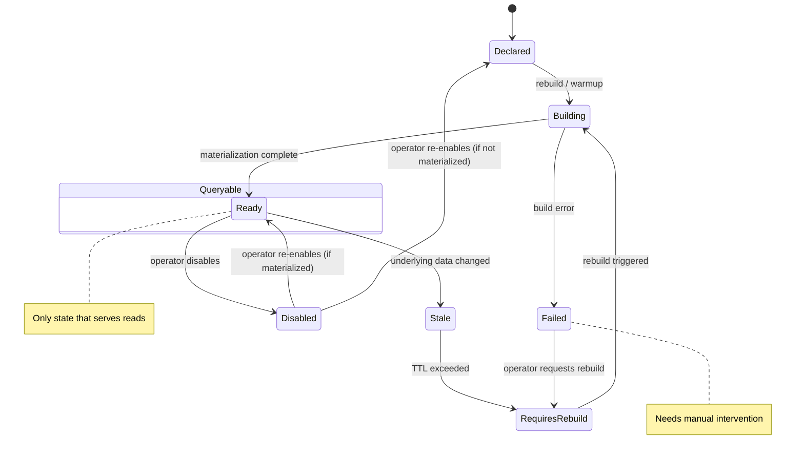
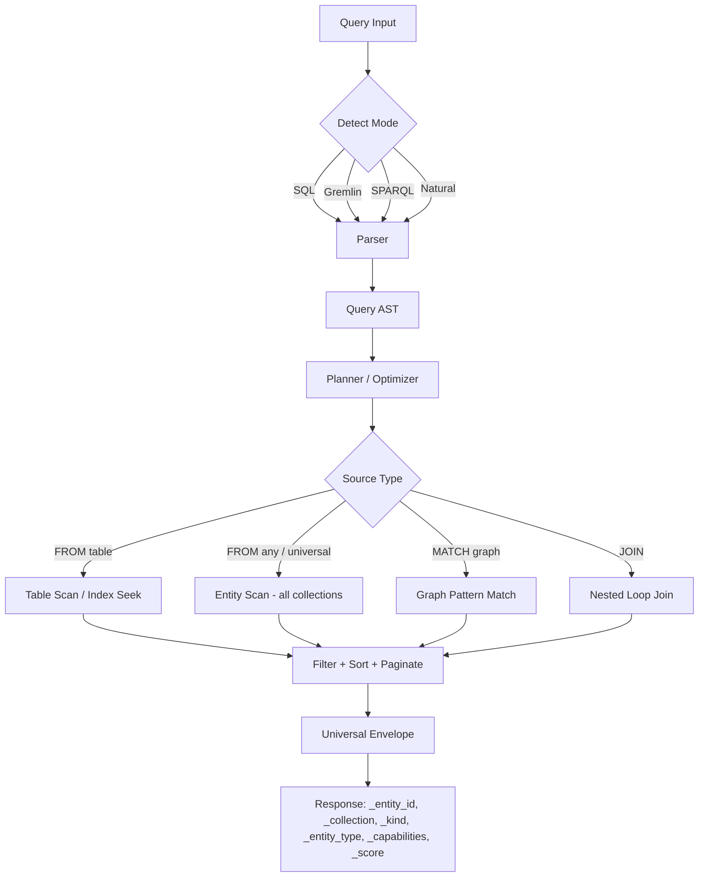

# RedDB

<p align="center">
  
</p>

<p align="center">
  <strong>One engine for all your data shapes: rows, docs, graphs and vectors</strong><br>
  <em>single runtime • one API surface • embedded-first • server and serverless profiles</em>
</p>

<p align="center">
  <strong>RedDB</strong> is a multi-structure database for systems that need stateful tables,
  document payloads, linked entities, semantic retrieval and graph analytics in one place,
  without operational split-brain.
</p>

<p align="center">
  
  &nbsp;
  
  &nbsp;
  
  &nbsp;
  
  &nbsp;
  
  &nbsp;
  
</p>

<p align="center">
  
  &nbsp;
  
  &nbsp;
  
</p>

---

## Save multiple shapes without moving data

`RedDB` is for systems that don’t fit in one model.

<table>
<tr>
<td width="33%">
<strong>Operational tables</strong><br><br>

- rows
- tables
- typed values and constraints
- point/range scans
- predicates and joins
- explicit delete/update flows

</td>
<td width="33%">
<strong>Payload-first entities</strong><br><br>

- documents / JSON payloads
- metadata
- binary blobs
- key-value fields
- snapshots and exports

</td>
<td width="33%">
<strong>Connected + semantic retrieval</strong><br><br>

- graph nodes
- graph edges
- paths
- vectors
- embeddings
- hybrid search
- ANN index-backed search readiness

</td>
</tr>
</table>

What this means in practice:

- store operational state, documents, relationships, and embeddings in one catalog
- evolve from row-driven models to graph and vector workflows without migration hell
- run the same data model in embedded and server/runtime modes
- keep manifests, native state, snapshots, and exports in the same control plane

---

## Quick start

### Server

Run `RedDB` as an HTTP server or as a gRPC server.

#### 1. Start the HTTP server

```bash
reddb --path ./data/reddb.rdb --bind 127.0.0.1:8080
```

#### 2. Create a row

```bash
curl -X POST http://127.0.0.1:8080/collections/hosts/rows \
  -H 'content-type: application/json' \
  -d '{
    "fields": {
      "ip": "10.0.0.1",
      "os": "linux",
      "critical": true
    },
    "metadata": {
      "source": "quickstart"
    }
  }'
```

#### 3. Create a node

```bash
curl -X POST http://127.0.0.1:8080/collections/graph/nodes \
  -H 'content-type: application/json' \
  -d '{
    "label": "Host",
    "node_type": "host",
    "properties": {
      "ip": "10.0.0.1"
    }
  }'
```

#### 4. Create a vector

```bash
curl -X POST http://127.0.0.1:8080/collections/embeddings/vectors \
  -H 'content-type: application/json' \
  -d '{
    "dense": [0.12, 0.91, 0.44],
    "content": "host 10.0.0.1 running ssh",
    "metadata": {
      "kind": "host_embedding"
    }
  }'
```

#### 5. Run a universal query

```bash
curl -X POST http://127.0.0.1:8080/query \
  -H 'content-type: application/json' \
  -d '{
    "query": "FROM ANY WHERE _entity_type IN ('table', 'graph_node', 'vector') ORDER BY _score DESC LIMIT 10"
  }'
```

#### 6. Start the gRPC server

```bash
reddb-grpc --path ./data/reddb.rdb --bind 127.0.0.1:50051
```

#### 7. Query over gRPC

```bash
grpcurl \
  -plaintext \
  -d '{"query":"FROM hosts h WHERE h.os = \"linux\" LIMIT 5"}' \
  127.0.0.1:50051 \
  reddb.v1.RedDb/Query
```

#### 8. Create a row over gRPC

```bash
grpcurl \
  -plaintext \
  -d '{
    "collection": "hosts",
    "payloadJson": "{\"fields\":{\"ip\":\"10.0.0.3\",\"os\":\"linux\"}}"
  }' \
  127.0.0.1:50051 \
  reddb.v1.RedDb/CreateRow
```

### Embedded

Use `RedDB` directly inside your Rust process.

#### 1. Create a database handle

```rust
use reddb::{RedDB, Value};

fn main() -> Result<(), Box<dyn std::error::Error>> {
    let db = RedDB::new();

    let host_id = db
        .row(
            "hosts",
            vec![
                ("ip", Value::Text("10.0.0.1".into())),
                ("os", Value::Text("linux".into())),
                ("critical", Value::Boolean(true)),
            ],
        )
        .save()?;

    let node_id = db
        .node("graph", "Host")
        .node_type("host")
        .property("ip", "10.0.0.1")
        .save()?;

    let vector_id = db
        .vector("embeddings")
        .dense(vec![0.12, 0.91, 0.44])
        .content("host 10.0.0.1 running ssh")
        .save()?;

    println!("host={host_id} node={node_id} vector={vector_id}");
    Ok(())
}
```

#### 2. What happened

In a few lines, the same database stored:

- a table row
- a graph node
- a vector embedding

No extra services. No separate graph store. No separate vector engine.

---

## A real multi-structure flow

This is the shape `RedDB` is built for:

| Need | Store it as |
| --- | --- |
| operational facts | rows |
| rich object payloads | documents / JSON-like values |
| raw files or opaque bytes | binary payloads |
| linked entities | graph nodes and edges |
| semantic retrieval | vectors and embeddings |
| search context | metadata |
| operational durability state | manifests, roots, snapshots and exports |

And this is the point:

- one application can write a row
- link it to a graph node
- attach one or more embeddings
- run structured queries
- run graph traversal
- run vector or hybrid retrieval
- export and snapshot the same dataset

without changing databases halfway through the system design.

---

## What is `RedDB`?

`RedDB` is a standalone Rust database engine for multi-structure workloads.

It is not trying to be “just SQL”, “just document”, or “just vector”.
It is a **multi-structure database core** with one persistence layer and one operational surface for:

- structured rows and scans
- semi-structured documents
- graph nodes, edges, traversals and analytics
- dense vector search, IVF and hybrid retrieval
- physical metadata, manifests, snapshots and exports

`RedDB` is designed to feel like one coherent system:

- one engine
- one runtime
- one operational surface
- multiple native data shapes

---

## Why `RedDB`

Most storage stacks get awkward the moment your application needs more than one structure.

You start with rows.
Then you need metadata-heavy docs.
Then graph relationships.
Then embeddings.
Then hybrid search.
Then operational metadata.
Then exports, scans, health and online maintenance.

`RedDB` is built so all of that belongs to the same system from day one.

- rows, docs, graph and vectors live in one engine
- one transaction boundary can touch multiple structures
- one runtime exposes scans, queries, analytics and operations
- one physical metadata story tracks snapshots, roots, manifests and exports

---

## What makes it special

### One database, not four glued together

- table data
- document-like payloads
- graph entities and traversals
- vector retrieval and hybrid ranking

All of these are first-class.

### Embedded-first, server-capable

Use `RedDB` directly as a Rust crate inside your process, or run it as a server.

- low-latency local access
- no mandatory network hop
- clean server surface when you do want remote access

### Operational by default

- health endpoints
- runtime stats
- manifests
- collection roots
- snapshots
- exports
- retention controls
- maintenance and checkpointing

### Search that crosses structures

- text search
- vector search
- IVF search
- hybrid search
- graph-aware traversal and analytics

### Analytics built into the graph layer

- shortest path
- traversals
- components
- centrality
- communities
- clustering
- cycles
- topological sort

---

## Current capabilities

### Core engine

- unified entity model
- persistence for rows, graph entities and vectors
- paged backend support
- physical metadata sidecar
- manifest trail and collection roots
- snapshots and named exports
- retention policy for snapshots and exports
- health diagnostics and runtime stats

### Query/runtime

- embedded runtime with connection pool
- HTTP server surface
- gRPC server surface
- collection scans
- table query execution in `/query`
- join execution in `/query`
- graph query execution in `/query`
- path query execution in `/query`
- vector query execution in `/query`
- hybrid query execution in `/query`

### Vector

- similarity search
- IVF search
- k-means-backed IVF training on demand
- hybrid search
- text/doc search API
- vector metadata filtering in runtime query path

### Graph

- neighborhood expansion
- BFS / DFS traversal
- shortest path
- connected / weak / strong components
- degree / closeness / betweenness / eigenvector centrality
- PageRank and personalized PageRank
- HITS
- Louvain and label propagation
- clustering coefficient
- cycle discovery
- topological sort
- named graph projections
- persisted analytics job metadata

### Operations

- `GET /health`
- `GET /ready`
- `GET /stats`
- `GET /catalog`
- `GET /manifest`
- `GET /roots`
- `GET /snapshots`
- `GET /exports`
- `GET /indexes`
- `GET /graph/projections`
- `GET /graph/jobs`
- `POST /collections/{name}/rows`
- `POST /collections/{name}/nodes`
- `POST /collections/{name}/edges`
- `POST /collections/{name}/vectors`
- `POST /collections/{name}/bulk/rows`
- `POST /collections/{name}/bulk/nodes`
- `POST /collections/{name}/bulk/edges`
- `POST /collections/{name}/bulk/vectors`
- `PATCH /collections/{name}/entities/{id}`
- `DELETE /collections/{name}/entities/{id}`
- gRPC `Health`
- gRPC `Ready`
- gRPC `Stats`
- gRPC `Collections`
- gRPC `Scan`
- gRPC `Query`
- gRPC `CreateRow`
- gRPC `CreateNode`
- gRPC `CreateEdge`
- gRPC `CreateVector`
- gRPC `BulkCreateRows`
- gRPC `BulkCreateNodes`
- gRPC `BulkCreateEdges`
- gRPC `BulkCreateVectors`
- gRPC `PatchEntity`
- gRPC `DeleteEntity`
- gRPC `Checkpoint`

---

## Feature matrix

| Area | What `RedDB` already exposes |
| --- | --- |
| Storage | rows, graph entities, vectors, paged persistence, metadata sidecar |
| Query | table, join, graph, path, vector and hybrid execution |
| Search | text, similarity, IVF, hybrid |
| Graph | traversals, pathfinding, centrality, communities, clustering, cycles |
| Operations | health, stats, manifest, roots, snapshots, exports, retention, CRUD, bulk ingest |
| Runtime | embedded runtime, connection pool, HTTP server, gRPC server |

---

## Architecture direction

`RedDB` is being shaped as a layered database engine:

1. **Physical layer**
   - durable file layout
   - metadata manifest
   - snapshots
   - exports
   - collection roots

2. **Logical catalog**
   - collections
   - schema manifests
   - index descriptors
   - graph projections
   - analytics jobs

3. **Execution layer**
   - scans
   - table filters
   - joins
   - graph traversal
   - vector retrieval
   - hybrid ranking

4. **Operational surface**
   - embedded runtime
   - HTTP API
   - gRPC API
   - health
   - stats
   - maintenance
   - checkpointing

The physical side is still evolving toward a tighter root-publication model. The repo already persists operational metadata, roots, manifests, snapshots and exports, but the final publication path is still being hardened.

---

## Repo status

This repository is already beyond “scaffold”, but it is **not at 1.0 shape yet**.

What is already strong:

- storage extraction is complete
- runtime/API surface is broad
- graph and vector capabilities are real
- operational metadata exists and is queryable

What still needs to harden:

- final physical publication model
- persistent binary index formats
- stronger SQL/table planner and executor depth
- replication and log shipping

---

## Philosophy

`RedDB` is built around one principle:

- one storage engine
- one runtime
- one operational story
- multiple native data shapes

Rows, docs, graphs and vectors should feel like different faces of the same database.

That is the bar.

---

## Crate

`Cargo.toml`

```toml
[package]
name = "reddb"
version = "0.1.0"
edition = "2021"
```

Current feature flags:

- `query-vector`
- `query-graph`
- `query-fulltext`
- `encryption`

---

## Artifact Lifecycle

Every index and artifact in RedDB follows a canonical lifecycle:



States: `declared` | `building` | `ready` | `disabled` | `stale` | `failed` | `requires_rebuild`

- **Ready** is the only state that serves query reads.
- **can_rebuild()**: `declared`, `stale`, `failed`, `requires_rebuild`.
- **needs_attention()**: `failed`, `stale`, `requires_rebuild`.

---

## Query Execution Flow



---

## v1 Beta Limitations

| Feature | Status | Notes |
|---|---|---|
| Multi-region replication | Not supported | Planned for v2 |
| Automatic sharding | Not supported | Single-node only |
| Advanced RBAC | Not supported | Token-based auth only |
| Cross-entity transactions | Not supported | Per-collection atomicity |
| Distributed query planner | Not supported | Local cost-based planner |
| ACID guarantees | WAL-based | Best-effort durability |

---

## License

MIT License. See [LICENSE](LICENSE) for details.
