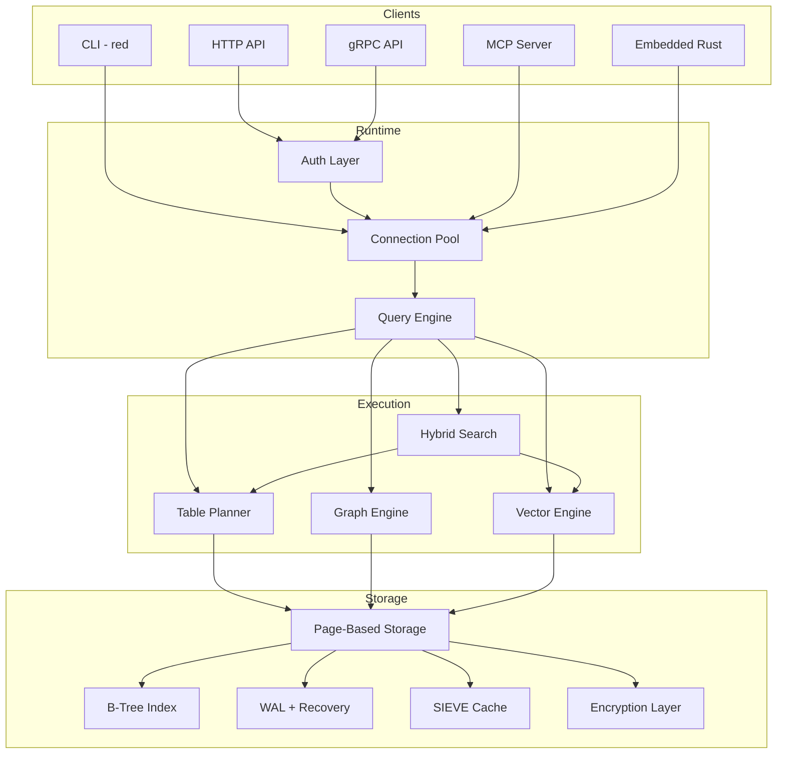

# RedDB

> Unified multi-model database: tables, documents, graphs, vectors, and key-value in one engine

**RedDB** is a standalone Rust database engine for multi-structure workloads. It stores operational rows, document payloads, linked graph entities, semantic vector embeddings, and key-value data in a single runtime with one API surface.

It is not "just SQL", "just document", or "just vector". It is a **multi-model database core** with one persistence layer and one operational surface for every data shape your application needs.

## Why RedDB?

| Feature | Description |
|:--------|:------------|
| **Multi-Model** | Rows, documents, graphs, vectors, and KV in one engine |
| **Single Binary** | One `red` binary for embedded, server, and serverless modes |
| **48 Native Types** | From `Integer` to `GeoPoint`, `Cidr`, `Semver`, and `Currency` |
| **Universal Query** | `FROM ANY` queries across all entity types simultaneously |
| **Graph Analytics** | PageRank, Louvain communities, shortest path, centrality, cycles |
| **Vector Search** | HNSW, IVF, product quantization, SIMD-accelerated distance |
| **AI-Ready** | 29 MCP tools for direct AI agent integration |

## Key Numbers

| Metric | Count |
|:-------|:------|
| gRPC RPCs | 116 |
| HTTP routes | 97+ |
| MCP tools | 29 |
| Native data types | 48 |
| Graph algorithms | 12+ |
| Deployment profiles | 3 (embedded, server, serverless) |

## Quick Example

Create a table row, a graph node, and a vector embedding in the same database:

```bash
# Start the server
red server --http --path ./data/reddb.rdb --bind 127.0.0.1:8080

# Insert a table row
curl -X POST http://127.0.0.1:8080/collections/hosts/rows \
  -H 'content-type: application/json' \
  -d '{"fields": {"ip": "10.0.0.1", "os": "linux", "critical": true}}'

# Insert a graph node
curl -X POST http://127.0.0.1:8080/collections/graph/nodes \
  -H 'content-type: application/json' \
  -d '{"label": "Host", "node_type": "host", "properties": {"ip": "10.0.0.1"}}'

# Insert a vector embedding
curl -X POST http://127.0.0.1:8080/collections/embeddings/vectors \
  -H 'content-type: application/json' \
  -d '{"dense": [0.12, 0.91, 0.44], "content": "host 10.0.0.1 running ssh"}'

# Query across all entity types
curl -X POST http://127.0.0.1:8080/query \
  -H 'content-type: application/json' \
  -d '{"query": "FROM ANY ORDER BY _score DESC LIMIT 10"}'
```

Or use the embedded Rust API directly:

```rust
use reddb::{RedDB, Value};

fn main() -> Result<(), Box<dyn std::error::Error>> {
    let db = RedDB::new();

    // Table row
    let host_id = db.row("hosts", vec![
        ("ip", Value::Text("10.0.0.1".into())),
        ("os", Value::Text("linux".into())),
        ("critical", Value::Boolean(true)),
    ]).save()?;

    // Graph node
    let node_id = db.node("graph", "Host")
        .node_type("host")
        .property("ip", "10.0.0.1")
        .save()?;

    // Vector embedding
    let vector_id = db.vector("embeddings")
        .dense(vec![0.12, 0.91, 0.44])
        .content("host 10.0.0.1 running ssh")
        .save()?;

    println!("host={host_id} node={node_id} vector={vector_id}");
    Ok(())
}
```

## Feature Matrix

| Area | Capabilities |
|:-----|:------------|
| **Storage** | Rows, documents, graph entities, vectors, KV, paged persistence, metadata sidecar |
| **Query** | Table, join, graph, path, vector, and hybrid execution; Gremlin, SPARQL, natural language modes |
| **Search** | Text, similarity, IVF, hybrid, tiered |
| **Graph** | Traversals, pathfinding, centrality (degree/closeness/betweenness/eigenvector), PageRank, HITS, Louvain, label propagation, clustering, cycles, topological sort |
| **Operations** | Health, stats, manifest, roots, snapshots, exports, retention, CRUD, bulk ingest, checkpoints |
| **Auth** | Users, roles (admin/write/read), API keys, session tokens, encrypted vault |
| **Runtime** | Embedded, HTTP server, gRPC server, MCP server, CLI, read replicas |

## Architecture



## Next Steps

<div class="grid-3">
  <a href="#/getting-started/installation" class="card">
    <h4>Installation</h4>
    <p>Install RedDB from source, binary, or Docker</p>
  </a>
  <a href="#/getting-started/quick-start" class="card">
    <h4>Quick Start</h4>
    <p>Store and query your first multi-model data in 5 minutes</p>
  </a>
  <a href="#/api/grpc" class="card">
    <h4>API Reference</h4>
    <p>Full gRPC and HTTP endpoint documentation</p>
  </a>
</div>
