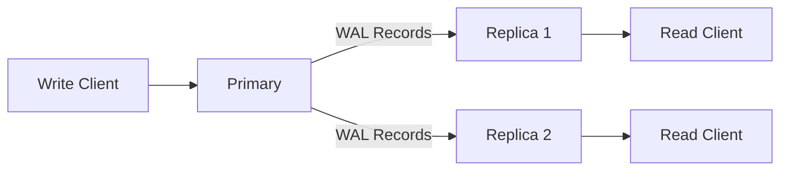

# Replication

> [!WARNING]
> Replication is now wired for snapshot bootstrap plus incremental
> logical WAL replay, but it is still an early implementation.
> Treat the primary as the only writer, keep snapshot/WAL retention
> enabled, and validate failover/recovery in staging before calling
> this production-grade multi-writer infrastructure.

RedDB supports primary-replica replication for read scaling and high availability.

## Architecture



## Setting Up

### Primary

```bash
red server \
  --path ./data/primary.rdb \
  --role primary \
  --grpc-bind 0.0.0.0:50051 \
  --http-bind 0.0.0.0:8080
```

### Replica

```bash
red replica \
  --primary-addr http://primary-host:50051 \
  --path ./data/replica.rdb \
  --grpc-bind 0.0.0.0:50051 \
  --http-bind 0.0.0.0:8080
```

Recommended topology:

- Primary exposes gRPC for replica streaming and HTTP for ops endpoints
- Replicas expose gRPC for service clients and HTTP for health, query, and observability
- All writes go to the primary

## How It Works

1. Writes go to the primary
2. Primary records changes in the local physical WAL and emits logical WAL records
3. Replicas bootstrap from a snapshot, then pull logical WAL records from the primary
4. Replicas apply logical WAL records to their local copy
5. Reads can be served from any replica

## Persisted Artifacts

The replication path is built around a timeline, not a single file:

- `data.rdb` or versioned snapshots for bootstrap
- a local logical WAL spool beside the data file, currently `data.rdb.logical.wal`
- archived logical WAL segments for incremental catch-up
- replication metadata such as `last_applied_lsn`
- a remote `head` manifest that points to the latest durable snapshot and WAL frontier

That is the stepping stone toward a more Turso-like design later. The
current architecture still runs the database locally per instance and
uses remote storage for snapshot/WAL persistence and replay.

## Monitoring

### Replication Status

```bash
# From primary
curl http://primary:8080/replication/status

# Via CLI
red status --bind primary:50051
```

Replica status includes operational fields beyond role and LSN:

- `state`: `idle`, `connecting`, `healthy`, `stalled_gap`, or `apply_error`
- `last_error`: latest replication failure reason, when present
- `last_seen_primary_lsn` and `last_seen_oldest_lsn`: the last frontier advertised by the primary

### Replication Snapshot

Get a full snapshot for bootstrapping a new replica:

```bash
grpcurl -plaintext 127.0.0.1:50051 reddb.v1.RedDb/ReplicationSnapshot
```

## Commit Policy

The primary chooses how durable a write must be **before** acking the
client. Set globally via `RED_PRIMARY_COMMIT_POLICY` (or per-request
in the gRPC bulk RPCs). Default is `local`.

| Policy | Acks the client when… | Use it for |
|--------|----------------------|------------|
| `local` | the WAL fsync on the primary returns | latency-sensitive, replicas catch up async |
| `remote_wal` | the WAL segment has been uploaded to the configured remote backend | DR posture without paying for replica fan-out |
| `ack_n` | at least N replicas have acked the LSN durable | synchronous group commit |
| `quorum` | a majority of registered replicas have acked the LSN durable | the safe synchronous default |

`ack_n` and `quorum` go through the `CommitWaiter` primitive
(`src/replication/commit_waiter.rs`). Replicas durably-ack via the
`AckReplicaLsn` gRPC, which records `last_seen / last_sent /
last_durable` per replica on the primary. When the deadline expires
the writer surface returns a typed `commit_wait_timed_out` error
(HTTP `503`, gRPC `DEADLINE_EXCEEDED`) and the metric
`reddb_commit_wait_total{outcome="timed_out"}` increments — the
write is **not** rolled back, just unacked.

```bash
# Force ack_n=2 with a 750 ms deadline
export RED_PRIMARY_COMMIT_POLICY=ack_n
export RED_PRIMARY_COMMIT_ACK_N=2
export RED_PRIMARY_COMMIT_DEADLINE_MS=750
```

## Replica apply state machine

The replica drives a `LogicalChangeApplier` that tracks LSN
contiguity. Three failure modes are surfaced as typed errors and as
`reddb_replica_apply_errors_total{kind=…}`:

- `gap` — incoming LSN is greater than `last_applied + 1`. Replica
  pauses apply, expects the operator to widen WAL retention or
  re-bootstrap from a snapshot covering the gap.
- `divergence` — same LSN with a different payload than recorded.
  This is page-the-operator immediately: split-brain or corruption.
  Apply stops and the replica refuses promotion.
- `apply` / `decode` — a record reached the apply path but the
  storage layer rejected it (schema mismatch, decode error). The
  replica goes `apply_error`, surfacing in `/replication/status`.

## Writer lease (split-brain prevention)

A single CAS-based writer lease lives on the configured remote
backend. Acquiring it is a precondition for entering write mode;
holding it is a precondition for keeping mutations open. Heartbeat
loss → lease expiry → the runtime fails closed and rejects every
public write boundary with `lease_not_held`.

| Backend | Lease semantics |
|---------|-----------------|
| Local filesystem | content-hash CAS + exclusive flock |
| S3-compatible | ETag + `If-Match` on PUT/DELETE |
| Generic HTTP | requires `RED_HTTP_CONDITIONAL_WRITES=true` and an ETag-aware service |
| Turso / D1 | n/a — single-writer by construction |

Set `RED_LEASE_REQUIRED=true` in serverless/multi-replica deployments;
a misconfigured backend that doesn't support conditional writes
refuses to acquire the lease and the writer gate stays closed by
design. Detail: [Operator Runbook §1](../operations/runbook.md#writer-lease-backend-matrix).

## Consistency Model

| Property | Guarantee |
|:---------|:---------|
| Write consistency | Primary-only (strong); commit policy drives ack durability |
| Read consistency | Eventual on replicas; `local` policy may ack before any replica has the record |
| `ack_n` / `quorum` | Linearizable across the acking set; reads from those replicas observe the committed LSN |
| Lag | Typically sub-second; `reddb_replica_lag_seconds` exposes per-replica wall-clock lag |
| SLO budget | `reddb_slo_lag_budget_remaining_seconds` = `RED_SLO_REPLICA_LAG_BUDGET_SECONDS` minus measured lag; negative = SLO breach |

## Docker Compose Example

See [Docker Deployment](/deployment/docker.md) for a complete primary + replica Docker Compose setup.
For a terminal-first walkthrough, see [Read Replica Tutorial](/guides/read-replica-tutorial.md).

> [!NOTE]
> Multi-region replication and automatic failover are planned for a future release. Currently, replication is single-region with manual failover.
