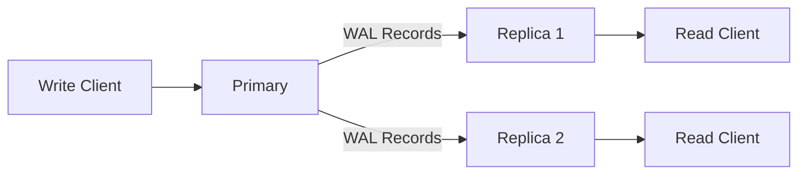

# Replication

> [!WARNING]
> Replication is now wired for snapshot bootstrap plus incremental
> logical WAL replay, but it is still an early implementation.
> Treat the primary as the only writer, keep snapshot/WAL retention
> enabled, and validate failover/recovery in staging before calling
> this production-grade multi-writer infrastructure.

RedDB supports primary-replica replication for read scaling and high availability.

## Architecture



## Setting Up

### Primary

```bash
red server \
  --path ./data/primary.rdb \
  --role primary \
  --grpc-bind 0.0.0.0:50051 \
  --http-bind 0.0.0.0:8080
```

### Replica

```bash
red replica \
  --primary-addr http://primary-host:50051 \
  --path ./data/replica.rdb \
  --grpc-bind 0.0.0.0:50051 \
  --http-bind 0.0.0.0:8080
```

Recommended topology:

- Primary exposes gRPC for replica streaming and HTTP for ops endpoints
- Replicas expose gRPC for service clients and HTTP for health, query, and observability
- All writes go to the primary

## How It Works

1. Writes go to the primary
2. Primary records changes in the local physical WAL and emits logical WAL records
3. Replicas bootstrap from a snapshot, then pull logical WAL records from the primary
4. Replicas apply logical WAL records to their local copy
5. Reads can be served from any replica

## Persisted Artifacts

The replication path is built around a timeline, not a single file:

- `data.rdb` or versioned snapshots for bootstrap
- a local logical WAL spool beside the data file, currently `data.rdb.logical.wal`
- archived logical WAL segments for incremental catch-up
- replication metadata such as `last_applied_lsn`
- a remote `head` manifest that points to the latest durable snapshot and WAL frontier

That is the stepping stone toward a more Turso-like design later. The
current architecture still runs the database locally per instance and
uses remote storage for snapshot/WAL persistence and replay.

## Monitoring

### Replication Status

```bash
# From primary
curl http://primary:8080/replication/status

# Via CLI
red status --bind primary:50051
```

Replica status includes operational fields beyond role and LSN:

- `state`: `idle`, `connecting`, `healthy`, `stalled_gap`, or `apply_error`
- `last_error`: latest replication failure reason, when present
- `last_seen_primary_lsn` and `last_seen_oldest_lsn`: the last frontier advertised by the primary

### Replication Snapshot

Get a full snapshot for bootstrapping a new replica:

```bash
grpcurl -plaintext 127.0.0.1:50051 reddb.v1.RedDb/ReplicationSnapshot
```

## Consistency Model

| Property | Guarantee |
|:---------|:---------|
| Write consistency | Primary-only (strong) |
| Read consistency | Eventual (replicas lag behind primary) |
| Lag | Typically sub-second |

## Docker Compose Example

See [Docker Deployment](/deployment/docker.md) for a complete primary + replica Docker Compose setup.
For a terminal-first walkthrough, see [Read Replica Tutorial](/guides/read-replica-tutorial.md).

> [!NOTE]
> Multi-region replication and automatic failover are planned for a future release. Currently, replication is single-region with manual failover.
