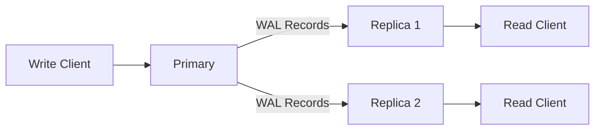

# Replication

RedDB supports primary-replica replication for read scaling and high availability.

## Architecture



## Setting Up

### Primary

```bash
red server --grpc --path ./data/primary.rdb --role primary --bind 0.0.0.0:50051
```

### Replica

```bash
red replica \
  --primary-addr http://primary-host:50051 \
  --path ./data/replica.rdb \
  --http --bind 0.0.0.0:8080
```

## How It Works

1. Writes go to the primary
2. Primary records changes in the WAL
3. Replicas pull WAL records from the primary
4. Replicas apply WAL records to their local copy
5. Reads can be served from any replica

## Monitoring

### Replication Status

```bash
# From primary
curl http://primary:8080/replication/status

# Via CLI
red status --bind primary:50051
```

### Replication Snapshot

Get a full snapshot for bootstrapping a new replica:

```bash
grpcurl -plaintext 127.0.0.1:50051 reddb.v1.RedDb/ReplicationSnapshot
```

## Consistency Model

| Property | Guarantee |
|:---------|:---------|
| Write consistency | Primary-only (strong) |
| Read consistency | Eventual (replicas lag behind primary) |
| Lag | Typically sub-second |

## Docker Compose Example

See [Docker Deployment](/deployment/docker.md) for a complete primary + replica Docker Compose setup.

> [!NOTE]
> Multi-region replication and automatic failover are planned for a future release. Currently, replication is single-region with manual failover.
