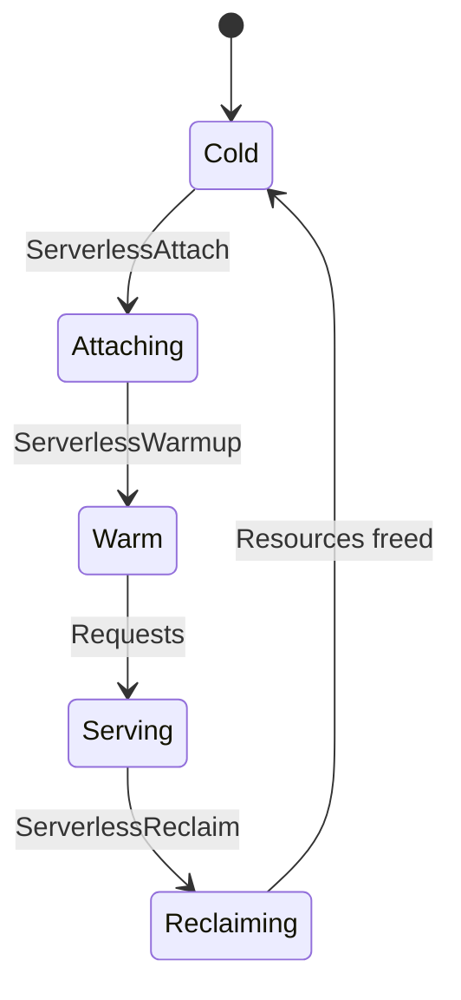

# Serverless Mode

Serverless mode is designed for edge/function workloads where the database instance has a limited lifecycle.

## Lifecycle



## Operations

### Attach

Connect a serverless instance to its storage:

```bash
grpcurl -plaintext \
  -d '{"payloadJson": "{\"path\":\"/data/reddb.rdb\"}"}' \
  127.0.0.1:50051 reddb.v1.RedDb/ServerlessAttach
```

### Warmup

Pre-load indexes and hot data:

```bash
grpcurl -plaintext \
  -d '{"payloadJson": "{}"}' \
  127.0.0.1:50051 reddb.v1.RedDb/ServerlessWarmup
```

### Reclaim

Release resources when the instance is no longer needed:

```bash
grpcurl -plaintext \
  -d '{"payloadJson": "{}"}' \
  127.0.0.1:50051 reddb.v1.RedDb/ServerlessReclaim
```

When you need platform-level hooks (or external workflows), call:

```bash
curl -X POST http://127.0.0.1:8080/tick \
  -H 'content-type: application/json' \
  -d '{"operations":["maintenance","retention","checkpoint"],"dry_run":false}'
```

`/tick` is equivalent to `/serverless/reclaim` for serverless reclaim semantics.

## Readiness

Check serverless-specific readiness:

```bash
curl http://127.0.0.1:8080/ready/serverless
```

This checks query, write, and repair readiness gates specific to the serverless profile.

## Remote Backends

Serverless mode pairs well with remote storage backends:

- **S3/R2**: Object storage for database files
- **Turso**: LibSQL for remote SQL storage
- **D1**: Cloudflare D1 for edge deployment

See [Remote Backends](/deployment/backends.md).
