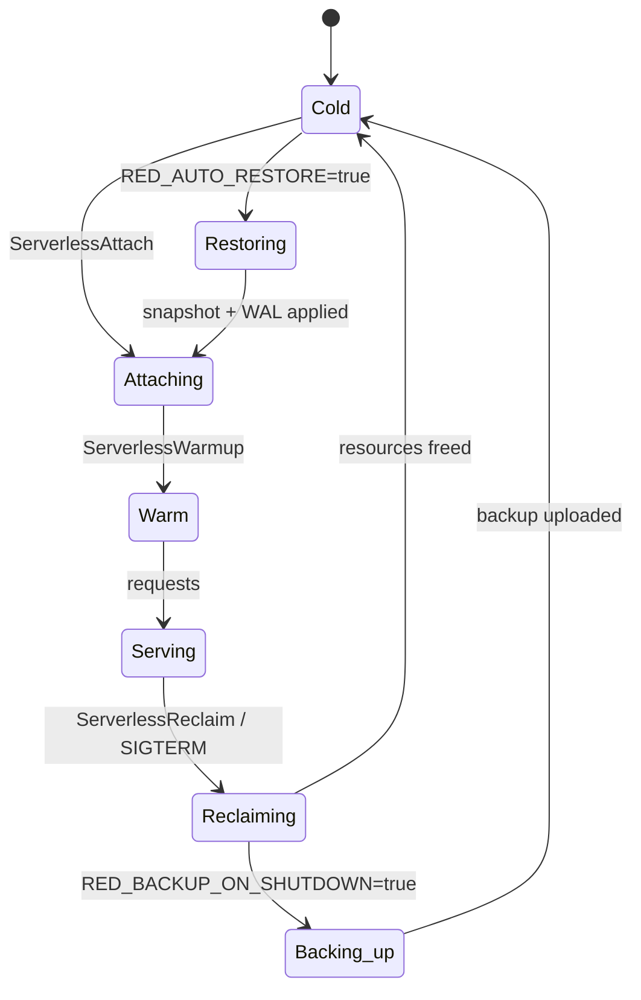

# Serverless Mode

Serverless mode targets edge / function workloads where the database
process has a finite lifecycle — the runtime spins up cold, attaches
to remote storage, serves traffic, and tears down on a signal. Since
the v1.0 release the serverless surface is a first-class deployment
shape with explicit lifecycle, resource limits, and CAS-based writer
fencing.

## Lifecycle



Cold-start phases (`restore`, `wal_replay`, `index_warmup`) are
recorded in `reddb_cold_start_phase_seconds{phase}` so dashboards
can see exactly where the boot budget was spent.

## Required environment

| Variable | Purpose |
|----------|---------|
| `RED_BACKEND` | `s3`, `fs`, `http`, `turso`, `d1`, or `none`. See [backends.md](backends.md). |
| `RED_AUTO_RESTORE` | `true` to rebuild the local data file from the latest manifest on cold boot. |
| `RED_BACKUP_ON_SHUTDOWN` | `true` to take a final backup on SIGTERM before exit. |
| `RED_LEASE_REQUIRED` | `true` to demand a CAS-backed writer lease. Multi-replica deployments must set this. |
| `RED_HTTP_BIND_ADDR` | data-plane bind, e.g. `0.0.0.0:8080`. |
| `RED_ADMIN_BIND` (opt) | dedicated `/admin/*` listener; pairs with `RED_METRICS_BIND` for split surfaces. |

Sensitive values support the `_FILE` companion convention (e.g.
`RED_S3_SECRET_KEY_FILE=/run/secrets/s3-secret`). See
[Auth & Security Overview](../security/overview.md#security-features).

## Resource limits

Operators pin instance budgets via `RED_MAX_*`. Each cap maps to a
gauge that tooling can read out of `/admin/status` or `/metrics`.

| Variable | Cap | Metric |
|----------|-----|--------|
| `RED_MAX_DB_SIZE_BYTES` | Primary DB file size | `reddb_limit_db_size_bytes` |
| `RED_MAX_CONNECTIONS` | Concurrent client connections | `reddb_limit_connections` |
| `RED_MAX_QPS` | Sustained per-instance QPS | `reddb_limit_qps` |
| `RED_MAX_QPS_PER_CALLER` | Per-caller token-bucket QPS (HMAC keyed by `bearer:<sha256-prefix>` / `replica:<id>` / `anon`) | `reddb_quota_rejected_total{principal}` |
| `RED_MAX_BATCH_SIZE` | Rows per bulk DML batch | `reddb_limit_batch_size` |
| `RED_MAX_MEMORY_BYTES` | Soft RSS budget; honoured against the cgroup memory hint when present | `reddb_limit_memory_bytes` |

Hot-path enforcement applies before request dispatch — once the cap
is hit the surface returns `429` with a `Retry-After` header, while
the engine keeps serving in-flight work.

## Server surfaces

Three logical surfaces live on the HTTP transport. Operators can
pin each to its own listener:

- **Public** (`/collections/*`, `/query`, `/auth/*`) — the data
  plane that customer traffic hits.
- **Admin** (`/admin/*`) — backup, restore, promote, openapi,
  encryption status, dynamic readonly toggle. Audit-logged.
- **Metrics** (`/metrics`, `/health/*`, `/ready/*`) — Prometheus
  scrape + readiness probes.

```bash
export RED_HTTP_BIND_ADDR=0.0.0.0:8080      # public
export RED_ADMIN_BIND=127.0.0.1:18080       # admin (loopback, behind ingress)
export RED_METRICS_BIND=0.0.0.0:9090         # scrape target
```

`ServerSurface::AdminOnly` and `ServerSurface::MetricsOnly` listeners
serve **only** the routes that belong to them, so an exposed metrics
port can't be tricked into accepting writes.

## Operations

### Attach

Connect a serverless instance to its storage:

```bash
grpcurl -plaintext \
  -d '{"payloadJson": "{\"path\":\"/data/reddb.rdb\"}"}' \
  127.0.0.1:50051 reddb.v1.RedDb/ServerlessAttach
```

### Warmup

Pre-load indexes and hot data:

```bash
grpcurl -plaintext \
  -d '{"payloadJson": "{}"}' \
  127.0.0.1:50051 reddb.v1.RedDb/ServerlessWarmup
```

### Reclaim

Release resources when the instance is no longer needed:

```bash
grpcurl -plaintext \
  -d '{"payloadJson": "{}"}' \
  127.0.0.1:50051 reddb.v1.RedDb/ServerlessReclaim
```

When you need platform-level hooks (or external workflows), call:

```bash
curl -X POST http://127.0.0.1:8080/tick \
  -H 'content-type: application/json' \
  -d '{"operations":["maintenance","retention","checkpoint"],"dry_run":false}'
```

`/tick` is equivalent to `/serverless/reclaim` for serverless reclaim
semantics.

### Dynamic read-only toggle

Flip the writer gate without restarting:

```bash
curl -X POST http://127.0.0.1:8080/admin/readonly \
  -H "Authorization: Bearer $RED_ADMIN_TOKEN" \
  -d '{"enabled": true}'
```

The toggle is the safe step before forced restore, manual promotion,
or blue/green flips.

## Readiness

```bash
curl http://127.0.0.1:8080/ready/serverless
```

This checks query, write, and repair readiness gates specific to the
serverless profile. Pair with `red doctor` for an end-to-end probe
that maps the same gates onto exit codes.

## Lifecycle hooks

| Signal | Behavior |
|--------|----------|
| `SIGTERM` | Drain in-flight requests, take final backup if `RED_BACKUP_ON_SHUTDOWN=true`, release writer lease, exit `0`. |
| `SIGINT` | Same as SIGTERM; intended for local dev. |
| `SIGHUP` | Reload every `*_FILE` companion in place — admin token / S3 secret / HTTP backend creds rotate without restart. |
| `SIGUSR1` | Trigger a checkpoint + manifest rewrite. Useful for ops scripts. |

## Reference deployment manifests

End-to-end examples live in `examples/`. All set
`RED_LEASE_REQUIRED=true`:

| Platform | Manifest |
|----------|----------|
| AWS ECS Fargate | `examples/aws-ecs/task-definition.json` |
| AWS App Runner | `examples/aws-app-runner/apprunner.yaml` |
| AWS Lambda + EFS (read replica) | `examples/aws-lambda/template.yaml` |
| Azure Container Apps | `examples/azure-container-apps/manifest.yaml` |
| Cloudflare Containers (Workers + D1) | `examples/cloudflare/wrangler.toml` |
| Fly Machines | `examples/fly/fly.toml` |
| Google Cloud Run | `examples/gcp-cloud-run/service.yaml` |
| HashiCorp Nomad | `examples/nomad/reddb.nomad.hcl` |
| Kubernetes (StatefulSet + PVC) | `examples/kubernetes/reddb.yaml` |

Static-binary container image is shipped via `Dockerfile.musl`
(release profile `release-static`, `panic = "abort"`), suitable for
distroless / scratch base images.

## Remote Backends

Serverless mode pairs with any remote backend. Most production
deployments use S3-compatible storage so the writer lease has a
home. See [Remote Backends](backends.md) for the full matrix and
the conditional-write contract.

## See also

- [Backends](backends.md) — `RED_BACKEND` matrix, CAS contract
- [Replication](replication.md) — commit policy, writer lease
- [Operator Runbook](../operations/runbook.md) — full deploy / DR playbook
- [Metrics Spec](../spec/metrics.md) — every gauge / counter named above
- [Admin API](../spec/admin-api.openapi.yaml) — every `/admin/*` endpoint
