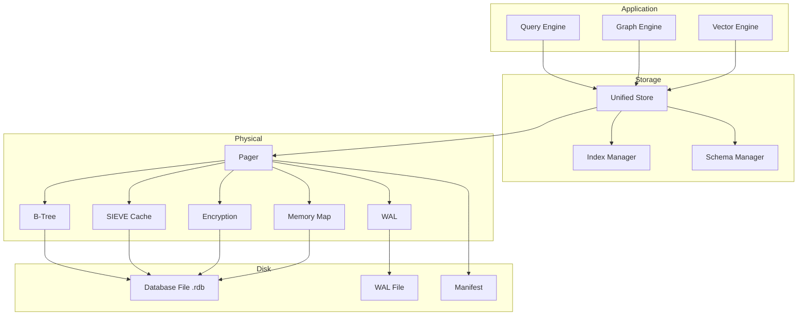

# Storage Engine Architecture

RedDB uses a layered storage engine that handles all data models through a unified persistence layer.

## Layer Overview



## Physical Layer

The physical layer manages durable file I/O:

- **Pager**: Page-based I/O with configurable page sizes
- **WAL**: Write-ahead log for crash recovery
- **SIEVE Cache**: Adaptive page cache (SIEVE eviction algorithm)
- **Memory Map**: Optional mmap for read-heavy workloads
- **Encryption**: AES-256-GCM encryption at the page level

## Logical Catalog

The catalog tracks the database's logical structure:

- **Collections**: Named entity containers
- **Schema Manifests**: Column type definitions
- **Index Descriptors**: Index metadata and lifecycle state
- **Graph Projections**: Named graph views for analytics
- **Analytics Jobs**: Scheduled graph computation metadata

## Execution Layer

The execution layer processes queries across all data models:

- **Table Planner**: Cost-based optimizer for SELECT/INSERT/UPDATE/DELETE
- **Graph Engine**: Pattern matching, traversal, pathfinding, analytics
- **Vector Engine**: HNSW, IVF, PQ, hybrid search
- **Join Executor**: Nested-loop joins between tables

## Entity Model

All data in RedDB is stored as entities. Every entity has:

| Field | Description |
|:------|:------------|
| `entity_id` | Unique u64 identifier (auto-assigned) |
| `collection` | Collection name |
| `kind` | Entity kind (row, node, edge, vector, document, kv) |
| `payload` | Kind-specific data (fields, properties, dense vector, etc.) |
| `metadata` | Optional key-value metadata |

## File Layout

A persistent RedDB database consists of:

```
data/
  reddb.rdb          # Main database file (pages)
  reddb.rdb.wal      # Write-ahead log
  reddb.rdb.manifest  # Physical metadata manifest
```

## Page Structure

The database file is divided into fixed-size pages:

| Section | Purpose |
|:--------|:--------|
| Header page | Database metadata, version, configuration |
| Collection root pages | One root per collection |
| B-Tree pages | Index and data pages |
| Overflow pages | Large values that don't fit in a single page |
| Free list | Recycled page tracking |
