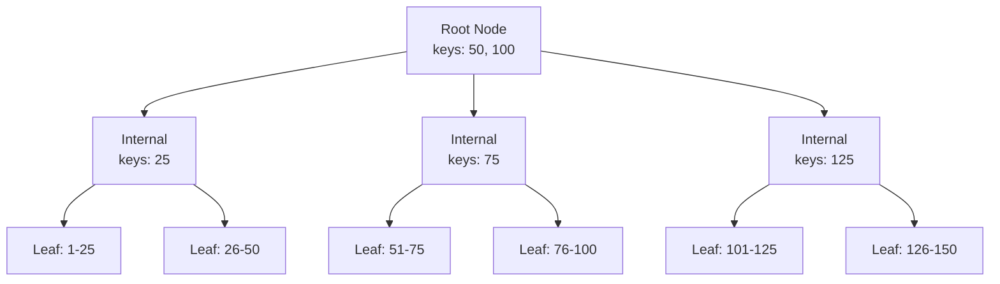

# B-Tree Index

RedDB uses B-Trees as the primary index structure for all entity lookups and range scans.

## Overview

The B-Tree implementation supports:

- Point lookups by entity ID
- Range scans with start/end bounds
- Ordered iteration
- Efficient insert and delete
- Page-level persistence

## Structure

## Operations

| Operation | Complexity | Description |
|:----------|:-----------|:------------|
| Point lookup | O(log n) | Find entity by ID |
| Range scan | O(log n + k) | Scan k entities in a range |
| Insert | O(log n) | Insert with page splits |
| Delete | O(log n) | Delete with page merges |
| Ordered iteration | O(n) | Full scan in key order |

## Bulk Insert Fast Path

When the incoming keys are already sorted (the wire bulk protocol
and time-series chunk writer both guarantee this), the B-tree
streams them into leaves without re-descending from the root per
key. When a leaf fills up, the cursor hops to the right sibling via
the sibling pointer and keeps filling — root-to-leaf traversal
only happens once per split, not once per key.

## Page Splits

When a leaf node is full, it splits into two nodes:

1. Allocate a new page
2. Move the upper half of entries to the new page
3. Insert a separator key into the parent
4. If the parent is full, split recursively

## Index Types

RedDB uses B-Trees for:

- **Primary index**: Entity ID lookups per collection
- **Secondary indexes**: Column-based indexes for filtered queries
- **Graph indexes**: Node label and edge label lookups

## Configuration

B-Tree parameters are tuned for the page size:

| Parameter | Value | Description |
|:----------|:------|:------------|
| Branching factor | ~128 | Keys per internal node |
| Leaf capacity | ~64 | Entries per leaf node |
| Page size | 4096 bytes | Default page size |
