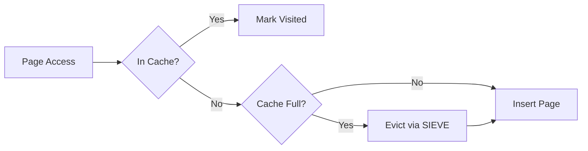

# SIEVE Cache

RedDB uses the SIEVE eviction algorithm for its page cache, providing better hit rates than traditional LRU for database workloads.

## What is SIEVE?

SIEVE is a cache eviction algorithm that:

- Tracks access frequency with minimal overhead
- Outperforms LRU on skewed workloads (common in databases)
- Uses O(1) operations for both lookup and eviction
- Adapts to changing access patterns

## How It Works

1. **On access**: Mark the page as recently used
2. **On eviction**: Scan from a hand pointer, evicting the first page not recently used
3. **On insert**: If cache is full, evict first, then insert



## Benefits for RedDB

| Property | Advantage |
|:---------|:---------|
| Scan resistance | Range scans don't flush hot pages |
| Frequency awareness | Frequently accessed pages stay cached |
| Low overhead | No lock contention on reads |
| Adaptive | Adjusts to workload changes |

## Cache Statistics

Cache performance is visible in the runtime stats:

```bash
curl -s http://127.0.0.1:8080/stats
```

## Relation to Page-Based Storage

The SIEVE cache sits between the query engine and the pager:

```
Query Engine --> SIEVE Cache --> Pager --> Disk
                    |
                    +-- Cache Hit: return page from memory
                    +-- Cache Miss: read from pager, cache result
```
