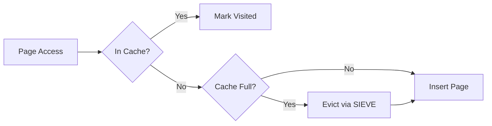

# SIEVE Cache

RedDB uses the SIEVE eviction algorithm for its page cache, providing better hit rates than traditional LRU for database workloads.

## What is SIEVE?

SIEVE is a cache eviction algorithm that:

- Tracks access frequency with minimal overhead
- Outperforms LRU on skewed workloads (common in databases)
- Uses O(1) operations for both lookup and eviction
- Adapts to changing access patterns

## How It Works

1. **On access**: Mark the page as recently used
2. **On eviction**: Scan from a hand pointer, evicting the first page not recently used
3. **On insert**: If cache is full, evict first, then insert



## Benefits for RedDB

| Property | Advantage |
|:---------|:---------|
| Scan resistance | Range scans don't flush hot pages |
| Frequency awareness | Frequently accessed pages stay cached |
| Low overhead | No lock contention on reads |
| Adaptive | Adjusts to workload changes |

## Cache Statistics

Cache performance is visible in the runtime stats:

```bash
curl -s http://127.0.0.1:5000/stats
```

## Relation to Page-Based Storage

The SIEVE cache sits between the query engine and the pager:

```
Query Engine --> SIEVE Cache --> Pager --> Disk
                    |
                    +-- Cache Hit: return page from memory
                    +-- Cache Miss: read from pager, cache result
```

---

## Result Cache

On top of the page cache, RedDB maintains a **query result cache** for
small `SELECT` results. Keys include the SQL text plus the current
tenant and auth identity, so scoped callers do not share cached rows.

| Property | Value |
|:---------|:------|
| TTL | 30 seconds |
| Max entries | 1 000 |
| Eviction | Oldest entry removed when full |
| Scope | SELECT queries only |
| Blob backend L2 | `<data-path>.result-cache.l2` plus `<data-path>.result-cache.blob-cache.ctl` |

### How It Works

1. Before parsing a query, the runtime checks the result cache
2. On cache hit with a valid TTL, the cached result is returned immediately (no parse, no plan, no scan)
3. On cache miss, the query executes normally and the result is stored
4. Writes invalidate affected result-cache entries. The Blob Cache
   backend uses a conservative namespace flush for table writes so
   unrehydrated L2 entries from a previous process cannot become stale.

When `runtime.result_cache.backend = 'blob_cache'`, cacheable results
are written as Blob Cache payloads, not only in-memory sidecars. A clean
runtime restart can rehydrate eligible entries from L2 until their
30-second TTL expires. Statements rejected by the normal safety gate
still do not persist: volatile builtins, active-transaction reads,
oversized result sets, vault results, and pre-serialized fast paths are
recomputed instead.

```
SELECT * FROM users WHERE active = true
  1st call: ~5ms   (cold: parse + plan + scan)
  2nd call: <0.1ms (cache hit, clone only)
  After INSERT: ~5ms (cache invalidated, re-executes)
```

### Invalidation

The legacy backend is cleared or narrowed by dependency on write paths:
- SQL DML: `INSERT`, `UPDATE`, `DELETE`
- REST API: entity create, patch, delete
- Retention policy sweep
- Any operation that calls the runtime cache invalidation hooks

The Blob Cache backend deliberately chooses a broader namespace
invalidation on table writes. That costs occasional misses after
unrelated writes, but preserves correctness for durable entries that
exist only in L2 after restart.

---

## Query Plan Cache

Parsed query plans are cached to avoid re-parsing and re-planning identical SQL strings.

| Property | Value |
|:---------|:------|
| Capacity | 1 000 plans |
| TTL | 1 hour |
| Eviction | LRU (least recently used) |

### How It Works

1. Before calling `parse_multi(query)`, the runtime checks the plan cache
2. On cache hit, the cached `QueryExpr` is used directly (skips lexer + parser + planner)
3. On cache miss, the query is parsed normally and the result is stored

The plan cache saves ~100us per query for repeated SQL patterns. It is especially effective for application code that issues the same parameterized queries.

### Cache Layers Summary

```
┌──────────────────────────────────────────────────────┐
│ Result Cache   (30s TTL, 1K entries)                  │
│   Hit → return full result, zero compute              │
├──────────────────────────────────────────────────────┤
│ Plan Cache     (1h TTL, 1K entries, LRU)              │
│   Hit → skip parse/plan, go straight to execution     │
├──────────────────────────────────────────────────────┤
│ SIEVE Page Cache (10K pages, ~40MB)                   │
│   Hit → return page from memory, no disk I/O          │
├──────────────────────────────────────────────────────┤
│ Entity Cache   (10K entities, LRU)                    │
│   Hit → skip cross-collection scan for get_any(id)    │
└──────────────────────────────────────────────────────┘
```

## Proposed Blob Cache

RedDB also has a proposed native **Blob Cache** module for Redis-adjacent cache
workloads. Unlike the page cache, result cache, and entity cache, Blob Cache is
designed around arbitrary byte values, rich TTL policy, durable L2 storage, fast
existence checks, and explicit invalidation by key, prefix, tag, dependency, or
namespace generation.

See [Cache](/data-models/cache.md) and
[ADR 0006](/adr/0006-tiered-blob-cache.md) for the proposed Interface and
rollout plan.
