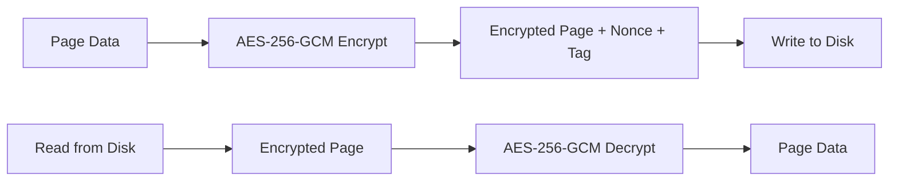

# Encryption at Rest

RedDB supports AES-256-GCM encryption at the page level for data at rest.

## Enabling Encryption

Compile with the `encryption` feature:

```toml
[dependencies]
reddb = { version = "0.1", features = ["encryption"] }
```

## How It Works

Encryption is applied at the page level:

1. Each page is encrypted with AES-256-GCM before writing to disk
2. A unique nonce is generated per page write
3. Pages are decrypted on read
4. The encryption key is derived from a user-provided passphrase



## Cryptographic Primitives

RedDB uses the following cryptographic primitives:

| Primitive | Algorithm | Use |
|:----------|:----------|:----|
| Encryption | AES-256-GCM | Page-level encryption |
| Hashing | SHA-256 | Integrity verification |
| MAC | HMAC-SHA256 | Authentication |
| Random | OS entropy | Nonce and key generation |
| UUID | v4 (random) | Entity identifiers |

## Auth Vault

When `--vault` is enabled, authentication data (users, roles, API keys) is stored in encrypted reserved pages within the main database file:

```bash
red server --http --path ./data/reddb.rdb --vault --bind 0.0.0.0:8080
```

The vault uses a certificate-seal model where the encryption key is sealed to the database file.

> [!WARNING]
> Encryption adds overhead to every page read and write. Enable it only when data at rest protection is required.
