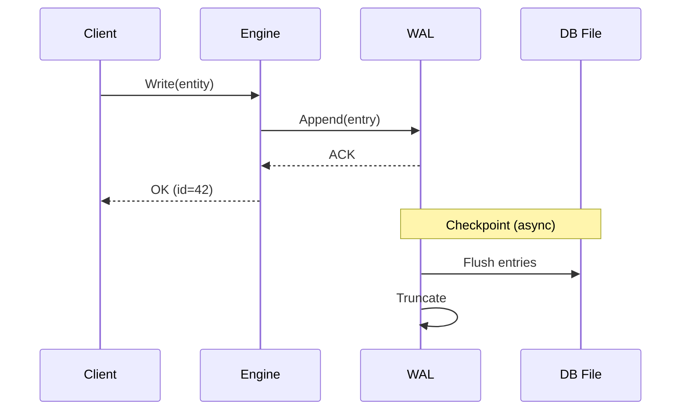
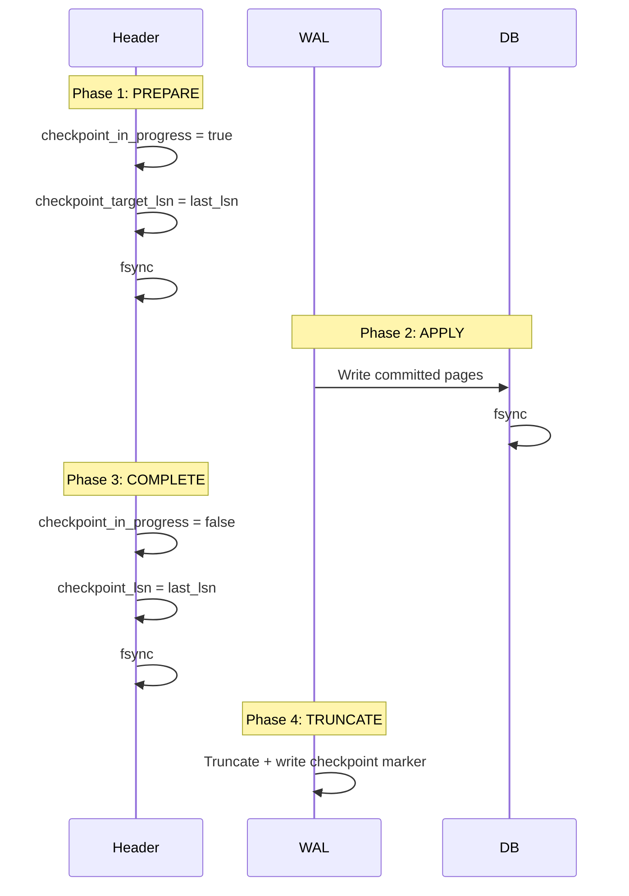

# WAL & Recovery

The Write-Ahead Log (WAL) ensures durability and crash recovery for persistent databases.

## How It Works

Every write operation follows the WAL protocol:

1. Write the change to the WAL file first
2. Acknowledge the write to the caller
3. Eventually flush WAL entries to the main database file (checkpoint)



## Recovery

On startup, RedDB checks for unflushed WAL entries:

1. Open the database file
2. Open the WAL file
3. Replay any entries not yet checkpointed
4. Resume normal operation

This ensures no committed writes are lost, even after a crash.

## Checkpointing

Checkpoints flush WAL entries to the main database file. They happen:

- Automatically when the WAL reaches a size threshold
- On graceful shutdown
- On demand via the API

```bash
# Force a checkpoint
curl -X POST http://127.0.0.1:8080/checkpoint

# Via gRPC
grpcurl -plaintext 127.0.0.1:50051 reddb.v1.RedDb/Checkpoint
```

## WAL File

The WAL is stored alongside the main database file:

```
data/
  reddb.rdb       # Main database
  reddb.rdb.wal   # Write-ahead log
```

## Two-Phase Checkpoint Protocol

The checkpoint process is crash-safe via a two-phase protocol with a flag stored in the database header (page 0, offset 192):



### Crash Recovery Scenarios

| Crash point | On recovery |
|:------------|:------------|
| Before PREPARE completes | Flag not set; WAL replayed normally |
| Between PREPARE and COMPLETE | Flag detected; WAL replayed from scratch (idempotent) |
| After COMPLETE, before TRUNCATE | checkpoint_lsn updated; WAL replayed and truncated |
| After TRUNCATE | Clean state, nothing to recover |

The key insight: page writes are **idempotent** (last-write-wins), so replaying the WAL after a partially-applied checkpoint is always safe.

---

## Durability Guarantees

| Mode | Durability | Performance |
|:-----|:-----------|:------------|
| WAL-based (default) | All ACKed writes survive crash | High throughput |
| In-memory (no path) | None -- data lost on exit | Maximum performance |

### 7-Layer Defense

RedDB uses 7 layers of corruption defense:

1. **File lock** -- exclusive `flock` prevents concurrent writers
2. **Double-write buffer** -- `.rdb-dwb` protects against torn pages
3. **Header shadow** -- `.rdb-hdr` recovers corrupted page 0
4. **Metadata shadow** -- `.rdb-meta` recovers corrupted page 1
5. **fsync discipline** -- all critical writes followed by `sync_all()`
6. **Two-phase checkpoint** -- crash-safe WAL application (described above)
7. **Binary store CRC32** -- V3 files have integrity footer + atomic rename

See [File Format Specification](/engine/file-format.md) for byte-level details.
