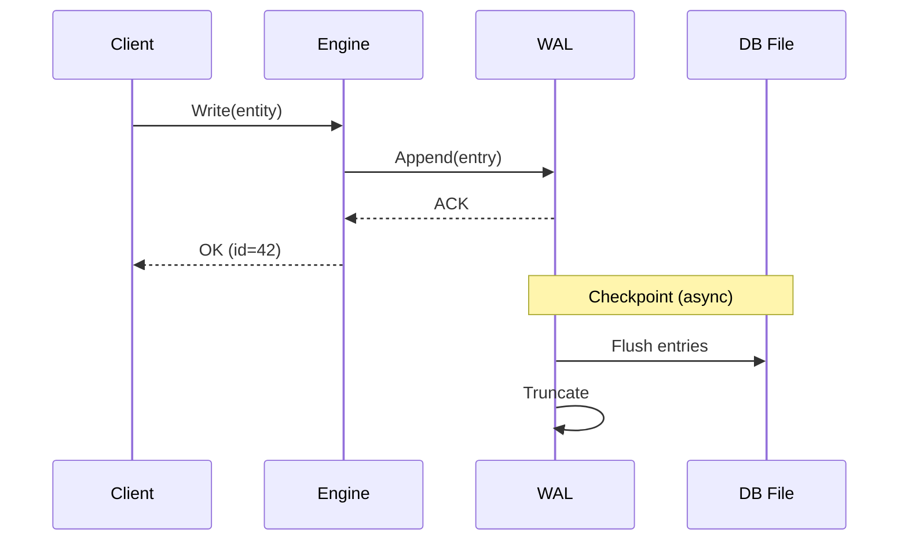

# WAL & Recovery

The Write-Ahead Log (WAL) ensures durability and crash recovery for persistent databases.

## How It Works

Every write operation follows the WAL protocol:

1. Write the change to the WAL file first
2. Acknowledge the write to the caller
3. Eventually flush WAL entries to the main database file (checkpoint)



## Recovery

On startup, RedDB checks for unflushed WAL entries:

1. Open the database file
2. Open the WAL file
3. Replay any entries not yet checkpointed
4. Resume normal operation

This ensures no committed writes are lost, even after a crash.

## Checkpointing

Checkpoints flush WAL entries to the main database file. They happen:

- Automatically when the WAL reaches a size threshold
- On graceful shutdown
- On demand via the API

```bash
# Force a checkpoint
curl -X POST http://127.0.0.1:8080/checkpoint

# Via gRPC
grpcurl -plaintext 127.0.0.1:50051 reddb.v1.RedDb/Checkpoint
```

## WAL File

The WAL is stored alongside the main database file:

```
data/
  reddb.rdb       # Main database
  reddb.rdb.wal   # Write-ahead log
```

## Durability Guarantees

| Mode | Durability | Performance |
|:-----|:-----------|:------------|
| WAL-based (default) | Best-effort -- all ACKed writes survive crash | High throughput |
| In-memory (no path) | None -- data lost on exit | Maximum performance |

> [!NOTE]
> RedDB currently provides WAL-based best-effort durability. Full ACID transactions with cross-entity atomicity are planned for a future release.
