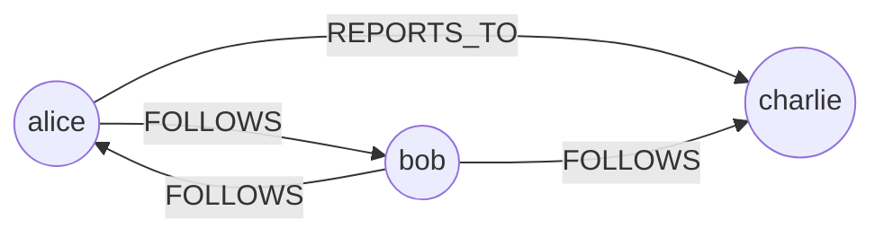

# Node & Edge Model

RedDB's graph engine uses a labeled property graph model where nodes and edges carry labels, types, and arbitrary properties.

## Nodes

A node represents an entity in the graph:

| Field | Required | Description |
|:------|:---------|:------------|
| `label` | Yes | Unique identifier within the collection (e.g., `"alice"`, `"web-01"`) |
| `node_type` | No | Classification (e.g., `"person"`, `"host"`, `"service"`) |
| `properties` | No | Arbitrary key-value properties |
| `metadata` | No | Operational metadata |

```bash
curl -X POST http://127.0.0.1:8080/collections/social/nodes \
  -H 'content-type: application/json' \
  -d '{
    "label": "alice",
    "node_type": "person",
    "properties": {
      "name": "Alice Johnson",
      "department": "engineering"
    }
  }'
```

## Edges

An edge represents a directed relationship between two nodes:

| Field | Required | Description |
|:------|:---------|:------------|
| `label` | Yes | Relationship type (e.g., `"FOLLOWS"`, `"REPORTS_TO"`) |
| `from_rid` | Yes | Source node RedDB ID |
| `to_rid` | Yes | Target node RedDB ID |
| `weight` | No | Numeric weight (default `1.0`) |
| `properties` | No | Arbitrary key-value properties |
| `metadata` | No | Operational metadata |

```bash
curl -X POST http://127.0.0.1:8080/collections/social/edges \
  -H 'content-type: application/json' \
  -d '{
    "label": "FOLLOWS",
    "from_rid": 102,
    "to_rid": 103,
    "weight": 1.0,
    "properties": {"since": "2024-01-01"}
  }'
```

## Graph Storage

Nodes and edges are stored as entities in the same collection system as rows and vectors. They participate in:

- Universal queries (`FROM ANY`)
- Collection scans
- Metadata filtering
- Bulk operations

## Adjacency

The graph engine maintains adjacency lists for efficient traversal:



## Multi-Collection Graphs

Graph entities from different collections can be queried together using graph projections. A projection defines which collections, node types, and edge labels to include.

## RedDB ID Referencing

Edges reference nodes by RedDB ID (`rid`), which is a globally unique u64.
Use `from_rid` for the source endpoint and `to_rid` for the target endpoint.
This means edges can connect nodes across collections when using projections.
