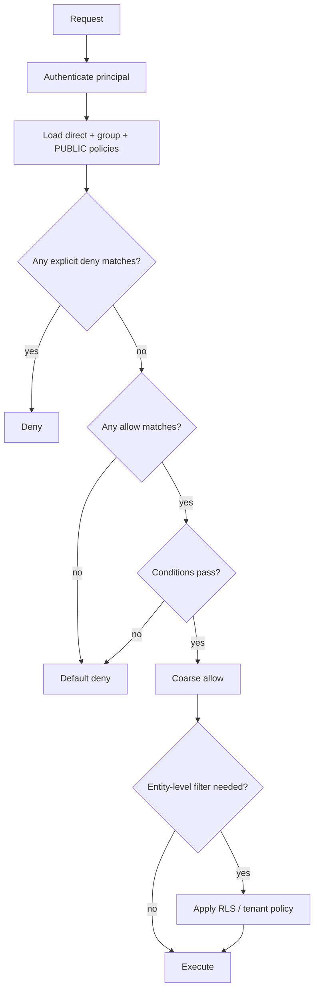

# Permission Recipes

This cookbook turns the RedDB permission model into production patterns you
can copy, simulate, and adapt. Use it after reading the
[Permissioning Handbook](/security/permissions.md) when you already know the
resource vocabulary and want a concrete shape for an application.

Every recipe has four parts:

| Part | Purpose |
|---|---|
| Intent | The real-world permission boundary. |
| Policy | The IAM-style policy document. |
| Attach | The SQL or HTTP operation that binds it to a user or group. |
| Prove it | Simulator calls that show allow, explicit deny, or default deny. |

## Status Legend

RedDB's policy vocabulary is intentionally larger than the runtime hooks that
are wired today. The simulator understands every resource in this cookbook.
The runtime currently enforces IAM policies mainly on table DML and policy
management paths; see the [current enforcement map](/security/permissions.md#current-enforcement-map)
before relying on model-specific runtime enforcement.

| Label | Meaning |
|---|---|
| Runtime-enforced | The live query/API path checks this IAM policy today. |
| Simulator/audit vocabulary | The resource name is valid and stable, but the live path may still be role-gated or RLS-gated. |
| RLS-enforced | Entity filtering happens through row/entity-level policies, not IAM. |
| Role-gated today | Use service-account separation or deployment controls until the IAM hook lands. |

## Decision Flow



## 1. Read One Table, Hide PII

Intent: analysts can read `orders`, but not sensitive user columns.

Status:

| Surface | Status |
|---|---|
| `table:orders` | Runtime-enforced for SQL `SELECT`. |
| `column:users.email` | Simulator/audit vocabulary until the specific query path has column enforcement. Use a safe view or omit fields at the query boundary today. |

Policy:

```json
{
  "version": 1,
  "id": "analyst-orders",
  "statements": [
    {
      "sid": "read-orders",
      "effect": "allow",
      "actions": ["select"],
      "resources": ["table:orders"]
    },
    {
      "sid": "deny-pii",
      "effect": "deny",
      "actions": ["select"],
      "resources": ["column:users.email", "column:users.phone", "column:users.ssn"]
    }
  ]
}
```

Attach:

```sql
CREATE POLICY 'analyst-orders' AS $$ { ... } $$;
ATTACH POLICY 'analyst-orders' TO GROUP analysts;
ALTER USER alice ADD GROUP analysts;
```

Prove it:

```sql
SIMULATE alice ACTION select ON table:orders;
-- decision=allow, matched_sid=read-orders

SIMULATE alice ACTION select ON column:users.email;
-- decision=deny, matched_sid=deny-pii, reason=explicit deny
```

Production note: expose `orders_safe` or `users_public` views until the SQL
projection path enforces `column:*` directly.

## 2. Multi-Tenant SaaS Reader

Intent: a tenant user can read rows in shared tables only for the tenant bound
to the session.

Status:

| Surface | Status |
|---|---|
| `table:orders` | Runtime-enforced for SQL `SELECT`. |
| `tenant_match` | Policy condition evaluated by the policy engine. |
| `TENANT BY` / RLS | RLS-enforced for table rows. |

Schema:

```sql
CREATE TABLE orders (
  id INT,
  tenant_id TEXT,
  total DECIMAL,
  status TEXT
) TENANT BY (tenant_id);
```

Policy:

```json
{
  "version": 1,
  "id": "tenant-reader",
  "statements": [
    {
      "sid": "read-own-tenant-tables",
      "effect": "allow",
      "actions": ["select"],
      "resources": ["table:orders", "table:invoices", "table:tickets"],
      "condition": { "tenant_match": true }
    }
  ]
}
```

Attach:

```sql
ATTACH POLICY 'tenant-reader' TO GROUP tenant_readers;
ALTER USER acme_alice ADD GROUP tenant_readers;
```

Prove it:

```http
POST /admin/policies/simulate
```

```json
{
  "principal": "acme_alice",
  "action": "select",
  "resource": { "kind": "table", "name": "orders", "tenant": "acme" },
  "ctx": { "current_tenant": "acme" }
}
```

Expected: `decision=allow`, `matched_sid=read-own-tenant-tables`.

```json
{
  "principal": "acme_alice",
  "action": "select",
  "resource": { "kind": "table", "name": "orders", "tenant": "globex" },
  "ctx": { "current_tenant": "acme" }
}
```

Expected: `decision=default_deny`, usually with a condition/default-deny
reason.

Runtime query:

```sql
SET TENANT 'acme';
SELECT id, total, status FROM orders;
```

The IAM policy answers "can this principal read orders at all?" The tenant/RLS
layer answers "which order rows are visible?"

## 3. Tenant Admin Without Platform Admin

Intent: tenant admins can manage data inside their own tenant but cannot
manage policies, platform users, backups, or other tenants.

Status:

| Surface | Status |
|---|---|
| table DML | Runtime-enforced. |
| `tenant/<id>` resource qualification | Canonical simulator/audit vocabulary; use with `tenant_match`. |
| DDL/admin actions | Role-gated today unless policy-management path. |

Policy:

```json
{
  "version": 1,
  "id": "tenant-admin",
  "statements": [
    {
      "sid": "tenant-data",
      "effect": "allow",
      "actions": ["select", "insert", "update", "delete"],
      "resources": ["table:*"],
      "condition": { "tenant_match": true, "mfa": true }
    },
    {
      "sid": "no-platform-admin",
      "effect": "deny",
      "actions": ["admin:*", "policy:*", "drop", "alter"],
      "resources": ["*"]
    }
  ]
}
```

Attach:

```sql
ATTACH POLICY 'tenant-admin' TO GROUP tenant_admins;
ALTER USER acme_owner ADD GROUP tenant_admins;
```

Prove it:

```http
POST /admin/policies/simulate
```

```json
{
  "principal": "acme_owner",
  "action": "update",
  "resource": { "kind": "table", "name": "orders", "tenant": "acme" },
  "ctx": { "current_tenant": "acme", "mfa": true }
}
```

Expected: `decision=allow`, `matched_sid=tenant-data`.

```sql
SIMULATE acme_owner ACTION policy:put ON policy:analyst;
-- decision=deny, matched_sid=no-platform-admin
```

## 4. Ingest-Only Service Account

Intent: a worker can write telemetry/events but cannot read back what it wrote.

Status:

| Surface | Status |
|---|---|
| table `insert` | Runtime-enforced for SQL `INSERT`. |
| table `select` deny | Runtime-enforced for SQL `SELECT`. |
| `source_ip` | Policy condition evaluated by the policy engine. |

Policy:

```json
{
  "version": 1,
  "id": "svc-events-ingest",
  "statements": [
    {
      "sid": "write-events-from-private-net",
      "effect": "allow",
      "actions": ["insert"],
      "resources": ["table:events"],
      "condition": { "source_ip": ["10.0.0.0/8", "192.168.0.0/16"] }
    },
    {
      "sid": "no-readback",
      "effect": "deny",
      "actions": ["select"],
      "resources": ["table:events"]
    }
  ]
}
```

Attach:

```sql
ATTACH POLICY 'svc-events-ingest' TO USER svc_events_ingest;
```

Prove it:

```http
POST /admin/policies/simulate
```

```json
{
  "principal": "svc_events_ingest",
  "action": "insert",
  "resource": "table:events",
  "ctx": { "source_ip": "10.2.3.4" }
}
```

Expected: `decision=allow`, `matched_sid=write-events-from-private-net`.

```json
{
  "principal": "svc_events_ingest",
  "action": "select",
  "resource": "table:events",
  "ctx": { "source_ip": "10.2.3.4" }
}
```

Expected: `decision=deny`, `matched_sid=no-readback`.

## 5. KV Prefix Writer

Intent: a service can manage keys under `feature_flags/app1/*` but cannot read
or mutate the rest of the KV collection.

Status:

| Surface | Status |
|---|---|
| `kv-prefix:*` | Simulator/audit vocabulary. |
| SQL over KV collection | Runtime-enforced as `table:<collection>` for SQL paths. |
| Direct KV HTTP path | Role-gated today. |

Policy:

```json
{
  "version": 1,
  "id": "kv-app1-flags",
  "statements": [
    {
      "sid": "write-app1-flags",
      "effect": "allow",
      "actions": ["select", "insert", "update", "delete"],
      "resources": ["kv-prefix:config/feature_flags/app1/*"]
    },
    {
      "sid": "no-all-config",
      "effect": "deny",
      "actions": ["select", "insert", "update", "delete"],
      "resources": ["kv:config/*"]
    }
  ]
}
```

The explicit deny above is intentionally broad. If you use it, add a narrower
allow that the evaluator can match before the broad deny only when your
resource vocabulary distinguishes the prefix at the live hook. Until direct KV
hooks land, prefer separate collections such as `config_app1`.

Prove it:

```sql
SIMULATE svc_app1 ACTION update ON kv-prefix:config/feature_flags/app1/new_checkout;
-- decision=allow, matched_sid=write-app1-flags

SIMULATE svc_app1 ACTION update ON kv:config/database/password;
-- decision=deny, matched_sid=no-all-config
```

Safer today:

```json
{
  "version": 1,
  "id": "kv-app1-flags-table-path",
  "statements": [
    {
      "sid": "write-app1-config-collection",
      "effect": "allow",
      "actions": ["select", "insert", "update", "delete"],
      "resources": ["table:config_app1"]
    }
  ]
}
```

## 6. Document Owner With RLS

Intent: users can read a document collection, but only their own documents
unless a document is public.

Status:

| Surface | Status |
|---|---|
| document resources | Simulator/audit vocabulary. |
| SQL document inserts/selects | Runtime-enforced as `table:<collection>` for SQL paths. |
| owner/public filtering | RLS-enforced. |

IAM policy:

```json
{
  "version": 1,
  "id": "docs-reader",
  "statements": [
    {
      "sid": "read-docs-collection",
      "effect": "allow",
      "actions": ["select"],
      "resources": ["table:docs", "document:docs/*"]
    }
  ]
}
```

RLS:

```sql
CREATE POLICY docs_visibility ON DOCUMENTS OF docs
  USING (
    body.owner_id = CURRENT_USER()
    OR body.visibility = 'public'
  );

ALTER TABLE docs ENABLE ROW LEVEL SECURITY;
```

Prove coarse auth:

```sql
SIMULATE alice ACTION select ON document:docs/123;
-- decision=allow, matched_sid=read-docs-collection
```

The simulator proves the coarse decision. The RLS predicate decides whether
document `123` is visible to `alice` at query time.

## 7. Graph Social Reader

Intent: product users can traverse a social graph, but only through visible
nodes and edges.

Status:

| Surface | Status |
|---|---|
| `node:*`, `edge:*`, `path:*` | Simulator/audit vocabulary. |
| Graph `MATCH` IAM hook | Role-gated today for graph-specific resources. |
| Node/edge visibility | RLS where the graph query path applies graph entity policies. |

Policy:

```json
{
  "version": 1,
  "id": "graph-social-reader",
  "statements": [
    {
      "sid": "read-visible-social-graph",
      "effect": "allow",
      "actions": ["select"],
      "resources": ["graph:social", "node:social/*", "edge:social/*", "path:social/*"]
    },
    {
      "sid": "no-graph-analytics",
      "effect": "deny",
      "actions": ["execute"],
      "resources": ["graph-analytics:social/*"]
    }
  ]
}
```

RLS:

```sql
CREATE POLICY visible_nodes ON NODES OF social
  USING (
    properties.tenant = CURRENT_TENANT()
    OR properties.visibility = 'public'
  );

CREATE POLICY visible_edges ON EDGES OF social
  USING (
    properties.tenant = CURRENT_TENANT()
    OR properties.visibility = 'public'
  );

ALTER TABLE social ENABLE ROW LEVEL SECURITY;
```

Prove it:

```sql
SIMULATE alice ACTION select ON path:social/*;
-- decision=allow, matched_sid=read-visible-social-graph

SIMULATE alice ACTION execute ON graph-analytics:social/pagerank;
-- decision=deny, matched_sid=no-graph-analytics
```

## 8. Graph Analytics Service Account

Intent: analytics jobs can run centrality/community/path algorithms on a graph,
but only from a private IP range and only for a limited window.

Status:

| Surface | Status |
|---|---|
| `graph-analytics:*` | Simulator/audit vocabulary. |
| graph runtime | Role-gated today for graph-specific IAM resources. |
| `source_ip`, `expires_at` | Policy conditions evaluated by the policy engine. |

Policy:

```json
{
  "version": 1,
  "id": "svc-graph-analytics",
  "statements": [
    {
      "sid": "run-social-analytics",
      "effect": "allow",
      "actions": ["execute"],
      "resources": ["graph-analytics:social/*"],
      "condition": {
        "source_ip": ["10.20.0.0/16"],
        "expires_at": "2026-12-31T23:59:59Z"
      }
    }
  ]
}
```

Prove it:

```http
POST /admin/policies/simulate
```

```json
{
  "principal": "svc_graph",
  "action": "execute",
  "resource": "graph-analytics:social/pagerank",
  "ctx": { "source_ip": "10.20.4.9" }
}
```

Expected: `decision=allow`, `matched_sid=run-social-analytics`.

```json
{
  "principal": "svc_graph",
  "action": "execute",
  "resource": "graph-analytics:social/pagerank",
  "ctx": { "source_ip": "203.0.113.5" }
}
```

Expected: `decision=default_deny`, with a condition/default-deny reason.

## 9. Vector RAG Reader With Metadata RLS

Intent: a RAG service can search embeddings but only see documents from the
current tenant and non-sensitive classes.

Status:

| Surface | Status |
|---|---|
| `vector:*` | Simulator/audit vocabulary. |
| vector search IAM hook | Role-gated today for vector-specific resources. |
| vector metadata filter | RLS-enforced where vector search applies vector policies. |

Policy:

```json
{
  "version": 1,
  "id": "rag-reader",
  "statements": [
    {
      "sid": "read-doc-vectors",
      "effect": "allow",
      "actions": ["select"],
      "resources": ["table:docs", "vector:docs/*", "embedding:docs/*"],
      "condition": { "tenant_match": true }
    },
    {
      "sid": "no-sensitive-vector-index-admin",
      "effect": "deny",
      "actions": ["alter", "drop"],
      "resources": ["vector-index:docs/*"]
    }
  ]
}
```

RLS:

```sql
CREATE POLICY rag_visible_vectors ON VECTORS OF docs
  USING (
    metadata.tenant = CURRENT_TENANT()
    AND metadata.classification != 'restricted'
  );

ALTER TABLE docs ENABLE ROW LEVEL SECURITY;
```

Prove it:

```http
POST /admin/policies/simulate
```

```json
{
  "principal": "svc_rag",
  "action": "select",
  "resource": "vector:docs/982",
  "ctx": { "current_tenant": "acme" }
}
```

Expected: `decision=allow`, `matched_sid=read-doc-vectors`.

```sql
SIMULATE svc_rag ACTION alter ON vector-index:docs/hnsw;
-- decision=deny, matched_sid=no-sensitive-vector-index-admin
```

## 10. Vector Ingestion Service

Intent: an embedding worker can insert or update vectors, but cannot read raw
business tables or manage indexes.

Status:

| Surface | Status |
|---|---|
| SQL vector insert/update | Runtime-enforced as table insert/update when the statement writes a collection. |
| `vector:*` | Simulator/audit vocabulary for model-specific decisions. |

Policy:

```json
{
  "version": 1,
  "id": "svc-vector-ingest",
  "statements": [
    {
      "sid": "write-doc-vectors",
      "effect": "allow",
      "actions": ["insert", "update"],
      "resources": ["table:docs", "vector:docs/*", "embedding:docs/*"],
      "condition": { "source_ip": ["10.30.0.0/16"] }
    },
    {
      "sid": "no-doc-read",
      "effect": "deny",
      "actions": ["select"],
      "resources": ["table:docs", "document:docs/*"]
    }
  ]
}
```

Prove it:

```http
POST /admin/policies/simulate
```

```json
{
  "principal": "svc_embed",
  "action": "insert",
  "resource": "vector:docs/abc",
  "ctx": { "source_ip": "10.30.9.10" }
}
```

Expected: `decision=allow`, `matched_sid=write-doc-vectors`.

```sql
SIMULATE svc_embed ACTION select ON table:docs;
-- decision=deny, matched_sid=no-doc-read
```

## 11. Time-Series Ingest And Reader Split

Intent: collectors can ingest metrics; dashboards can read and aggregate them;
neither can drop retention or downsample policies.

Status:

| Surface | Status |
|---|---|
| timeseries resources | Simulator/audit vocabulary. |
| SQL time-series reads/writes | Runtime-enforced as table DML where routed through SQL collection paths. |
| point filtering | RLS-enforced where point policies apply. |

Collector policy:

```json
{
  "version": 1,
  "id": "metrics-collector",
  "statements": [
    {
      "sid": "insert-points",
      "effect": "allow",
      "actions": ["insert"],
      "resources": ["table:cpu_metrics", "timeseries:cpu_metrics", "point:cpu_metrics/*"]
    },
    {
      "sid": "no-retention-admin",
      "effect": "deny",
      "actions": ["alter", "drop", "delete"],
      "resources": ["retention:cpu_metrics", "downsample:cpu_metrics/*"]
    }
  ]
}
```

Dashboard policy:

```json
{
  "version": 1,
  "id": "metrics-reader",
  "statements": [
    {
      "sid": "read-points",
      "effect": "allow",
      "actions": ["select"],
      "resources": ["table:cpu_metrics", "timeseries:cpu_metrics", "point:cpu_metrics/*"]
    }
  ]
}
```

RLS:

```sql
CREATE POLICY tenant_points ON POINTS OF cpu_metrics
  USING (tags.tenant = CURRENT_TENANT());

ALTER TABLE cpu_metrics ENABLE ROW LEVEL SECURITY;
```

Prove it:

```sql
SIMULATE svc_metrics ACTION insert ON point:cpu_metrics/2026-04-26T10:00:00Z;
-- decision=allow, matched_sid=insert-points

SIMULATE svc_metrics ACTION alter ON retention:cpu_metrics;
-- decision=deny, matched_sid=no-retention-admin
```

## 12. Queue Producer And Worker

Intent: producers enqueue work; workers read and ack/nack; only operators can
purge or alter the queue.

Status:

| Surface | Status |
|---|---|
| queue/message resources | Simulator/audit vocabulary. |
| queue commands | Role-gated today for queue-specific IAM resources. |
| message filtering | RLS-enforced where message policies apply. |

Producer policy:

```json
{
  "version": 1,
  "id": "jobs-producer",
  "statements": [
    {
      "sid": "enqueue-jobs",
      "effect": "allow",
      "actions": ["insert"],
      "resources": ["queue:jobs", "message:jobs/*"]
    },
    {
      "sid": "producer-no-read-or-ack",
      "effect": "deny",
      "actions": ["select", "update", "delete"],
      "resources": ["queue:jobs", "message:jobs/*"]
    }
  ]
}
```

Worker policy:

```json
{
  "version": 1,
  "id": "jobs-worker",
  "statements": [
    {
      "sid": "consume-jobs",
      "effect": "allow",
      "actions": ["select", "update"],
      "resources": ["queue:jobs", "message:jobs/*", "consumer-group:jobs/email_workers"]
    },
    {
      "sid": "worker-no-purge",
      "effect": "deny",
      "actions": ["delete", "alter", "drop"],
      "resources": ["queue:jobs", "message:jobs/*", "dlq:jobs"]
    }
  ]
}
```

Attach:

```sql
ATTACH POLICY 'jobs-producer' TO USER svc_jobs_api;
ATTACH POLICY 'jobs-worker' TO GROUP queue_workers;
ALTER USER svc_email_worker ADD GROUP queue_workers;
```

Prove it:

```sql
SIMULATE svc_jobs_api ACTION insert ON message:jobs/abc;
-- decision=allow, matched_sid=enqueue-jobs

SIMULATE svc_jobs_api ACTION update ON message:jobs/abc;
-- decision=deny, matched_sid=producer-no-read-or-ack

SIMULATE svc_email_worker ACTION update ON consumer-group:jobs/email_workers;
-- decision=allow, matched_sid=consume-jobs
```

## 13. Policy Administrator Without Data Access

Intent: an operator can manage policy documents and attachments, but cannot
read application data.

Status:

| Surface | Status |
|---|---|
| `policy:*` actions | Runtime-enforced on policy management DDL/API. |
| application data denies | Runtime-enforced on table DML; simulator/audit vocabulary elsewhere. |

Policy:

```json
{
  "version": 1,
  "id": "policy-admin",
  "statements": [
    {
      "sid": "manage-policies",
      "effect": "allow",
      "actions": ["policy:*"],
      "resources": ["policy:*"]
    },
    {
      "sid": "no-data",
      "effect": "deny",
      "actions": ["select", "insert", "update", "delete"],
      "resources": ["table:*", "collection:*", "document:*", "kv:*", "graph:*", "vector:*", "queue:*"]
    }
  ]
}
```

Prove it:

```sql
SIMULATE authz_admin ACTION policy:put ON policy:tenant-reader;
-- decision=allow, matched_sid=manage-policies

SIMULATE authz_admin ACTION select ON table:orders;
-- decision=deny, matched_sid=no-data
```

## 14. Break-Glass Access

Intent: a short-lived admin path for incidents, gated by MFA, source IP, and an
expiry timestamp.

Status:

| Surface | Status |
|---|---|
| `admin:*`, `*` | Runtime-enforced where IAM policy hooks exist; use operational controls for role-gated paths. |
| `mfa`, `source_ip`, `expires_at` | Policy conditions evaluated by the policy engine. |

Policy:

```json
{
  "version": 1,
  "id": "breakglass-inc-7421",
  "statements": [
    {
      "sid": "incident-window",
      "effect": "allow",
      "actions": ["*"],
      "resources": ["*"],
      "condition": {
        "mfa": true,
        "source_ip": ["10.0.10.0/24"],
        "expires_at": "2026-05-01T00:00:00Z"
      }
    }
  ]
}
```

Attach only to the incident principal:

```sql
ATTACH POLICY 'breakglass-inc-7421' TO USER breakglass_inc_7421;
```

Prove it:

```http
POST /admin/policies/simulate
```

```json
{
  "principal": "breakglass_inc_7421",
  "action": "admin:reload",
  "resource": { "kind": "system", "name": "runtime" },
  "ctx": { "mfa": true, "source_ip": "10.0.10.42" }
}
```

Expected: `decision=allow`, `matched_sid=incident-window`.

```json
{
  "principal": "breakglass_inc_7421",
  "action": "admin:reload",
  "resource": { "kind": "system", "name": "runtime" },
  "ctx": { "mfa": false, "source_ip": "10.0.10.42" }
}
```

Expected: `decision=default_deny`, with a condition/default-deny reason.

After the incident:

```sql
DETACH POLICY 'breakglass-inc-7421' FROM USER breakglass_inc_7421;
DROP POLICY 'breakglass-inc-7421';
```

## Review Checklist

Use this checklist for every permission set before it reaches production:

1. Simulate at least one allow, one explicit deny, and one default deny.
2. Verify whether the live path is runtime-enforced, RLS-enforced, or role-gated today.
3. Prefer groups over direct user attachments for durable access.
4. Split service accounts by workflow: ingest, read, worker, admin.
5. Pair wildcard allows with `expires_at`, `mfa`, `source_ip`, or `time_window`.
6. Use RLS for row, document, node, edge, vector metadata, point, and message filtering.
7. Do not rely on `PUBLIC` for production access.
8. For model-specific resources that are simulator/audit vocabulary today, use table-level hooks, safe views, RLS, or dedicated service accounts until the direct hook lands.
