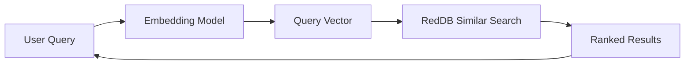

# Building a Vector Search App

This guide shows how to build a semantic search application using RedDB's vector engine.

## Architecture



## 1. Start RedDB

```bash
red server --http --path ./data/search.rdb --bind 127.0.0.1:5000
```

## 2. Index Documents

For each document, generate an embedding (using OpenAI, Cohere, or any embedding model) and insert it:

```bash
# Document 1
curl -X POST http://127.0.0.1:5000/collections/articles/vectors \
  -H 'content-type: application/json' \
  -d '{
    "dense": [0.12, 0.45, 0.78, 0.23, 0.56, 0.89, 0.34, 0.67],
    "content": "Introduction to machine learning and neural networks",
    "metadata": {"title": "ML Basics", "author": "Alice", "category": "tutorial"}
  }'

# Document 2
curl -X POST http://127.0.0.1:5000/collections/articles/vectors \
  -H 'content-type: application/json' \
  -d '{
    "dense": [0.91, 0.23, 0.56, 0.78, 0.12, 0.45, 0.89, 0.34],
    "content": "Database indexing strategies for optimal query performance",
    "metadata": {"title": "DB Indexing", "author": "Bob", "category": "database"}
  }'
```

## 3. Bulk Index

For production, use bulk insert:

```bash
curl -X POST http://127.0.0.1:5000/collections/articles/bulk/vectors \
  -H 'content-type: application/json' \
  -d '[
    {"dense": [0.1, 0.2, 0.3, 0.4, 0.5, 0.6, 0.7, 0.8], "content": "Doc 1", "metadata": {"cat": "a"}},
    {"dense": [0.8, 0.7, 0.6, 0.5, 0.4, 0.3, 0.2, 0.1], "content": "Doc 2", "metadata": {"cat": "b"}}
  ]'
```

## 4. Search

Generate an embedding for the user's query and search:

```bash
curl -X POST http://127.0.0.1:5000/collections/articles/similar \
  -H 'content-type: application/json' \
  -d '{
    "vector": [0.15, 0.42, 0.75, 0.20, 0.58, 0.85, 0.30, 0.65],
    "k": 5,
    "min_score": 0.5
  }'
```

Or do the same flow through the SQL query endpoint:

```sql
VECTOR SEARCH articles SIMILAR TO 'machine learning and neural networks' LIMIT 5
```

## 5. Hybrid Search

Combine vector similarity with text matching:

```bash
curl -X POST http://127.0.0.1:5000/hybrid/search \
  -H 'content-type: application/json' \
  -d '{
    "collections": ["articles"],
    "vector": [0.15, 0.42, 0.75, 0.20, 0.58, 0.85, 0.30, 0.65],
    "query": "machine learning",
    "k": 10
  }'
```

## 6. Text-Only Search

When you don't have an embedding model available:

```bash
curl -X POST http://127.0.0.1:5000/text/search \
  -H 'content-type: application/json' \
  -d '{
    "query": "database indexing performance",
    "collections": ["articles"],
    "limit": 10,
    "fuzzy": true
  }'
```

## Inspect VECTOR SEARCH execution

Use `EXPLAIN` to inspect the planned runtime route, or `EXPLAIN ANALYZE` to
execute the query and measure its work:

```sql
EXPLAIN VECTOR SEARCH articles
SIMILAR TO [0.15,0.42,0.75,0.20,0.58,0.85,0.30,0.65] LIMIT 5;

EXPLAIN ANALYZE VECTOR SEARCH articles
SIMILAR TO [0.15,0.42,0.75,0.20,0.58,0.85,0.30,0.65]
WHERE category = 'tutorial' LIMIT 5;
```

`VECTOR SEARCH` defaults to `MODE EXACT`, including collections created with
`CREATE VECTOR`. Exact search evaluates every eligible vector at full precision,
applying visibility, row policies, and metadata filters before selecting the best
`k` results. Equal scores prefer the smaller entity id.

Use `MODE APPROXIMATE` to opt into TurboQuant candidate selection followed by
full-precision reranking:

```sql
VECTOR SEARCH articles SIMILAR TO [0.15,0.42,0.75,0.20,0.58,0.85,0.30,0.65]
MODE APPROXIMATE LIMIT 5;
```

Approximate candidate selection can miss a true nearest neighbor. Its packed
scorer still visits the entire index; a small reranking candidate count does not
prove sublinear search. Without an operational TurboQuant route, execution falls
back to exact search and reports why. Registered HNSW/IVF indexes do not change
this runtime route.

Exact selection retains at most `k` results. It gathers visible entity ids and
fetches vector payloads in batches of 256 before evaluating policies, so the
working set includes O(N) ids, one payload batch, and O(k) retained results.

ANALYZE returns one measured row with `metrics_scope = vector_pipeline`:

| Field | Meaning |
| --- | --- |
| `mode_requested`, `mode_executed` | Requested accuracy and actual execution mode |
| `fallback_reason` | Why approximation fell back to exact, or NULL |
| `index_used` | Whether the pipeline used the TurboQuant index |
| `candidates_examined` | Scan entities or returned TurboQuant hits visited by the pipeline |
| `approximate_distance_evaluations` | Vectors scored by the packed index |
| `metadata_rejected`, `rls_rejected` | Candidates rejected by predicates or row policies |
| `visibility_rejected` | Candidates missing or invisible in the statement snapshot |
| `exact_distance_evaluations` | Exact distance calls, including reranking |
| `peak_topk_entries` | Maximum retained selection entries, bounded by k |
| `actual_rows` | Rows returned after filtering and top-k |
| `actual_ms` | Vector pipeline time, excluding surrounding authorization/frame overhead |

These measurements describe the vector pipeline, not individual logical operator
timings. Other vector endpoints may have different execution paths.

Ordinary queries expose optional `stats.vector` measurements. `cache_hit=true`
means those measurements describe the cached computation. ANALYZE always runs
the query again through the normal authorization gate and preserves an active
caller transaction.

## Tips

- **Dimension consistency**: All vectors in a collection should have the same dimension
- **Normalization**: Cosine similarity works best with normalized vectors
- **Metadata filtering**: Use metadata to filter results by category, date, or author
- **Hybrid search**: Combines the semantic understanding of vectors with the precision of keyword matching


### Measured operator work

Vector execution statistics and `EXPLAIN ANALYZE VECTOR SEARCH` include an
`operators` array in child-before-parent order. Each entry reports the executed
operator, input/output rows and `inclusive_time_us`. Time includes descendants;
do not add entries to estimate total query time. The scan owns pushed-down
visibility, RLS, metadata filtering and bounded top-k, so later logical filter
nodes can legitimately reject zero rows. Cache hits retain the original
measurements and set `cache_hit`; EXPLAIN ANALYZE performs a fresh execution.
