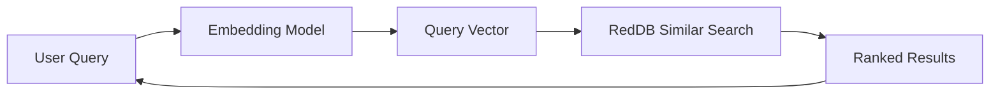

# Building a Vector Search App

This guide shows how to build a semantic search application using RedDB's vector engine.

## Architecture



## 1. Start RedDB

```bash
red server --http --path ./data/search.rdb --bind 127.0.0.1:5000
```

## 2. Index Documents

For each document, generate an embedding (using OpenAI, Cohere, or any embedding model) and insert it:

```bash
# Document 1
curl -X POST http://127.0.0.1:5000/collections/articles/vectors \
  -H 'content-type: application/json' \
  -d '{
    "dense": [0.12, 0.45, 0.78, 0.23, 0.56, 0.89, 0.34, 0.67],
    "content": "Introduction to machine learning and neural networks",
    "metadata": {"title": "ML Basics", "author": "Alice", "category": "tutorial"}
  }'

# Document 2
curl -X POST http://127.0.0.1:5000/collections/articles/vectors \
  -H 'content-type: application/json' \
  -d '{
    "dense": [0.91, 0.23, 0.56, 0.78, 0.12, 0.45, 0.89, 0.34],
    "content": "Database indexing strategies for optimal query performance",
    "metadata": {"title": "DB Indexing", "author": "Bob", "category": "database"}
  }'
```

## 3. Bulk Index

For production, use bulk insert:

```bash
curl -X POST http://127.0.0.1:5000/collections/articles/bulk/vectors \
  -H 'content-type: application/json' \
  -d '[
    {"dense": [0.1, 0.2, 0.3, 0.4, 0.5, 0.6, 0.7, 0.8], "content": "Doc 1", "metadata": {"cat": "a"}},
    {"dense": [0.8, 0.7, 0.6, 0.5, 0.4, 0.3, 0.2, 0.1], "content": "Doc 2", "metadata": {"cat": "b"}}
  ]'
```

## 4. Search

Generate an embedding for the user's query and search:

```bash
curl -X POST http://127.0.0.1:5000/collections/articles/similar \
  -H 'content-type: application/json' \
  -d '{
    "vector": [0.15, 0.42, 0.75, 0.20, 0.58, 0.85, 0.30, 0.65],
    "k": 5,
    "min_score": 0.5
  }'
```

Or do the same flow through the SQL query endpoint:

```sql
VECTOR SEARCH articles SIMILAR TO 'machine learning and neural networks' LIMIT 5
```

## 5. Hybrid Search

Combine vector similarity with text matching:

```bash
curl -X POST http://127.0.0.1:5000/hybrid/search \
  -H 'content-type: application/json' \
  -d '{
    "collections": ["articles"],
    "vector": [0.15, 0.42, 0.75, 0.20, 0.58, 0.85, 0.30, 0.65],
    "query": "machine learning",
    "k": 10
  }'
```

## 6. Text-Only Search

When you don't have an embedding model available:

```bash
curl -X POST http://127.0.0.1:5000/text/search \
  -H 'content-type: application/json' \
  -d '{
    "query": "database indexing performance",
    "collections": ["articles"],
    "limit": 10,
    "fuzzy": true
  }'
```

## Inspect VECTOR SEARCH execution

Use `EXPLAIN` to inspect the planned runtime route, or `EXPLAIN ANALYZE` to
execute the query and measure its work:

```sql
EXPLAIN VECTOR SEARCH articles
SIMILAR TO [0.15,0.42,0.75,0.20,0.58,0.85,0.30,0.65] LIMIT 5;

EXPLAIN ANALYZE VECTOR SEARCH articles
SIMILAR TO [0.15,0.42,0.75,0.20,0.58,0.85,0.30,0.65]
WHERE category = 'tutorial' LIMIT 5;
```

`vector_turbo_search` means TurboQuant candidates followed by exact reranking.
New collections created with `CREATE VECTOR` use this route. Legacy collections
without the TurboQuant marker use `vector_exact_scan`. The plan's
`access_path_reason` explains the choice, including registered HNSW/IVF indexes
that this runtime route does not use. These names describe `VECTOR SEARCH`;
other vector endpoints may have different execution paths.

ANALYZE returns one measured row with `metrics_scope = vector_pipeline`:

| Field | Meaning |
| --- | --- |
| `index_used` | Whether the pipeline used the TurboQuant index |
| `candidates_examined` | Visible scan entities or returned TurboQuant hits visited by the pipeline |
| `metadata_rejected` | Candidates rejected by the effective predicate |
| `visibility_rejected` | TurboQuant hits missing or invisible in the statement snapshot |
| `exact_distance_evaluations` | Exact distance calls, including reranking |
| `actual_rows` | Rows returned after filtering and top-k |
| `actual_ms` | Vector pipeline time, excluding the surrounding authorization/frame overhead |

These counters do not measure approximate scoring inside the index or each
logical operator separately. A filtered TurboQuant query can still visit the
whole collection. A small candidate count alone does not prove low index cost.

Ordinary queries expose optional `stats.vector` measurements. `cache_hit=true`
means those measurements describe the cached computation. ANALYZE always runs
the query again through the normal authorization gate and preserves an active
caller transaction.

## Tips

- **Dimension consistency**: All vectors in a collection should have the same dimension
- **Normalization**: Cosine similarity works best with normalized vectors
- **Metadata filtering**: Use metadata to filter results by category, date, or author
- **Hybrid search**: Combines the semantic understanding of vectors with the precision of keyword matching
