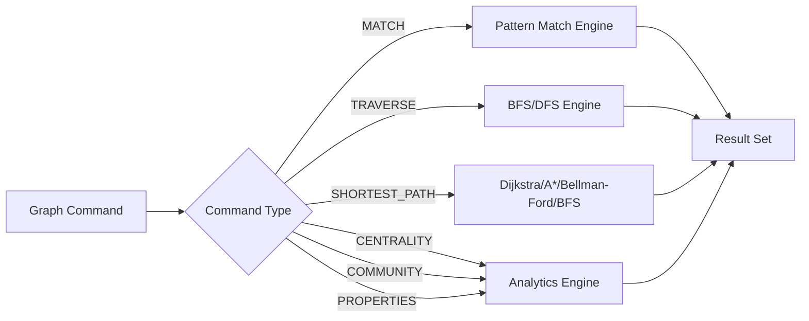

# Graph Commands

RedDB supports graph-specific commands within the query engine for traversals, pathfinding, and analytics.

## MATCH (Graph Pattern)

Query the graph using pattern matching:

```sql
MATCH (a:person)-[r:REPORTS_TO]->(b:person) RETURN a.name, b.name, r.since
```

### Syntax

```sql
MATCH (node_alias[:label])-[edge_alias[:label]]->(node_alias[:label])
[WHERE condition]
RETURN expressions
```

### Examples

```sql
-- Find all relationships from a node
MATCH (a:alice)-[r]->(b) RETURN b.label, r.label

-- Find incoming edges
MATCH (a)<-[r:FOLLOWS]-(b:person) WHERE a.label = 'bob' RETURN b.name

-- Multi-hop pattern
MATCH (a:person)-[:WORKS_AT]->(c:company)-[:LOCATED_IN]->(city)
RETURN a.name, c.name, city.name
```

## GRAPH NEIGHBORHOOD

Expand the immediate neighborhood of a node:

```sql
GRAPH NEIGHBORHOOD 'alice' DIRECTION outgoing DEPTH 2
```

## GRAPH TRAVERSE

Run BFS or DFS traversal from a starting node:

```sql
GRAPH TRAVERSE FROM 'alice' STRATEGY bfs DIRECTION outgoing MAX_DEPTH 3
```

Parameters:
- `STRATEGY`: `bfs` or `dfs`
- `DIRECTION`: `outgoing`, `incoming`, or `both`
- `MAX_DEPTH`: maximum traversal depth

## GRAPH SHORTEST_PATH

Find the shortest path between two nodes:

```sql
GRAPH SHORTEST_PATH FROM 'alice' TO 'charlie' ALGORITHM dijkstra
GRAPH SHORTEST_PATH FROM 'alice' TO 'charlie' ORDER BY hop_count ASC LIMIT 1
```

Algorithms:
- `bfs`: shortest path by hop count
- `dijkstra`: weighted shortest path (non-negative weights)
- `astar`: heuristic-guided search; the generic runtime currently uses a null heuristic
- `bellman_ford`: supports negative weights and detects negative cycles

Ordering metrics: `hop_count`, `total_weight`, `nodes_visited`.

`GRAPH SHORTEST_PATH` returns one summary row unless `LIMIT 0` is used. The
row includes `path_found`; when no route exists between the resolved source and
target, `path_found` is `false` and `hop_count` / `total_weight` are `NULL`
instead of looking like a successful empty path.

## GRAPH CENTRALITY

Compute centrality scores:

```sql
GRAPH CENTRALITY ALGORITHM pagerank
GRAPH CENTRALITY ALGORITHM pagerank ORDER BY centrality_score DESC LIMIT 10
```

Algorithms: `degree`, `closeness`, `betweenness`, `eigenvector`, `pagerank`.

`GRAPH CENTRALITY` keeps the historical implicit top-100 cap when `LIMIT`
is omitted. Use `LIMIT N` to choose a different cap, or `LIMIT 0` to return
no rows. For full-graph use — e.g. resolving `label → node_id` across the
whole graph — pass an explicit `LIMIT` at least as large as the node count,
otherwise nodes past the top 100 are silently omitted (no `truncated` flag)
and look like missing data. See
[Centrality → Default row cap](/graph/centrality.md#default-row-cap).
Ordering metrics: `score`, `centrality_score`.

## GRAPH COMMUNITY

Detect communities in the graph:

```sql
GRAPH COMMUNITY ALGORITHM louvain MAX_ITERATIONS 100
GRAPH COMMUNITY ALGORITHM louvain ORDER BY size DESC LIMIT 5
```

Algorithms: `louvain`, `label_propagation`.

Ordering metrics: `size`, `community_size`.

## GRAPH COMPONENTS

Find connected components:

```sql
GRAPH COMPONENTS MODE weakly_connected
GRAPH COMPONENTS MODE weakly_connected ORDER BY component_size DESC LIMIT 20
```

Modes: `weakly_connected`, `strongly_connected`.

Ordering metrics: `size`, `component_size`.

## GRAPH CYCLES

Detect cycles up to a maximum length (default `10` when omitted):

```sql
GRAPH CYCLES MAX_LENGTH 10
```

> [!NOTE]
> `MAX_CYCLES n` is **not** parsed today. Track [#465](https://github.com/reddb-io/reddb/issues/465)
> for the result-cap form.

## GRAPH CLUSTERING

Compute the clustering coefficient:

```sql
GRAPH CLUSTERING
```

> [!NOTE]
> `GRAPH HITS` (hub/authority scoring) is **not** parsed today. Use
> `GRAPH CENTRALITY ALGORITHM pagerank` for influence ranking until a HITS
> grammar is wired up.

## GRAPH TOPOLOGICAL_SORT

Compute topological ordering of a DAG. Returns nodes in dependency-safe sequence — each node appears before the nodes it points to.

```sql
GRAPH TOPOLOGICAL_SORT
```

The command fails if the graph contains a cycle. Run `GRAPH CYCLES` or check `is_acyclic` from `GRAPH PROPERTIES` first.

Typical use cases: CI/CD stage ordering, service boot order, package install sequencing, task scheduling.

See [Topology & Topological Sort](/graph/topology.md) for worked examples covering build pipelines, service dependency graphs, network infrastructure, and package resolution.

## GRAPH PROPERTIES

Compute structural graph properties:

```sql
GRAPH PROPERTIES
```

Returns a summary with connectivity, completeness, cyclicity, density, and component counts.

## PATH Query

Dedicated path queries between two nodes:

```sql
PATH FROM alice TO charlie ALGORITHM dijkstra DIRECTION both
```

### Node Selectors

Nodes can be selected by label:

```sql
PATH FROM 'web-server-01' TO 'db-primary' ALGORITHM bfs
```

## Query Flow



<!-- contract-matrix:begin -->
## Public-surface support

> Generated from [`docs/conformance/public-surface-contract-matrix.json`](/docs/conformance/public-surface-contract-matrix.json) by `scripts/gen-docs-from-matrix.mjs`. Do not edit between the markers by hand — run `node scripts/gen-docs-from-matrix.mjs --write`. The matrix is the source of truth; this block can never claim more than it, and CI (`docs-matrix`) fails on drift.
>
> The public promises this document makes, and the status of each surface.

| Promise | sql | http | redwire | grpc | driver_helpers |
| --- | --- | --- | --- | --- | --- |
| **PSC-002** — MATCH supports node, edge, label, property, and LIMIT projections. | ✅ supported | ✅ supported | ⚠️ partial | ⚠️ partial | ✅ supported |
| **PSC-003** — GRAPH algorithms accept semantic identifiers, limits, ordering, and return stable rich rows. | ✅ supported | ✅ supported | ❌ unsupported | ❌ unsupported | ❌ unsupported |

_Status legend: ✅ supported · ⚠️ partial (known gaps) · ❌ unsupported._
<!-- contract-matrix:end -->
