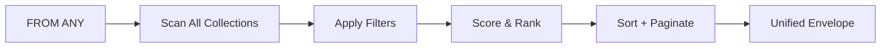

# Universal Query (FROM ANY)

The universal query is one of RedDB's most powerful features. It searches across
all item kinds and all collections in a single query, returning results in the
public item envelope.

Prefer positional parameters for filter values and result caps:

```ts
const sql = "FROM ANY WHERE collection = $1 ORDER BY rid DESC LIMIT $2";
const params = ["hosts", 20];
const rows = await db.query(sql, params);
```

The parameterized-query design is tracked in
[ADR #352](https://github.com/reddb-io/reddb/issues/352).

## Syntax

```sql
FROM ANY [WHERE condition] [ORDER BY field [ASC|DESC]] [LIMIT n] [OFFSET n]
```

## Basic Usage

### All Items

```sql
FROM ANY ORDER BY rid DESC LIMIT 10
```

### Filter by Item Kind

```sql
FROM ANY WHERE kind = $1 LIMIT $2
```

```sql
FROM ANY WHERE kind = $1 OR kind = $2 LIMIT $3
```

### Filter by Collection

```sql
FROM ANY WHERE collection = $1 LIMIT $2
```

### Combined Filters

```sql
FROM ANY WHERE kind = $1 AND collection = $2 ORDER BY rid DESC LIMIT $3
```

## Item Kinds

| Kind | Description |
|:-----|:------------|
| `row` | Table row |
| `node` | Graph node |
| `edge` | Graph edge |
| `vector` | Vector embedding |
| `document` | JSON document |
| `kv` | Key-value pair |

## Unified Envelope

Every item returned by a universal query includes standard fields:

```json
{
  "rid": 42,
  "collection": "hosts",
  "kind": "row",
  "tenant": null,
  "created_at": 1760000000000,
  "updated_at": 1760000001000,
  "ip": "10.0.0.1",
  "os": "linux"
}
```

| Field | Type | Description |
|:------|:-----|:------------|
| `rid` | `u64` | RedDB ID for the item |
| `collection` | `string` | Source collection name |
| `kind` | `string` | Item kind (`row`, `node`, `edge`, `vector`, `document`, `kv`) |
| `tenant` | `string` / `null` | Tenant visible to the statement |
| `created_at` | timestamp/integer millis | Creation timestamp |
| `updated_at` | timestamp/integer millis | Last update timestamp |

## Example: Cross-Model Query

This is the power of universal queries. In a single request, you can retrieve a host row, its graph node representation, and its vector embedding:

```bash
curl -X POST http://127.0.0.1:8080/query \
  -H 'content-type: application/json' \
  -d '{"query": "FROM ANY ORDER BY _score DESC LIMIT $1", "params": [20]}'
```

Response:

```json
{
  "ok": true,
  "mode": "sql",
  "engine": "universal",
  "record_count": 3,
  "records": [
    {
      "rid": 102,
      "collection": "hosts",
      "kind": "row",
      "ip": "10.0.0.1",
      "os": "linux"
    },
    {
      "rid": 103,
      "collection": "network",
      "kind": "node",
      "label": "web-server-01",
      "node_type": "host"
    },
    {
      "rid": 104,
      "collection": "embeddings",
      "kind": "vector",
      "content": "host 10.0.0.1 running ssh"
    }
  ]
}
```

## Filtering with Entity Types and Capabilities

The gRPC `Query` RPC accepts additional filters:

```bash
grpcurl -plaintext \
  -d '{
    "query": "FROM ANY LIMIT $1",
    "params": [{"intValue": 20}],
    "entity_types": ["row", "node"],
    "capabilities": ["read"]
  }' \
  127.0.0.1:50051 reddb.v1.RedDb/Query
```

## Query Flow



> [!WARNING]
> Universal queries scan all collections. For large databases, always use `LIMIT` to bound the result set. Target specific collections with `WHERE collection = '...'` when possible.
