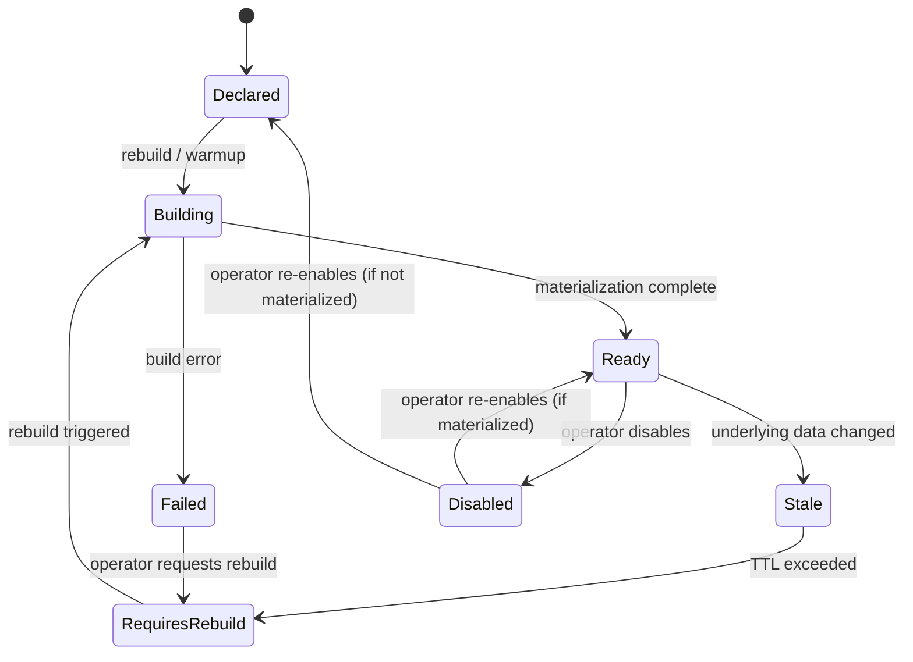

# Artifact Lifecycle

Every index, graph projection, and analytics job in RedDB follows a canonical lifecycle.

## States



| State | Queryable | Description |
|:------|:----------|:------------|
| `declared` | No | Defined but not yet built |
| `building` | No | Currently being materialized |
| `ready` | **Yes** | Materialized and serving reads |
| `disabled` | No | Temporarily disabled by operator |
| `stale` | No | Data changed, may need rebuild |
| `failed` | No | Build failed, needs manual intervention |
| `requires_rebuild` | No | Marked for rebuild |

## Operations

| Method | Applicable States |
|:-------|:------------------|
| `can_rebuild()` | `declared`, `stale`, `failed`, `requires_rebuild` |
| `needs_attention()` | `failed`, `stale`, `requires_rebuild` |

## Managing Index Lifecycle

```bash
# List index statuses
grpcurl -plaintext 127.0.0.1:50051 reddb.v1.RedDb/IndexStatuses

# Warm up an index
grpcurl -plaintext -d '{"name": "my-index"}' 127.0.0.1:50051 reddb.v1.RedDb/WarmupIndex

# Mark an index as stale
grpcurl -plaintext -d '{"name": "my-index"}' 127.0.0.1:50051 reddb.v1.RedDb/MarkIndexStale

# Rebuild all indexes in a collection
grpcurl -plaintext -d '{"collection": "users"}' 127.0.0.1:50051 reddb.v1.RedDb/RebuildIndexes

# Enable/disable an index
grpcurl -plaintext -d '{"name": "my-index", "enabled": false}' 127.0.0.1:50051 reddb.v1.RedDb/SetIndexEnabled
```

## Attention Endpoints

Find artifacts needing attention:

```bash
# Indexes
curl http://127.0.0.1:8080/catalog/indexes/attention

# Graph projections
curl http://127.0.0.1:8080/catalog/graph/projections/attention

# Analytics jobs
curl http://127.0.0.1:8080/catalog/analytics-jobs/attention
```

These return only artifacts in `failed`, `stale`, or `requires_rebuild` states.
