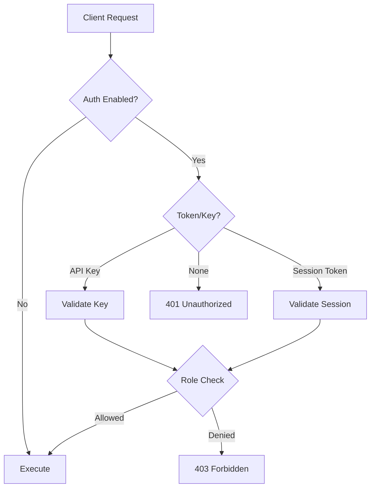

# Auth & Security Overview

RedDB includes a built-in authentication and authorization system with role-based access control, API keys, session tokens, and an encrypted vault.

## Architecture



## Enabling Auth

Auth is enabled by starting the server with `--vault`:

```bash
red server --http --path ./data/reddb.rdb --vault --bind 0.0.0.0:8080
```

## Bootstrap

When no users exist, bootstrap the first admin:

```bash
curl -X POST http://127.0.0.1:8080/auth/bootstrap \
  -H 'content-type: application/json' \
  -d '{"username": "admin", "password": "changeme"}'
```

This returns the admin user and an initial API key.

## Roles

| Role | Read | Write | Admin |
|:-----|:-----|:------|:------|
| `read` | Yes | No | No |
| `write` | Yes | Yes | No |
| `admin` | Yes | Yes | Yes |

## Auth Methods

| Method | Header | Persistence |
|:-------|:-------|:------------|
| API Key | `Authorization: Bearer <key>` | Persistent until revoked |
| Session Token | `Authorization: Bearer <token>` | Expires after session |

## Security Features

- **RBAC**: Role-based access control (admin, write, read)
- **API Keys**: Persistent tokens for service accounts
- **Session Tokens**: Time-limited tokens from login
- **Encrypted Vault**: Auth data stored in encrypted pages
- **Encryption at Rest**: AES-256-GCM page-level encryption
- **Password Hashing**: Secure password storage
