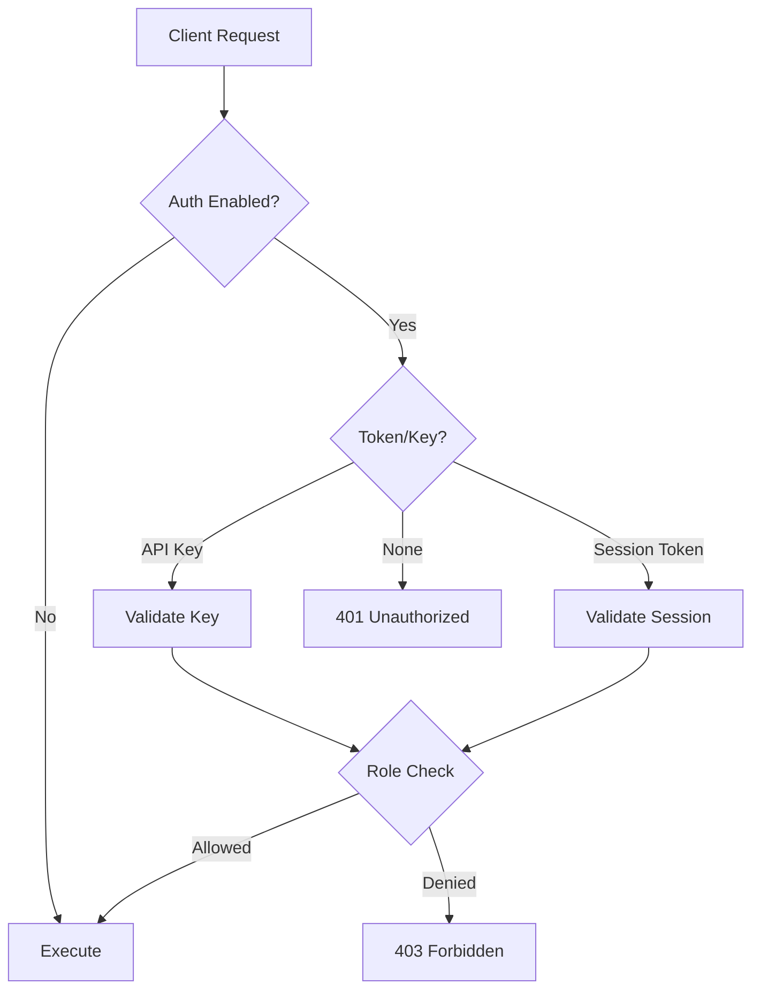

# Auth & Security Overview

RedDB includes a built-in authentication and authorization system with role-based access control, API keys, session tokens, and an encrypted vault.

## Architecture



## Enabling Auth

Auth is enabled by starting the server with `--vault`:

```bash
red server --http --path ./data/reddb.rdb --vault --bind 0.0.0.0:8080
```

## Bootstrap

When no users exist, bootstrap the first admin:

```bash
curl -X POST http://127.0.0.1:8080/auth/bootstrap \
  -H 'content-type: application/json' \
  -d '{"username": "admin", "password": "changeme"}'
```

This returns the admin user and an initial API key.

## Roles

| Role | Read | Write | Admin |
|:-----|:-----|:------|:------|
| `read` | Yes | No | No |
| `write` | Yes | Yes | No |
| `admin` | Yes | Yes | Yes |

## Auth Methods

| Method | Header | Persistence |
|:-------|:-------|:------------|
| API Key | `Authorization: Bearer <key>` | Persistent until revoked |
| Session Token | `Authorization: Bearer <token>` | Expires after session |
| Client Certificate (mTLS) | TLS handshake | Per-connection |
| OAuth / OIDC JWT | `Authorization: Bearer <jwt>` | Token lifetime |
| SCRAM-SHA-256 | RedWire v2 handshake / PG SASL | Per-connection |
| HMAC-signed request | `X-RedDB-Key-Id` + `-Timestamp` + `-Nonce` + `-Signature` | Per-request, ±5 min window, single-use nonce |

### mTLS client certificates

Enable the cert authenticator via `AuthConfig.cert`. Two modes map
the certificate to a RedDB identity:

- **`CommonName`** — the subject's CN is looked up against the user
  registry
- **`SanRfc822Name`** — the certificate's `subjectAltName rfc822Name`
  extension is used as the username

Optional OID-to-role mapping lets custom X.509 extensions carry the
caller's RedDB role directly, avoiding a user-registry lookup.

### OAuth / OIDC

Enable the OAuth validator via `AuthConfig.oauth`. The validator
accepts a pluggable `JwtVerifier` closure so you pick the signing
algorithm and key source (JWKS, shared secret, HSM). Validates the
standard `iss`, `aud`, `exp`, and `nbf` claims and maps a claim
(default `preferred_username`) onto a RedDB identity. The same
validator path is used by HTTP, gRPC, and the RedWire v2 handshake.

### SCRAM-SHA-256

Stored credentials live in the user vault as
`SCRAM-SHA-256$<iter>:<salt>:<stored-key>:<server-key>`. The same
state machine drives the PG-wire SASL flow and the
`AuthStart`/`AuthChallenge`/`AuthResponse` frames in RedWire v2.
Provision with `red auth set-scram <user>`. Spec: RFC 5802. Details:
[`tokens.md`](tokens.md#scram-sha-256).

### HMAC-signed requests

Tamper-evident, replay-protected request signing for cross-org
webhooks and high-trust automation. Canonical string is
`{method}\n{path}\n{timestamp}\n{nonce}\n{sha256(body)}`, signed
with the shared secret minted at API-key creation. Nonces are
remembered server-side for the validity window (±5 min default).
Details: [`tokens.md`](tokens.md#hmac-signed-requests).

### Row-level security & tenancy

Per-row authorization on top of authentication:

- [Row Level Security](rls.md) — `CREATE POLICY` with USING
  predicates, ENABLE / DISABLE ROW LEVEL SECURITY
- [Multi-Tenancy](multi-tenancy.md) — `SET TENANT`, declarative
  `TENANT BY (col)`, auto-RLS

## Security Features

- **RBAC**: Role-based access control (admin, write, read)
- **API Keys**: Persistent tokens for service accounts
- **Session Tokens**: Time-limited tokens from login
- **mTLS**: Client certificate authentication (CN / SAN / OID roles)
- **OAuth / OIDC**: JWT bearer-token validation with pluggable verifier
- **SCRAM-SHA-256**: RFC 5802 challenge/response in RedWire v2 + PG wire
- **HMAC-signed requests**: timestamped + nonce-protected request signatures
- **Row-Level Security**: Per-row predicates via CREATE POLICY
- **Multi-Tenancy**: Declarative `TENANT BY` + session tenant handle
- **Encrypted Vault / Secret values**: Auth secrets and `Secret` values use the vault/secret encryption pipeline when configured
- **At-rest posture**: v1.0 relies on infrastructure encryption for full database files; pager-level encryption is foundation-only
- **Password Hashing**: Secure password storage
- **`Secret` column type**: Transparent AES-256-GCM field-level encryption, keyed by the vault
- **`Password` column type**: argon2id hashing with `VERIFY_PASSWORD()` comparator
- **`_FILE` secrets convention**: every sensitive env var (`RED_ADMIN_TOKEN`, `RED_S3_SECRET_KEY`, `RED_BACKEND_HTTP_AUTH`, …) honours an `*_FILE` companion that wins over the inline value. Pairs with Kubernetes Secrets, Docker secrets, and systemd `LoadCredential`.
- **Live secret rotation via SIGHUP**: sending `SIGHUP` to the process reloads every `*_FILE` companion in place, so token rotation no longer requires a pod roll.
