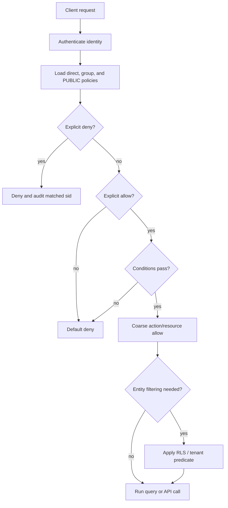

# Permissioning Handbook

This handbook is the practical guide for designing RedDB permissions across
users, groups, tenants, collections, tables, documents, KV, graphs, vectors,
time-series, and queues.

Use it together with:

- [Policies](policies.md) for the JSON policy format, evaluator, simulator,
  conditions, and SQL/HTTP policy management API.
- [Permission Recipes](/guides/permissions-cookbook.md) for copyable patterns
  across tables, documents, KV, graphs, vectors, time-series, and queues.
- [Users, Groups, and Legacy Roles](rbac.md) for bootstrap, users, tokens,
  API keys, groups, and legacy coarse roles.
- [Row Level Security](rls.md) for per-row and per-entity predicates.
- [Data Model Overview](/data-models/overview.md) for the collection-first
  mental model.

## Read this first

RedDB permissioning has two jobs:

1. Decide whether a principal can run a verb on a resource.
2. Decide which individual entities inside that resource are visible or
   writable.

Those are intentionally separate:

| Need | Mechanism |
|---|---|
| "Can Alice read orders at all?" | IAM-style policy statement on `table:orders` or `collection:orders` |
| "Can Alice read only her tenant's orders?" | RLS predicate, usually `tenant_id = CURRENT_TENANT()` |
| "Can Alice read orders but not PII fields?" | Column/resource deny where wired, or a view/RLS workaround |
| "Can this worker enqueue jobs but not pop them?" | Queue resource policy once queue IAM hooks are wired; today role gate + service account separation |
| "Can this service use only one IP range and expire next Friday?" | Policy `condition` block |

The design rule is:

> Use policies for coarse action/resource authorization. Use RLS for
> entity-level filtering. Use tenants to make the resource namespace explicit.

## Request lifecycle



Keep the two decisions separate when designing access:

| Question | Best tool | Why |
|---|---|---|
| Can this principal call this operation on this resource at all? | IAM-style policy | Fast, auditable, simulatable, Git-friendly. |
| Which rows/documents/nodes/edges/vectors/messages are visible? | RLS / tenancy | Depends on entity content and session context. |
| Does this need a temporary or network-bound exception? | Policy condition | `expires_at`, `source_ip`, `mfa`, and `time_window` live with the statement. |
| Does this path lack a direct IAM hook today? | Service-account split, safe view, or RLS | Keeps production behavior honest while the canonical vocabulary stays stable. |

## Current enforcement map

The policy vocabulary is intentionally broader than the first set of runtime
hooks. The simulator can evaluate any `kind:name` resource, but the runtime
only checks policies on the surfaces that have been wired.

| Surface | IAM policy checked today | RLS checked today | Fallback gate | Notes |
|---|---:|---:|---|---|
| SQL `SELECT table` | Yes, `select` on `table:<name>` | Yes | Legacy GRANT/RBAC until first policy | Main production path for table reads. |
| SQL `INSERT table` | Yes, `insert` on `table:<name>` | Tenancy auto-fill and RLS where applicable | Legacy GRANT/RBAC until first policy | Also covers `INSERT ... DOCUMENT/KV/NODE/EDGE/VECTOR` because those parse as inserts into a collection. |
| SQL `UPDATE table` | Yes, `update` on `table:<name>` | Yes | Legacy GRANT/RBAC until first policy | Use RLS for row ownership checks. |
| SQL `DELETE table` | Yes, `delete` on `table:<name>` | Yes | Legacy GRANT/RBAC until first policy | Use RLS for row ownership checks. |
| SQL joins | Yes, currently `select` on `database:*` | Per-table RLS during execution | Legacy GRANT/RBAC until first policy | Grant `database:*` or refactor to views until per-input join checks land. |
| Policy management DDL/API | Yes, `policy:*` actions on `policy:<id>` | No | Admin role before IAM is enabled | Includes create, drop, attach, detach, simulate. |
| `GRANT/REVOKE` compatibility | Translates user/PUBLIC grants to synthetic IAM policies | No | Admin role | `GRANT TO GROUP` legacy syntax is still rejected; use policy groups. |
| SQL DDL (`CREATE TABLE`, `CREATE QUEUE`, indexes, etc.) | Not yet | No | Role gate | Use service accounts and deployment controls for DDL today. |
| SQL graph commands (`MATCH`, graph analytics) | Not yet as graph-specific IAM resources | RLS for graph entity policies where the query path applies them | Role gate | Use RLS on `NODES`/`EDGES` plus separate service accounts. |
| SQL vector search | Not yet as vector-specific IAM resources | RLS on vector entities where the search path applies it | Role gate | Use RLS on `VECTORS OF <collection>` for tenant/metadata filtering. |
| SQL queue commands | Not yet as queue-specific IAM resources | RLS on messages where the command path applies it | Role gate | Use dedicated worker accounts. |
| Direct HTTP collection endpoints | Not yet policy-aware | Not consistently | HTTP bearer role gate | GET/HEAD/OPTIONS require read; mutating methods require write. |
| `/admin/*` and `/metrics` | Admin token first, then policy handlers where applicable | No | `RED_ADMIN_TOKEN` | If `RED_ADMIN_TOKEN` is set, it bypasses user auth for operator continuity. |

When this table says "not yet", still use the canonical resource names below
in policies, tests, and simulation. That keeps policy documents stable while
the missing hooks are wired.

Use the status words consistently:

| Status | Meaning |
|---|---|
| Runtime-enforced | A live SQL/API path calls the IAM evaluator today. |
| RLS-enforced | Entity-level visibility is controlled by row/entity predicates. |
| Simulator/audit vocabulary | The resource name is valid and stable, but the live path may not check it yet. |
| Role-gated today | The path still relies on legacy role/admin gates or operational controls. |

## Permission layers

Evaluation is easier to reason about if you keep the layers distinct.

| Layer | Purpose | Example |
|---|---|---|
| Authentication | Prove who the caller is | API key, session token, OAuth JWT, SCRAM, mTLS |
| Principal | The user/service account identity | `alice`, `svc_ingest`, `tenant/acme/alice` |
| Group | Shared policy attachment target | `analysts`, `tenant_admins`, `ingest_workers` |
| Legacy role | Coarse compatibility fallback | `read`, `write`, `admin` |
| IAM policy | Explicit allow/deny on action/resource | allow `select` on `table:orders` |
| Conditions | Context gates attached to a statement | `source_ip`, `mfa`, `expires_at` |
| RLS | Entity-level predicate | `tenant_id = CURRENT_TENANT()` |
| Tenancy | Namespace and auto-RLS | `SET TENANT 'acme'`, `TENANT BY (tenant_id)` |

The most common production shape is:

```text
service account -> group -> policies -> collection/table access -> RLS tenant filter
```

## Principals and groups

### Users

Users are identities. Prefer one user per human and one service account per
automation workload.

Recommended naming:

| Kind | Pattern | Example |
|---|---|---|
| Human | `<name>` | `alice` |
| Tenant human | tenant-scoped user | `acme/alice` in audit output |
| Service account | `svc_<purpose>` | `svc_ingest`, `svc_billing_api` |
| Break-glass | `breakglass_<ticket>` or policy id | `breakglass_incident_7421` |

Create users through the auth surface, then attach policies:

```bash
curl -sX POST http://127.0.0.1:8080/auth/users \
  -H "Authorization: Bearer $ADMIN_TOKEN" \
  -H 'content-type: application/json' \
  -d '{"username":"svc_ingest","password":"...","role":"write"}'

curl -sX PUT http://127.0.0.1:8080/admin/users/svc_ingest/policies/ingest-orders \
  -H "Authorization: Bearer $ADMIN_TOKEN"
```

### Groups

Groups are policy attachment sets, not login identities.

```sql
ATTACH POLICY 'analyst' TO GROUP analysts;
ALTER USER alice ADD GROUP analysts;
ALTER USER alice DROP GROUP analysts;
```

HTTP equivalent:

```http
PUT    /admin/groups/analysts/policies/analyst
DELETE /admin/groups/analysts/policies/analyst
PUT    /admin/users/alice/groups/analysts
DELETE /admin/users/alice/groups/analysts
```

Recommended group design:

| Group | Purpose |
|---|---|
| `readers` | Generic read-only access to low-risk collections |
| `analysts` | Read analytical tables and vectors, no writes |
| `ingest_workers` | Insert-only data ingestion |
| `queue_workers` | Queue processing service accounts |
| `tenant_admins` | Tenant-scoped broad access with `tenant_match` |
| `policy_admins` | Can manage policy documents, not necessarily data |

### PUBLIC

`GRANT ... TO PUBLIC` is supported for compatibility. Internally RedDB
translates it to a synthetic IAM policy attached to an implicit public policy
group that every principal belongs to.

Use PUBLIC sparingly. It is better for bootstrap/demo data than production
authorization.

```sql
GRANT SELECT ON TABLE product_catalog TO PUBLIC;
REVOKE SELECT ON TABLE product_catalog FROM PUBLIC;
```

## Resource naming

Resources use the shape:

```text
kind:name
```

The kernel accepts any non-empty `kind:name` pair. The names below are the
canonical vocabulary RedDB docs, tests, policy simulator calls, and future
runtime hooks should use.

### Database, schema, table, column

| Resource | Meaning | Example |
|---|---|---|
| `database:*` | Whole database instance | `database:*` |
| `schema:<schema>.*` | Every object in a schema | `schema:billing.*` |
| `table:<table>` | Table or table-like collection | `table:orders` |
| `table:<schema>.<table>` | Schema-qualified table | `table:billing.invoices` |
| `<kind>:tenant/<tenant>/<name>` | Explicit tenant-qualified resource | `table:tenant/acme/orders` |
| `column:<table>.<column>` | Column in a table | `column:users.email` |
| `column:<schema>.<table>.<column>` | Schema-qualified column | `column:billing.invoices.total` |

Table resources are the primary enforcement path today. Column resources are
valid for policy simulation and audit vocabulary. Where column enforcement is
not yet wired in a query path, expose safe views or use RLS/generation
patterns instead of relying on a column deny alone.

### Collection umbrella

Collections are the logical containers behind most models.

| Resource | Meaning | Example |
|---|---|---|
| `collection:<name>` | All entities in one collection | `collection:orders` |
| `collection:<prefix>*` | Collection family | `collection:tenant_acme_*` |
| `collection:*` | Every collection | `collection:*` |

Use `collection:<name>` for model-agnostic policies and simulation. Use a
more specific resource kind when the permission is tied to a model-specific
operation.

### Documents

Documents are user-facing JSON records in a collection.

| Resource | Meaning | Example |
|---|---|---|
| `document:<collection>/*` | Every document in a collection | `document:logs/*` |
| `document:<collection>/<id>` | One document entity | `document:logs/123` |
| `document-field:<collection>.<path>` | JSON path or generated field | `document-field:profiles.ssn` |

Use RLS when the rule depends on document content:

```sql
CREATE POLICY own_docs ON DOCUMENTS OF docs
  USING (body.owner_id = CURRENT_USER());

ALTER TABLE docs ENABLE ROW LEVEL SECURITY;
```

### Key-value

KV is a user-facing model over the collection layer.

| Resource | Meaning | Example |
|---|---|---|
| `kv:<collection>/*` | Every key in a KV collection | `kv:config/*` |
| `kv:<collection>/<key>` | One key | `kv:config/max_retries` |
| `kv-prefix:<collection>/<prefix>*` | Key prefix family | `kv:sessions/user:42:*` |

Action mapping:

| KV operation | Policy action |
|---|---|
| get/list | `select` |
| put new key | `insert` |
| overwrite existing key | `update` |
| delete key | `delete` |

For current runtime enforcement through SQL, a KV collection is still checked
as `table:<collection>` on SQL `INSERT`/`SELECT`/`UPDATE`/`DELETE`. Use the
KV resource names in simulator tests and future-facing policy docs.

### Graphs

Graphs have nodes and edges inside a collection.

| Resource | Meaning | Example |
|---|---|---|
| `graph:<collection>` | Whole graph collection | `graph:social` |
| `node:<collection>/*` | Every node in a graph | `node:social/*` |
| `node:<collection>/<label>` | Nodes by label | `node:social/user` |
| `node:<collection>/<label>/<id>` | One node | `node:social/user/42` |
| `edge:<collection>/*` | Every edge in a graph | `edge:social/*` |
| `edge:<collection>/<type>` | Edges by relationship type | `edge:social/follows` |
| `path:<collection>/*` | Path/traversal result | `path:social/*` |
| `graph-analytics:<collection>/<algorithm>` | Analytics command | `graph-analytics:social/pagerank` |

Recommended graph model:

- Use IAM/RBAC to decide whether the principal may run graph commands.
- Use RLS on `NODES OF <collection>` and `EDGES OF <collection>` for
  ownership, tenant, visibility, and relationship-level filtering.
- Use separate service accounts for graph analytics if analytics can reveal
  structure from otherwise hidden edges.

Example RLS:

```sql
CREATE POLICY visible_nodes ON NODES OF social
  USING (
    properties.tenant = CURRENT_TENANT()
    OR properties.visibility = 'public'
  );

CREATE POLICY visible_edges ON EDGES OF social
  USING (
    properties.tenant = CURRENT_TENANT()
    OR properties.visibility = 'public'
  );

ALTER TABLE social ENABLE ROW LEVEL SECURITY;
```

### Vectors and embeddings

Vectors live in collections and often carry metadata used for authorization.

| Resource | Meaning | Example |
|---|---|---|
| `vector:<collection>/*` | Every vector in a collection | `vector:docs/*` |
| `vector:<collection>/<id>` | One vector entity | `vector:docs/982` |
| `vector-index:<collection>/<index>` | Native vector index | `vector-index:docs/hnsw` |
| `embedding:<collection>/*` | Semantic embedding family | `embedding:docs/*` |

Action mapping:

| Vector operation | Policy action |
|---|---|
| search/read vector | `select` |
| insert embedding | `insert` |
| refresh/rebuild vector index | `alter` or DDL role gate today |
| delete embedding | `delete` |

Use RLS on vector metadata for tenant isolation:

```sql
CREATE POLICY tenant_vectors ON VECTORS OF docs
  USING (metadata.tenant = CURRENT_TENANT());

ALTER TABLE docs ENABLE ROW LEVEL SECURITY;
```

### Time-series

Time-series collections store native points and optional retention/downsample
metadata.

| Resource | Meaning | Example |
|---|---|---|
| `timeseries:<name>` | Series/collection | `timeseries:cpu_metrics` |
| `point:<series>/*` | Every point in a series | `point:cpu_metrics/*` |
| `point:<series>/<timestamp>` | Point or time bucket | `point:cpu_metrics/2026-04-26T10:00:00Z` |
| `retention:<series>` | Retention policy | `retention:cpu_metrics` |
| `downsample:<series>/<policy>` | Downsample policy | `downsample:cpu_metrics/1h_avg` |

Action mapping:

| Time-series operation | Policy action |
|---|---|
| query points | `select` |
| ingest points | `insert` |
| backfill/rewrite points | `update` |
| delete/drop old points | `delete` |
| retention/downsample DDL | `alter` or DDL role gate today |

RLS example:

```sql
CREATE POLICY host_points ON POINTS OF cpu_metrics
  USING (tags.tenant = CURRENT_TENANT());

ALTER TABLE cpu_metrics ENABLE ROW LEVEL SECURITY;
```

### Queues and messages

Queues represent work distribution, so model permissions around the lifecycle
of a message.

| Resource | Meaning | Example |
|---|---|---|
| `queue:<name>` | Queue object | `queue:jobs` |
| `message:<queue>/*` | Every message in a queue | `message:jobs/*` |
| `message:<queue>/<id>` | One message | `message:jobs/123` |
| `consumer-group:<queue>/<group>` | Consumer group | `consumer-group:jobs/email_workers` |
| `dlq:<queue>` | Dead-letter queue | `dlq:jobs` |

Action mapping:

| Queue operation | Policy action |
|---|---|
| inspect queue/read messages | `select` |
| enqueue | `insert` |
| ack/nack/retry/dead-letter mutation | `update` |
| purge/delete message | `delete` |
| create/drop/alter queue | `create`, `drop`, `alter` or DDL role gate today |

Use separate accounts for producers and workers:

```text
svc_job_producer -> insert on queue:jobs
svc_job_worker   -> select/update on queue:jobs and message:jobs/*
svc_job_admin    -> delete/alter on queue:jobs
```

### Indexes, views, functions, and admin resources

| Resource | Meaning | Example |
|---|---|---|
| `index:<collection>/<index>` | Physical or declared index | `index:orders/idx_orders_customer` |
| `view:<name>` | View or materialized view | `view:customer_summary` |
| `function:<name>` | Scalar/stored function | `function:hash_pwd` |
| `policy:<id>` | Policy document | `policy:analyst` |
| `admin:<surface>` | Admin surface | `admin:audit` |
| `lease:<name>` | Replication/lease control | `lease:primary` |

Policy management actions are wired today:

```json
{
  "version": 1,
  "id": "policy-admin",
  "statements": [
    {
      "sid": "manage-policies",
      "effect": "allow",
      "actions": ["policy:*"],
      "resources": ["policy:*"]
    }
  ]
}
```

## Action vocabulary by model

The policy validator has a compact action list. RedDB maps model-specific
verbs onto these generic actions:

| Model | Read action | Create/append action | Mutate action | Remove action | Admin/DDL action |
|---|---|---|---|---|---|
| Tables | `select` | `insert` | `update` | `delete` / `truncate` | `create`, `alter`, `drop` |
| Documents | `select` | `insert` | `update` | `delete` | `create`, `alter`, `drop` on collection/table |
| KV | `select` | `insert` | `update` | `delete` | `alter` on collection |
| Graph nodes | `select` | `insert` | `update` | `delete` | `alter` on graph/collection |
| Graph edges | `select` | `insert` | `update` | `delete` | `alter` on graph/collection |
| Vector embeddings | `select` | `insert` | `update` | `delete` | `alter` on index |
| Time-series points | `select` | `insert` | `update` for backfill | `delete` | `alter` on retention/downsample |
| Queues | `select` | `insert` enqueue | `update` ack/nack/retry | `delete` purge | `create`, `alter`, `drop` |
| Policies | n/a | `policy:put` | `policy:attach` / `policy:detach` | `policy:drop` | `policy:*` |
| Admin | `admin:audit-read` | n/a | `admin:reload`, `admin:lease-promote` | n/a | `admin:*` |

Do not create new verbs in policy JSON unless the validator knows them. Use
resource kinds to express model detail, not custom actions like `kv:get` or
`queue:ack`.

## Recommended policy patterns

### 1. Read one table

```json
{
  "version": 1,
  "id": "orders-read",
  "statements": [
    {
      "sid": "read-orders",
      "effect": "allow",
      "actions": ["select"],
      "resources": ["table:orders"]
    }
  ]
}
```

Attach:

```sql
ATTACH POLICY 'orders-read' TO GROUP analysts;
ALTER USER alice ADD GROUP analysts;
```

### 2. Read a schema, write one table

```json
{
  "version": 1,
  "id": "billing-operator",
  "statements": [
    {
      "sid": "read-billing",
      "effect": "allow",
      "actions": ["select"],
      "resources": ["table:billing.*"]
    },
    {
      "sid": "write-invoices",
      "effect": "allow",
      "actions": ["insert", "update"],
      "resources": ["table:billing.invoices"]
    }
  ]
}
```

### 3. Ingest-only service account

```json
{
  "version": 1,
  "id": "events-ingest",
  "statements": [
    {
      "sid": "append-events",
      "effect": "allow",
      "actions": ["insert"],
      "resources": ["table:events"]
    }
  ]
}
```

This account cannot read the data it writes unless you add `select`.

### 4. Tenant-matched admin

```json
{
  "version": 1,
  "id": "tenant-admin",
  "statements": [
    {
      "sid": "tenant-only",
      "effect": "allow",
      "actions": ["*"],
      "resources": ["*"],
      "condition": { "tenant_match": true }
    }
  ]
}
```

Pair with declarative tenancy:

```sql
CREATE TABLE orders (
  id INT,
  tenant_id TEXT,
  total DECIMAL
) TENANT BY (tenant_id);

SET TENANT 'acme';
```

### 5. KV config reader

Canonical policy shape:

```json
{
  "version": 1,
  "id": "config-reader",
  "statements": [
    {
      "sid": "read-config-kv",
      "effect": "allow",
      "actions": ["select"],
      "resources": ["kv:config/*", "table:config"]
    }
  ]
}
```

Why both resources:

- `kv:config/*` is the model-specific resource name for simulator, audit,
  and future direct KV hooks.
- `table:config` covers SQL reads that see KV as records in a collection.

### 6. KV writer for one prefix

```json
{
  "version": 1,
  "id": "session-cache-writer",
  "statements": [
    {
      "sid": "write-session-prefix",
      "effect": "allow",
      "actions": ["insert", "update", "delete"],
      "resources": ["kv:sessions/session:*", "table:sessions"]
    },
    {
      "sid": "no-global-config",
      "effect": "deny",
      "actions": ["*"],
      "resources": ["kv:config/*", "table:config"]
    }
  ]
}
```

### 7. Document collection with owner RLS

```json
{
  "version": 1,
  "id": "docs-app",
  "statements": [
    {
      "sid": "docs-crud",
      "effect": "allow",
      "actions": ["select", "insert", "update", "delete"],
      "resources": ["document:docs/*", "table:docs"]
    }
  ]
}
```

```sql
CREATE POLICY own_docs ON DOCUMENTS OF docs
  USING (body.owner_id = CURRENT_USER());

ALTER TABLE docs ENABLE ROW LEVEL SECURITY;
```

### 8. Graph social reader

```json
{
  "version": 1,
  "id": "social-graph-reader",
  "statements": [
    {
      "sid": "read-social-graph",
      "effect": "allow",
      "actions": ["select"],
      "resources": [
        "graph:social",
        "node:social/*",
        "edge:social/*",
        "table:social"
      ]
    }
  ]
}
```

```sql
CREATE POLICY visible_nodes ON NODES OF social
  USING (properties.visibility = 'public'
         OR properties.owner_id = CURRENT_USER());

CREATE POLICY visible_edges ON EDGES OF social
  USING (properties.visibility = 'public'
         OR properties.owner_id = CURRENT_USER());

ALTER TABLE social ENABLE ROW LEVEL SECURITY;
```

### 9. Graph analytics service account

Analytics can reveal hidden structure, so isolate it from ordinary readers.

```json
{
  "version": 1,
  "id": "graph-analytics",
  "statements": [
    {
      "sid": "pagerank-social",
      "effect": "allow",
      "actions": ["select"],
      "resources": [
        "graph:social",
        "graph-analytics:social/pagerank",
        "node:social/*",
        "edge:social/*"
      ]
    },
    {
      "sid": "office-hours-only",
      "effect": "deny",
      "actions": ["select"],
      "resources": ["graph-analytics:social/*"],
      "condition": {
        "time_window": { "from": "17:00", "to": "09:00", "tz": "UTC" }
      }
    }
  ]
}
```

For now, treat this as canonical policy vocabulary plus service-account
documentation; graph-specific runtime hooks should use these names when wired.

### 10. Vector RAG reader with metadata RLS

```json
{
  "version": 1,
  "id": "rag-reader",
  "statements": [
    {
      "sid": "read-doc-vectors",
      "effect": "allow",
      "actions": ["select"],
      "resources": ["vector:docs/*", "embedding:docs/*", "table:docs"]
    }
  ]
}
```

```sql
CREATE POLICY tenant_vecs ON VECTORS OF docs
  USING (metadata.tenant = CURRENT_TENANT());

ALTER TABLE docs ENABLE ROW LEVEL SECURITY;
```

### 11. Vector ingestion service

```json
{
  "version": 1,
  "id": "embedding-writer",
  "statements": [
    {
      "sid": "write-embeddings",
      "effect": "allow",
      "actions": ["insert", "update"],
      "resources": ["vector:docs/*", "embedding:docs/*", "table:docs"]
    }
  ]
}
```

Do not give this account `select` unless it must read back embeddings.

### 12. Time-series writer and reader

Writer:

```json
{
  "version": 1,
  "id": "metrics-writer",
  "statements": [
    {
      "sid": "insert-metrics",
      "effect": "allow",
      "actions": ["insert"],
      "resources": ["timeseries:cpu_metrics", "point:cpu_metrics/*", "table:cpu_metrics"]
    }
  ]
}
```

Reader:

```json
{
  "version": 1,
  "id": "metrics-reader",
  "statements": [
    {
      "sid": "read-metrics",
      "effect": "allow",
      "actions": ["select"],
      "resources": ["timeseries:cpu_metrics", "point:cpu_metrics/*", "table:cpu_metrics"]
    }
  ]
}
```

Tenant/host filter:

```sql
CREATE POLICY tenant_metrics ON POINTS OF cpu_metrics
  USING (tags.tenant = CURRENT_TENANT());

ALTER TABLE cpu_metrics ENABLE ROW LEVEL SECURITY;
```

### 13. Queue producer and worker

Producer:

```json
{
  "version": 1,
  "id": "job-producer",
  "statements": [
    {
      "sid": "enqueue-jobs",
      "effect": "allow",
      "actions": ["insert"],
      "resources": ["queue:jobs", "message:jobs/*", "table:jobs"]
    }
  ]
}
```

Worker:

```json
{
  "version": 1,
  "id": "job-worker",
  "statements": [
    {
      "sid": "read-and-ack-jobs",
      "effect": "allow",
      "actions": ["select", "update"],
      "resources": [
        "queue:jobs",
        "message:jobs/*",
        "consumer-group:jobs/email_workers"
      ]
    }
  ]
}
```

### 14. Policy administrator

```json
{
  "version": 1,
  "id": "policy-admin",
  "statements": [
    {
      "sid": "manage-authz",
      "effect": "allow",
      "actions": ["policy:*"],
      "resources": ["policy:*"]
    }
  ]
}
```

This is not the same as data admin. A policy admin can manage policy
documents and attachments. Give data access separately.

### 15. Break-glass access

```json
{
  "version": 1,
  "id": "break-glass-2026-04-26-incident-7421",
  "statements": [
    {
      "sid": "temporary-admin",
      "effect": "allow",
      "actions": ["*"],
      "resources": ["*"],
      "condition": {
        "expires_at": "2026-04-26T18:00:00Z",
        "mfa": true,
        "source_ip": ["10.0.0.0/8"]
      }
    }
  ]
}
```

Attach to a single human user, never to a broad group. Include the incident
or ticket id in the policy id and `sid`.

## RLS recipes by model

RLS is where RedDB becomes precise. Policies answer "can this principal touch
the resource"; RLS answers "which entities inside it".

| Model | RLS target | Typical predicate field |
|---|---|---|
| Table rows | `ON TABLE table_name` or default `ON table_name` | `tenant_id`, `owner_id`, `status` |
| Documents | `ON DOCUMENTS OF collection` | `body.tenant`, `body.owner_id` |
| KV | Treat as table/document shape | `key`, `value.tenant`, generated columns |
| Graph nodes | `ON NODES OF collection` | `properties.tenant`, `properties.visibility` |
| Graph edges | `ON EDGES OF collection` | `properties.tenant`, `properties.visibility` |
| Vectors | `ON VECTORS OF collection` | `metadata.tenant`, `metadata.source` |
| Queue messages | `ON MESSAGES OF queue` | `payload.tenant`, `payload.owner_id` |
| Time-series points | `ON POINTS OF series` | `tags.tenant`, `tags.host` |

### Tenant isolation everywhere

```sql
CREATE POLICY tenant_rows ON orders
  USING (tenant_id = CURRENT_TENANT());

CREATE POLICY tenant_docs ON DOCUMENTS OF docs
  USING (body.tenant = CURRENT_TENANT());

CREATE POLICY tenant_nodes ON NODES OF social
  USING (properties.tenant = CURRENT_TENANT());

CREATE POLICY tenant_edges ON EDGES OF social
  USING (properties.tenant = CURRENT_TENANT());

CREATE POLICY tenant_vectors ON VECTORS OF embeddings
  USING (metadata.tenant = CURRENT_TENANT());

CREATE POLICY tenant_jobs ON MESSAGES OF jobs
  USING (payload.tenant = CURRENT_TENANT());

CREATE POLICY tenant_points ON POINTS OF metrics
  USING (tags.tenant = CURRENT_TENANT());
```

Enable RLS on each affected collection:

```sql
ALTER TABLE orders ENABLE ROW LEVEL SECURITY;
ALTER TABLE docs ENABLE ROW LEVEL SECURITY;
ALTER TABLE social ENABLE ROW LEVEL SECURITY;
ALTER TABLE embeddings ENABLE ROW LEVEL SECURITY;
ALTER TABLE jobs ENABLE ROW LEVEL SECURITY;
ALTER TABLE metrics ENABLE ROW LEVEL SECURITY;
```

## How to simulate decisions

Use the simulator for every policy before attaching it:

```sql
SIMULATE alice ACTION select ON table:orders;
SIMULATE alice ACTION insert ON table:orders;
SIMULATE alice ACTION select ON kv:config/max_retries;
SIMULATE alice ACTION select ON node:social/user;
SIMULATE alice ACTION select ON vector:docs/123;
SIMULATE alice ACTION update ON message:jobs/abc;
```

HTTP:

```http
POST /admin/policies/simulate
```

```json
{
  "principal": "alice",
  "action": "select",
  "resource": { "kind": "table", "name": "orders" },
  "ctx": {
    "source_ip": "10.0.0.5",
    "mfa": true,
    "current_tenant": "acme"
  }
}
```

Simulator output tells you:

- whether the request is allowed
- which policy matched
- which `sid` matched
- whether deny/default-deny/admin-bypass decided the result

## Design checklist

Before shipping a permission set, answer these:

1. Which principal is this for: human, service account, tenant admin, or
   break-glass?
2. Should access be direct user attachment or group attachment?
3. What is the narrowest resource kind that names the data?
4. Is the operation coarse enough for IAM, or does it need RLS?
5. Does this policy need `expires_at`, `source_ip`, `mfa`, or `time_window`?
6. What happens after the first policy is created and the cluster becomes
   deny-by-default?
7. Have you simulated allow, explicit deny, and default deny cases?
8. Does the HTTP path you are using enforce policy today, or only role gate?
9. Are direct collection endpoints and SQL endpoints aligned for this use
   case?
10. Are wildcard statements paired with explicit deny or strong conditions?

## Anti-patterns

Avoid these unless you have a documented reason:

| Anti-pattern | Better |
|---|---|
| Attach a broad policy directly to many users | Attach to a group |
| Use `actions:["*"], resources:["*"]` without conditions | Scope resource, add `expires_at`/`mfa`/`source_ip` |
| Put tenant ids only in collection names | Use `SET TENANT` and RLS too |
| Rely on PUBLIC in production | Use a group with explicit membership |
| Reuse one service account for read and write paths | Split `svc_ingest`, `svc_reader`, `svc_worker` |
| Use column deny as the only PII guard before runtime hook exists | Use safe views, RLS, generated columns, or omit fields at query boundary |
| Give graph analytics to every graph reader | Use a separate analytics account |
| Give queue producers `select/update` | Producers usually need only `insert` |

## Migration from legacy roles and GRANT

Migration order:

1. Inventory users and API keys.
2. Create named policies for real use cases.
3. Attach policies to groups.
4. Add users to groups.
5. Convert `GRANT`-generated `_grant_*` policies into named policies.
6. Simulate common and denied actions.
7. Remove broad direct user attachments.

Legacy `GRANT` is still useful as a bridge:

```sql
GRANT SELECT ON TABLE orders TO alice;
GRANT SELECT ON TABLE product_catalog TO PUBLIC;
REVOKE SELECT ON TABLE orders FROM alice;
```

But named policies are better for production because they are stable,
reviewable, and group-friendly.

## See also

- [Policies](policies.md)
- [Permission Recipes](/guides/permissions-cookbook.md)
- [Users, Groups, and Legacy Roles](rbac.md)
- [Row Level Security](rls.md)
- [Multi-Tenancy](multi-tenancy.md)
- [Tables & Rows](/data-models/tables.md)
- [Documents](/data-models/documents.md)
- [Key-Value](/data-models/key-value.md)
- [Graphs](/data-models/graphs.md)
- [Vectors & Embeddings](/data-models/vectors.md)
- [Time-Series](/data-models/timeseries.md)
- [Queues & Deques](/data-models/queues.md)
