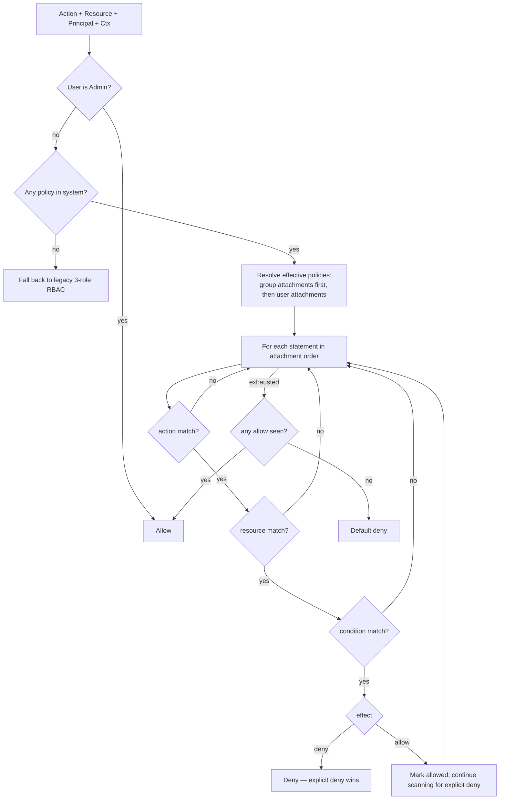
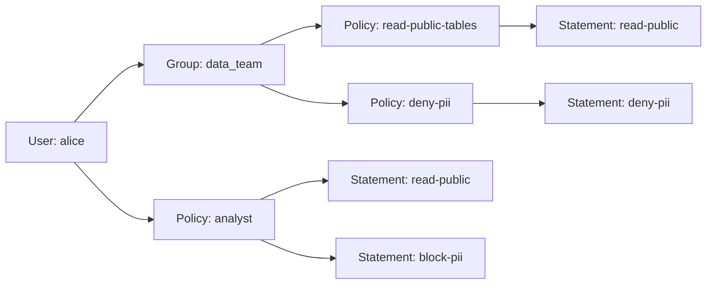

# Policies — IAM-style Authorization

> Canonical reference for RedDB's policy-based authorization model.
> Pairs with [Overview](overview.md) (auth posture), [Multi-Tenancy](multi-tenancy.md)
> (tenant scoping), [Permissioning Handbook](permissions.md) (model-by-model
> design patterns), [Permission Recipes](/guides/permissions-cookbook.md)
> (copyable production patterns), and [Audit](#audit-integration)
> (decision trail).

## Why policies

RedDB's authorization is JSON policy documents — think AWS IAM with the
verbosity ripped out. Each user (or group) attaches one or more policies.
Policies are version-controllable, simulatable, and use the same vocabulary
across SQL, HTTP, and the audit log. The legacy three-role RBAC model
(`read` / `write` / `admin`) still works for clusters that have never created
a policy; the moment any policy exists, the engine switches to deny-by-default
and only the explicit allow / deny statements you write are honored.

Compared with what you already know:

- **Postgres GRANT** is action-on-resource, but is global, has no expiry, no
  IP gating, and no MFA gating. RedDB policies cover all of those.
- **AWS IAM** has all the gates but takes 80 lines of JSON for "give Alice
  read-only on this table". RedDB drops the unused IAM ceremony (`Sid` is
  optional, no `Principal` block — the principal is whoever attached the
  policy, no nested `NotAction` / `NotResource`).

## 5-minute quickstart

Bootstrap an admin, write a policy that lets `alice` read `public.orders`,
attach it, then simulate both the table allow and a PII column deny.

```bash
# 1. bootstrap
curl -sX POST http://127.0.0.1:8080/auth/bootstrap \
  -H 'content-type: application/json' \
  -d '{"username":"admin","password":"changeme"}'
# => {"user":"admin","api_key":"red_ak_..."}

export ADMIN_TOKEN=red_ak_...

# 2. create alice (no role flags needed — policies will gate her)
curl -sX POST http://127.0.0.1:8080/auth/users \
  -H "Authorization: Bearer $ADMIN_TOKEN" \
  -H 'content-type: application/json' \
  -d '{"username":"alice","password":"hunter2"}'

# 3. write a policy
curl -sX PUT http://127.0.0.1:8080/admin/policies/analyst \
  -H "Authorization: Bearer $ADMIN_TOKEN" \
  -H 'content-type: application/json' \
  -d '{
    "version": 1,
    "id": "analyst",
    "statements": [
      { "sid":"read-public",
        "effect":"allow",
        "actions":["select"],
        "resources":["table:public.*"] },
      { "sid":"block-pii",
        "effect":"deny",
        "actions":["select"],
        "resources":["column:users.email","column:users.phone"] }
    ]
  }'

# 4. attach to alice
curl -sX PUT http://127.0.0.1:8080/admin/users/alice/policies/analyst \
  -H "Authorization: Bearer $ADMIN_TOKEN"

# 5. simulate a table allow
curl -sX POST http://127.0.0.1:8080/admin/policies/simulate \
  -H "Authorization: Bearer $ADMIN_TOKEN" \
  -H 'content-type: application/json' \
  -d '{"principal":"alice","action":"select","resource":"table:public.orders"}'
# => {"decision":"allow","matched_policy_id":"analyst","matched_sid":"read-public",...}

# 6. simulate a column deny
curl -sX POST http://127.0.0.1:8080/admin/policies/simulate \
  -H "Authorization: Bearer $ADMIN_TOKEN" \
  -H 'content-type: application/json' \
  -d '{"principal":"alice","action":"select","resource":"column:users.email"}'
# => {"decision":"deny","matched_policy_id":"analyst","matched_sid":"block-pii",
#     "reason":"explicit deny"}
```

Runtime note: table-level `select`/`insert`/`update`/`delete` policy checks
are wired today. `column:*` is the canonical resource vocabulary for PII
simulation and audit trails; use safe views, RLS, generated columns, or query
boundary filtering until a specific SQL path has column-level enforcement
wired. The model-by-model status lives in the
[Permissioning Handbook](permissions.md#current-enforcement-map).

For larger examples across tables, documents, KV, graphs, vectors,
time-series, and queues, use the
[Permission Recipes](/guides/permissions-cookbook.md). This page is the
reference; the cookbook is the implementation playbook.

## Policy anatomy

```jsonc
{
  "version": 1,                    // policy schema version (always 1 today)
  "id": "analyst",                 // stable id; matches URL + DDL handle
  "statements": [
    {
      "sid": "read-public-tables", // optional; surfaces in audit + simulate
      "effect": "allow",           // "allow" | "deny"
      "actions": ["select"],       // see action reference below
      "resources": ["table:public.*"]
    },
    {
      "sid": "block-pii",
      "effect": "deny",            // explicit deny supersedes any allow
      "actions": ["select"],
      "resources": ["column:users.email", "column:users.phone"]
    },
    {
      "effect": "allow",
      "actions": ["insert", "update"],
      "resources": ["table:orders"],
      "condition": {                // all six keys optional; AND-combined
        "expires_at": "2026-12-31T23:59:59Z",
        "source_ip": ["10.0.0.0/8"],
        "mfa": true,
        "time_window": { "from": "09:00", "to": "17:00", "tz": "UTC" }
      }
    }
  ]
}
```

Field rules:

- `version` — required, must be `1`.
- `id` — required, `[a-z0-9_-]{1,64}`. Used in URLs, DDL, and audit.
- `statements` — required, non-empty, max 100.
- `sid` — optional, free-form; recommended for greppable audit entries.
- `effect` — required, one of `"allow"` or `"deny"`.
- `actions` — required, max 50, see [action reference](#action-reference).
- `resources` — required, max 50, see [resource reference](#resource-reference).
- `condition` — optional; all six keys optional; see [conditions](#condition-reference).

## Action reference

| Action | Category | Description |
|---|---|---|
| `select` | DML | Read rows (or a column projection) from a table. |
| `insert` | DML | Add rows to a table. |
| `update` | DML | Mutate existing rows. |
| `delete` | DML | Remove rows. |
| `truncate` | DML | Drop all rows in a table without a `WHERE`. |
| `create` | DDL (future) | Create tables / schemas / indices. General DDL is still role-gated today. |
| `drop` | DDL (future) | Drop objects. General DDL is still role-gated today. |
| `alter` | DDL (future) | Schema mutation. General DDL is still role-gated today. |
| `usage` | Schema | Resolve names inside a schema (Postgres parity — required for any object access in that schema). |
| `execute` | Function | Call a function or stored routine. |
| `references` | DML | Create a foreign key that targets the resource. |
| `grant` | Mgmt | Forward an existing permission to another principal (back-compat for `WITH GRANT OPTION`). |
| `revoke` | Mgmt | Withdraw a permission previously forwarded. |
| `policy:put` | Policy | Create or replace a policy document. |
| `policy:drop` | Policy | Delete a policy document. |
| `policy:attach` | Policy | Bind a policy to a user or group. |
| `policy:detach` | Policy | Unbind a policy from a user or group. |
| `policy:simulate` | Policy | Run the simulator (`SIMULATE …` / `POST /admin/policies/simulate`). |
| `admin:bootstrap` | Admin | First-run bootstrap of the admin user / vault. |
| `admin:audit-read` | Admin | Read the audit log. |
| `admin:reload` | Admin | Force or request a `SIGHUP`-equivalent reload of runtime secrets where supported. |
| `admin:lease-promote` | Admin | Promote a follower lease in a replicated cluster. |
| `*` | Wildcard | Every action — including future ones. Use sparingly. |
| `admin:*` | Wildcard | Every admin verb. Pairs well with conditioned break-glass policies. |
| `policy:*` | Wildcard | Every policy verb. Use for sub-admins who manage authz only. |

## Resource reference

Resources are written `<kind>:<spec>`. `*` is a glob and matches any sequence
of characters within one segment of `spec`.

| Kind | Format | Example | Notes |
|---|---|---|---|
| `table` | `table:[schema.]name` | `table:public.orders` | Schema defaults to `public` if omitted. |
| `table` (glob) | `table:schema.*` | `table:billing.*` | All tables in the schema. |
| `column` | `column:[schema.]table.column` | `column:users.email` | Canonical PII/audit vocabulary; verify the query path has column enforcement before relying on it alone. |
| `schema` | `schema:name.*` | `schema:billing.*` | Implies access to every object in the schema. |
| `function` | `function:name` | `function:hash_pwd` | For `execute` action. |
| Tenant-qualified resource | `<kind>:tenant/<tenant>/<name>` | `table:tenant/acme/public.*` | Explicit cross-tenant form; prefer unqualified resources plus `tenant_match` for ordinary tenant policies. |
| `*` | (literal) | `*` | Every resource. Pair with `*` action only inside conditioned break-glass policies. |

Gotchas:

- **Implicit tenant prefix.** When a session has `SET TENANT 'acme'`, every
  unprefixed resource in a policy attached to a member of that tenant resolves
  to `tenant/acme/<resource-name>` inside the same resource kind. For example,
  `table:public.orders` is matched as `table:tenant/acme/public.orders`.
  Only write the explicit `tenant/<id>/...` prefix when you intentionally want
  to talk about another tenant; the engine refuses cross-tenant authoring
  unless the policy author is a platform admin.
- **Glob is per-segment.** `table:public.*` matches `public.orders` but not
  `public.orders.history` (which is two dots, i.e. column).
- **No `NotResource`.** If you want "everything except X", write an `allow`
  on `*` plus a `deny` on `X`. Explicit deny wins, so this is exact.

## Condition reference

All six keys are optional; if a `condition` block is present, every key
inside must evaluate true (AND). Missing keys = "don't care".

### `expires_at`

```json
{ "condition": { "expires_at": "2026-12-31T23:59:59Z" } }
{ "condition": { "expires_at": 1798675199000 } }
```

- **Type**: RFC 3339 timestamp string, or epoch milliseconds (number).
- **Semantics**: statement is denied if the current server clock is at or past
  this instant. Server clock is UTC.
- **Edge cases**: clock skew between followers / pods is bounded by your NTP
  setup; the engine refuses to evaluate a policy if local clock drift exceeds
  the configured tolerance (default 60 s).

### `valid_from`

```json
{ "condition": { "valid_from": "2026-05-01T00:00:00Z" } }
```

- **Type**: same as `expires_at`.
- **Semantics**: statement is denied if the current clock is *before* this
  instant.
- **Edge cases**: pair with `expires_at` to express a window. If
  `valid_from > expires_at`, the statement is unreachable and the engine
  rejects the policy at `policy:put` time.

### `tenant_match`

```json
{ "condition": { "tenant_match": true } }
```

- **Type**: boolean.
- **Semantics**: when `true`, the statement only matches when the resource's
  tenant scope equals `CURRENT_TENANT()`. Useful in tenant-admin policies
  that should never leak across tenants.
- **Edge cases**: `tenant_match: false` is a no-op (semantically equivalent
  to omitting the key).

### `source_ip`

```json
{ "condition": { "source_ip": ["10.0.0.0/8", "192.168.1.5"] } }
```

- **Type**: array of CIDR strings or single IP strings (IPv4 or IPv6).
- **Semantics**: OR-of-allow. The statement matches if the client's source IP
  is in *any* CIDR. An empty array matches nothing.
- **Edge cases**: behind a reverse proxy, RedDB honours `X-Forwarded-For`
  only when the immediate peer is in the configured trusted-proxy list (see
  [Transport TLS](transport-tls.md#reverse-proxy-patterns)). Otherwise the
  raw socket peer address is used.

### `mfa`

```json
{ "condition": { "mfa": true } }
```

- **Type**: boolean.
- **Semantics**: when `true`, the statement only matches if the session was
  authenticated with a second factor (TOTP / WebAuthn / mTLS client cert with
  the `mfa=1` OID extension).
- **Edge cases**: `mfa: false` is a no-op (does not *forbid* MFA — it just
  doesn't require it). To deny MFA-elevated calls, write an explicit `deny`.

### `time_window`

```json
{ "condition": {
    "time_window": { "from": "09:00", "to": "17:00", "tz": "UTC" }
} }
```

- **Type**: object with `from` (HH:MM), `to` (HH:MM), and optional `tz`
  (IANA name, default `"UTC"`).
- **Semantics**: matches if the server's clock-of-day in `tz` is within
  `[from, to)`. `from > to` is treated as "wraps midnight" — e.g.
  `from: "22:00", to: "06:00"` matches the night shift.
- **Edge cases**: timezone defaults to UTC; the engine refuses unknown IANA
  names at `policy:put` time. `time_window` does *not* implicitly account for
  DST jumps — be explicit if you care.

## Evaluation algorithm



Pseudocode:

```text
fn evaluate(principal, action, resource, ctx) -> Decision:
    if principal.is_admin():
        return Allow{reason: "admin bypass"}

    policies = effective_policies(principal)   // groups first, then user
    if policies.is_empty() and SYSTEM_HAS_NO_POLICIES:
        return legacy_rbac_decision(principal, action, resource)

    matched_allow = None
    for policy in policies:                    // attachment order
        for stmt in policy.statements:         // declaration order
            if !match_action(stmt.actions, action):    continue
            if !match_resource(stmt.resources, resource): continue
            if !match_condition(stmt.condition, ctx):  continue

            if stmt.effect == Deny:
                return Deny{policy: policy.id, sid: stmt.sid,
                            reason: "explicit deny"}
            if stmt.effect == Allow and matched_allow.is_none():
                matched_allow = Some((policy.id, stmt.sid))
            // do NOT short-circuit on allow — keep scanning for deny

    return matched_allow
        .map(|(pid, sid)| Allow{policy: pid, sid: sid})
        .unwrap_or(Deny{reason: "default deny"})
```

Notes:

1. **Iteration order**: statements are scanned in declaration order within a
   policy; policies in attachment order (groups first, then user-direct).
2. **Explicit deny wins** — even if many allows preceded it.
3. **Default deny** when no statement matches.
4. **Admin bypass** is unconditional. The engine still records the audit
   entry with `matched_policy_id: "<admin-bypass>"`.
5. **Legacy RBAC fallback** only applies until the first policy is installed.
   Once you `PUT /admin/policies/...` for the first time, the
   engine commits to deny-by-default forever — there is no flag to flip it
   back. Document this in your runbook.
6. **Tenant scoping**: implicit `tenant/<current_tenant>/` qualification is
   applied inside the resource kind before `match_resource` runs. A statement
   that names a different tenant is checked against the policy author's
   privileges, not the caller's.

## SQL surface (canonical DDL)

```sql
-- create or replace
CREATE POLICY 'analyst' AS $$
{
  "version": 1,
  "statements": [
    { "effect":"allow", "actions":["select"], "resources":["table:public.*"] },
    { "effect":"deny",  "actions":["select"], "resources":["column:users.email"] }
  ]
}
$$;

-- drop
DROP POLICY 'analyst';

-- attach / detach
ATTACH POLICY 'analyst' TO USER alice;
ATTACH POLICY 'analyst' TO GROUP analysts;
DETACH POLICY 'analyst' FROM USER alice;
DETACH POLICY 'analyst' FROM GROUP analysts;

-- group membership
ALTER USER alice ADD GROUP analysts;
ALTER USER alice DROP GROUP analysts;

-- introspection
SHOW POLICIES;
SHOW POLICIES FOR USER alice;
SHOW EFFECTIVE PERMISSIONS FOR alice;
SHOW EFFECTIVE PERMISSIONS FOR alice ON TABLE public.orders;

-- simulate (no side effects)
SIMULATE alice ACTION select ON table:public.orders;
SIMULATE alice ACTION delete ON table:audit_logs;
```

### Back-compat sugars (still fully supported)

`GRANT` and `REVOKE` for `USER` and `PUBLIC` keep working — internally
they are translated into inline policies with auto-generated ids.

```sql
GRANT SELECT, INSERT ON TABLE orders TO alice;
-- becomes inline policy "_grant_01HZX..." with one allow statement,
-- attached to alice.

GRANT SELECT ON TABLE orders TO PUBLIC;
-- attaches the inline policy to RedDB's implicit public policy group.

REVOKE SELECT ON TABLE orders FROM alice;
-- removes the matching statement; if the policy ends up empty it is
-- detached and dropped.
```

> [!WARNING]
> Auto-generated `_grant_<ulid>` policy ids are **not stable across
> backups/restores**. Production deployments should redo these as
> named policies (e.g. `analyst`, `auditor`) so attachments survive
> point-in-time recovery.

## HTTP API

All endpoints require `Authorization: Bearer <token>` and the caller must
have the corresponding `policy:*` action.

### Manage policies

```http
PUT  /admin/policies/{id}      body: <policy json>
GET  /admin/policies/{id}
GET  /admin/policies            -> { "policies": [...] }
DELETE /admin/policies/{id}
```

```bash
curl -sX PUT http://localhost:8080/admin/policies/analyst \
  -H "Authorization: Bearer $T" \
  -H 'content-type: application/json' \
  --data-binary @analyst.json
# 200 -> { "id": "analyst", "version": 1, "etag": "..." }
```

### Attach / detach

```http
PUT    /admin/users/{username}/policies/{id}
DELETE /admin/users/{username}/policies/{id}
PUT    /admin/groups/{group}/policies/{id}
DELETE /admin/groups/{group}/policies/{id}
PUT    /admin/users/{username}/groups/{group}
DELETE /admin/users/{username}/groups/{group}
```

```bash
curl -sX PUT http://localhost:8080/admin/users/alice/policies/analyst \
  -H "Authorization: Bearer $T"
# 200 -> { "ok": true }
```

### Effective permissions

```http
GET /admin/users/{username}/effective-permissions?resource=table:public.orders
```

```bash
curl -s "http://localhost:8080/admin/users/alice/effective-permissions?resource=table:public.orders" \
  -H "Authorization: Bearer $T"
```

```json
{
  "principal": "alice",
  "resource": "table:public.orders",
  "actions": {
    "select":   { "allowed": true,  "matched": { "policy": "analyst", "sid": "read-public" } },
    "insert":   { "allowed": false, "matched": null, "reason": "default deny" },
    "delete":   { "allowed": false, "matched": null, "reason": "default deny" }
  }
}
```

### Simulate

```http
POST /admin/policies/simulate
```

```bash
curl -sX POST http://localhost:8080/admin/policies/simulate \
  -H "Authorization: Bearer $T" \
  -H 'content-type: application/json' \
  -d '{
    "principal": "alice",
    "action":    "select",
    "resource":  "column:users.email",
    "ctx":       { "source_ip": "10.0.4.7", "mfa": true }
  }'
```

```json
{
  "decision":         "deny",
  "matched_policy_id":"analyst",
  "matched_sid":      "block-pii",
  "reason":           "explicit deny",
  "trail":            []
}
```

## Side-by-side comparison

How ten common scenarios look in Postgres `GRANT`, AWS IAM, and RedDB.

### 1. Read-only on one table

| | |
|---|---|
| **Postgres** | `GRANT SELECT ON TABLE orders TO analyst;` |
| **AWS IAM** | 12 lines of `Statement` JSON with `dynamodb:GetItem`, `dynamodb:Query`, table ARN. |
| **RedDB** | `{"effect":"allow","actions":["select"],"resources":["table:orders"]}` |

### 2. Block PII columns

| | |
|---|---|
| **Postgres** | `REVOKE SELECT (email, phone) ON users FROM PUBLIC;` then column-level `GRANT` to others. |
| **AWS IAM** | Not natively supported — needs an attribute-level Lake Formation policy. |
| **RedDB** | Canonical policy vocabulary: `{"effect":"deny","actions":["select"],"resources":["column:users.email","column:users.phone"]}`. Until the target query path has column enforcement, prefer safe views/RLS/generated columns. |

### 3. Expire access after a date

| | |
|---|---|
| **Postgres** | Cron job that runs `REVOKE`. |
| **AWS IAM** | `Condition: { DateLessThan: { "aws:CurrentTime": "..." } }` |
| **RedDB** | `"condition": { "expires_at": "2026-12-31T23:59:59Z" }` |

### 4. Require MFA for writes

| | |
|---|---|
| **Postgres** | Not built in — needs an external app gate. |
| **AWS IAM** | `Condition: { Bool: { "aws:MultiFactorAuthPresent": "true" } }` |
| **RedDB** | `"condition": { "mfa": true }` on the write statement. |

### 5. VPN CIDR allowlist

| | |
|---|---|
| **Postgres** | `pg_hba.conf` (network-level, not per-user-per-table). |
| **AWS IAM** | `Condition: { IpAddress: { "aws:SourceIp": ["10.0.0.0/8"] } }` |
| **RedDB** | `"condition": { "source_ip": ["10.0.0.0/8"] }` |

### 6. Business-hours only

| | |
|---|---|
| **Postgres** | Trigger or app-level. |
| **AWS IAM** | `Condition: { DateGreaterThan + DateLessThan }` per request — clunky. |
| **RedDB** | `"condition": { "time_window": { "from":"09:00","to":"17:00","tz":"UTC" } }` |

### 7. Tenant admin (full power within own tenant only)

| | |
|---|---|
| **Postgres** | Schema-per-tenant + `GRANT ALL ON SCHEMA acme TO acme_admin;` |
| **AWS IAM** | Resource ARN with `${aws:PrincipalTag/Tenant}` — works but verbose. |
| **RedDB** | `{"effect":"allow","actions":["*"],"resources":["*"],"condition":{"tenant_match":true}}` |

### 8. Service account, read-only across all schemas

| | |
|---|---|
| **Postgres** | `GRANT USAGE ON SCHEMA ALL ...; GRANT SELECT ON ALL TABLES ...;` |
| **AWS IAM** | A managed `ReadOnlyAccess` policy. |
| **RedDB** | `{"effect":"allow","actions":["select","usage"],"resources":["*"]}` |

### 9. Platform admin

| | |
|---|---|
| **Postgres** | `ALTER USER ops SUPERUSER;` |
| **AWS IAM** | `AdministratorAccess` managed policy. |
| **RedDB** | `{"effect":"allow","actions":["*"],"resources":["*"]}` (recommend pairing with `mfa: true`). |

### 10. Delegate (WITH GRANT OPTION)

| | |
|---|---|
| **Postgres** | `GRANT SELECT ON orders TO alice WITH GRANT OPTION;` |
| **AWS IAM** | `iam:AttachUserPolicy` permission, scoped via `Condition: { StringEquals: { "iam:PolicyARN": ... } }`. |
| **RedDB** | Attach a policy with `actions: ["policy:attach", "policy:detach"]` scoped to the policies the delegate may forward. |

## Cookbook

Ten ready-to-paste recipes. Each is a complete policy + the SQL to attach it
+ a simulator query that proves it works.

### Recipe 1 — Read-only analyst (deny PII)

```json
{
  "version": 1, "id": "analyst",
  "statements": [
    { "sid":"read-everything","effect":"allow","actions":["select","usage"],"resources":["*"] },
    { "sid":"no-pii","effect":"deny","actions":["select"],"resources":["column:*.email","column:*.phone","column:*.ssn"] }
  ]
}
```

```sql
ATTACH POLICY 'analyst' TO USER alice;
SIMULATE alice ACTION select ON column:customers.email;
-- expect: denied (sid=no-pii)
```

### Recipe 2 — Tenant admin (no cross-tenant)

```json
{
  "version": 1, "id": "tenant-admin",
  "statements": [
    { "sid":"own-tenant","effect":"allow","actions":["*"],"resources":["*"],
      "condition": { "tenant_match": true } }
  ]
}
```

```sql
ATTACH POLICY 'tenant-admin' TO GROUP tenant_admins;
-- After SET TENANT 'acme', tenant_admins can do everything in acme but
-- nothing in any other tenant — even with explicit tenant/<id> prefixes.
```

### Recipe 3 — Time-boxed contractor

```json
{
  "version": 1, "id": "contractor-2026q2",
  "statements": [
    { "effect":"allow","actions":["select","insert","update"],
      "resources":["table:billing.*"],
      "condition": {
        "valid_from":  "2026-04-01T00:00:00Z",
        "expires_at":  "2026-06-30T23:59:59Z"
      } }
  ]
}
```

```sql
ATTACH POLICY 'contractor-2026q2' TO USER ext.bob;
SIMULATE ext.bob ACTION select ON table:billing.invoices;
-- allowed only inside the window.
```

### Recipe 4 — On-call SRE (admin during business hours, MFA)

```json
{
  "version": 1, "id": "oncall-sre",
  "statements": [
    { "sid":"daytime-admin","effect":"allow","actions":["admin:*"],"resources":["*"],
      "condition": {
        "time_window": { "from":"08:00","to":"20:00","tz":"UTC" },
        "mfa": true
      } }
  ]
}
```

### Recipe 5 — Service account (no MFA, IP allowlisted, no admin)

```json
{
  "version": 1, "id": "svc-orders",
  "statements": [
    { "effect":"allow","actions":["select","insert","update"],
      "resources":["table:public.orders","table:public.order_items"],
      "condition": { "source_ip": ["10.0.0.0/8"] } },
    { "effect":"deny","actions":["admin:*","policy:*"],"resources":["*"] }
  ]
}
```

### Recipe 6 — CI runner (insert into one table, no select)

```json
{
  "version": 1, "id": "ci-events",
  "statements": [
    { "effect":"allow","actions":["insert"],"resources":["table:ci.events"],
      "condition": { "source_ip": ["10.42.0.0/16"] } }
  ]
}
```

```sql
SIMULATE ci_runner ACTION select ON table:ci.events;
-- denied (default deny — no select statement matches).
```

### Recipe 7 — Auditor (audit log only)

```json
{
  "version": 1, "id": "auditor",
  "statements": [
    { "effect":"allow","actions":["admin:audit-read"],"resources":["*"] }
  ]
}
```

### Recipe 8 — Backup operator (backup tables, no PII)

```json
{
  "version": 1, "id": "backup-operator",
  "statements": [
    { "effect":"allow","actions":["select"],"resources":["table:*"] },
    { "effect":"deny",  "actions":["select"],"resources":["column:*.email","column:*.phone","column:*.ssn","column:*.password_hash"] }
  ]
}
```

### Recipe 9 — Read replica connection

```json
{
  "version": 1, "id": "read-replica",
  "statements": [
    { "effect":"allow","actions":["select","usage"],"resources":["*"] }
  ]
}
```

### Recipe 10 — Break-glass admin

```json
{
  "version": 1, "id": "break-glass-2026-04-26-01",
  "statements": [
    { "effect":"allow","actions":["*"],"resources":["*"],
      "condition": {
        "valid_from":  "2026-04-26T14:31:00Z",
        "expires_at":  "2026-04-26T15:01:00Z",
        "mfa": true
      } }
  ]
}
```

```sql
ATTACH POLICY 'break-glass-2026-04-26-01' TO USER incident_lead;
-- 30-minute window; the policy auto-expires. Audit log captures
-- everything the holder did under sid (none in this case — set one).
```

> [!TIP]
> Make break-glass policy ids include the timestamp so post-incident
> review can grep for them; never reuse an id.

## Migration from GRANT/REVOKE

Old DDL still works. Internally:

| Before | After (auto-translated) |
|---|---|
| `GRANT SELECT ON orders TO alice;` | Inline policy `_grant_<ulid>` with `{"effect":"allow","actions":["select"],"resources":["table:orders"]}`, attached to `alice`. |
| `GRANT SELECT ON orders TO PUBLIC;` | Inline policy attached to RedDB's implicit public policy group. |
| `GRANT ALL ON SCHEMA billing TO ops;` | `{"effect":"allow","actions":["*"],"resources":["schema:billing.*"]}` |
| `REVOKE SELECT ON orders FROM alice;` | Removes the matching `select` statement; if the policy is empty, detaches + drops it. |

To migrate:

1. Run `SHOW POLICIES;` — every `_grant_*` is auto-generated.
2. For each set of related grants, write a single named policy
   (`analyst`, `auditor`, `svc-orders`).
3. Attach the named policy.
4. Detach the `_grant_*` policies (or `DROP POLICY '_grant_...';`).
5. Verify with `SIMULATE` for a representative principal.

> [!WARNING]
> Do step 5 before flipping production traffic. Auto-generated policy
> ids do not survive backup/restore round-trips identically — named
> policies do.

## Audit integration

Every policy evaluation emits one structured audit event. The shape:

```json
{
  "ts":                 "2026-04-26T14:32:11.123Z",
  "principal":          "alice",
  "action":             "select",
  "resource":           "column:users.email",
  "decision":           "deny",
  "matched_policy_id":  "analyst",
  "matched_sid":        "block-pii",
  "tenant":             "acme",
  "request_id":         "01HZX...",
  "source_ip":          "10.0.4.7",
  "transport":          "http"
}
```

Reasons emitted:

- `"explicit deny"` — a deny statement matched.
- `"explicit allow"` — an allow matched and no later deny did.
- `"default deny"` — no statement matched.
- `"admin bypass"` — caller was a system admin.
- `"legacy rbac"` — system has no policies; legacy three-role check ran.

The audit stream is queryable through the `red.audit` collection (every entry
is also written there) and via `GET /admin/audit?from=...&to=...` (requires
`admin:audit-read`).

## Limits

| Limit | Value | Notes |
|---|---|---|
| Statements per policy | 100 | Hard cap; `policy:put` rejects above. |
| Actions per statement | 50 | Hard cap. |
| Resources per statement | 50 | Hard cap. |
| Total policy JSON size | 32 KiB | Hard cap. |
| Policies per instance | 1000 | Soft (design target). Larger deployments work but evaluation cost grows linearly with attached policies per principal. |

If you bump against any of these, split into multiple named policies. There
is no performance benefit to a monolithic policy and the limits exist to keep
evaluation costs predictable.

## Threat model

- **Default deny** — nothing is exposed unless an explicit allow matches.
  The legacy three-role fallback only kicks in until the first policy is
  installed; after that, default deny is permanent.
- **Explicit deny supersedes** — useful for blanket "no PII anywhere" rules
  that you can attach via a group and never have to remember when writing a
  per-team policy.
- **Conditions evaluated server-side** — `mfa`, `source_ip`, `time_window`,
  and `expires_at` are read from server-side context, never from the
  request body. The client cannot lie about MFA.
- **Audit log carries `matched_sid`** — postmortems can pinpoint *which
  statement* allowed or denied something, not just *which policy*.
- **Tenant scoping** — engine refuses cross-tenant resources unless the
  policy author has `admin:*` on `*`. This means a tenant admin cannot
  privilege-escalate by writing a policy that touches another tenant.
- **Replay protection** — `expires_at`, `valid_from`, and `time_window`
  reduce the blast radius of a leaked token: even a long-lived API key is
  only useful within the policy's window.
- **Author-vs-caller** — when a policy names an explicit `tenant/<id>` resource, the
  engine checks the *author's* privileges (was the author a platform
  admin?), not the caller's. This is the same model AWS IAM uses for
  cross-account roles.

## Attachment model



Effective permissions are the union of all statements across all policies
attached transitively (group + user). Group attachments are evaluated *first*
within each policy attachment order.

## FAQ

**Q. How do I express "everyone except Bob can read this"?**
A. Two statements in the same policy: `allow select on table:foo` (attached
to a group everyone is in) and `deny select on table:foo` with a condition
that filters Bob — except RedDB has no principal-condition. The idiomatic
way is to *not attach* the policy to Bob, or to attach an additional
`deny`-only policy to Bob. Don't try to encode principal exceptions inside
a single policy — that's an AWS IAM antipattern that doesn't translate.

**Q. Can I do column-level on JSON paths?**
A. Not in v1. `column:users.profile.address` resolves to the column
`profile`, not the JSON sub-path. Use a generated column or RLS for sub-path
gating today.

**Q. Can I version policies?**
A. Yes — every `policy:put` returns an etag. The previous version is kept in
the `red.policies_history` collection (read-only, via `admin:audit-read`).
For application-level versioning, embed the version in the id:
`analyst-v3`.

**Q. Can I export to AWS IAM?**
A. Not exactly — RedDB resources don't have ARNs and condition keys differ.
But the structure maps well; we ship `red admin export-policies --format=iam`
that emits a best-effort translation suitable for human review.

**Q. How does this play with RLS?**
A. RLS evaluates *after* policy authorization. Policy says "can alice run
SELECT on this table at all?"; RLS then says "of the rows in that table,
which ones is she allowed to see?". They compose; neither replaces the
other. See [Row Level Security](rls.md).

**Q. Performance hit?**
A. Per-evaluation cost is O(statements attached to principal) — typically
sub-microsecond. The first evaluation per request loads policies through a
cache; subsequent statements in the same query don't re-read. Audit
emission is asynchronous (buffered, flushed every 200 ms or 4 KiB).

**Q. Policy id collision on `PUT`?**
A. `PUT /admin/policies/{id}` is a full replace. The previous version
goes to `red.policies_history`. There's no separate POST/PUT distinction.
If you want create-only semantics, set `If-None-Match: *`.

**Q. Multi-region / replicated clusters?**
A. Policy writes are serialized through the lease-holder, same as any other
admin write. Followers serve reads locally. There is a brief replication lag
window during which an attached policy might not be enforced on a follower —
default deny still applies, so the failure mode is "alice gets denied a
moment longer than expected", not unsafe.

## Cross-references

- [Overview](overview.md) — auth posture, RBAC fallback, transport TLS.
- [Permissioning Handbook](permissions.md) — resource vocabulary and current enforcement map.
- [Permission Recipes](/guides/permissions-cookbook.md) — copyable patterns across every data model.
- [Multi-Tenancy](multi-tenancy.md) — tenant scoping, `tenant_match`.
- [Row Level Security](rls.md) — per-row predicates, runs after policy authz.
- [API Keys & Tokens](tokens.md) — issuance + rotation.
- [Vault](vault.md) — where policy bodies are stored at rest.
- [Transport TLS](transport-tls.md) — covers the wire.
- [Audit](#audit-integration) — decision trail format.
