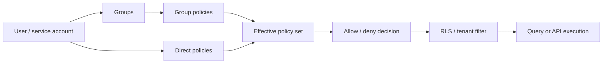

# Users, Groups, and Legacy Roles

RedDB has two authorization layers:

1. **IAM-style policies** are the canonical production model. They attach to
   users or groups, support explicit deny, conditions, simulation, and
   Git-friendly JSON documents.
2. **Legacy roles** (`read`, `write`, `admin`) are a compatibility fallback for
   simple deployments and clusters that have not created any policy yet.

> [!IMPORTANT]
> The moment any IAM policy exists in the cluster, RedDB switches to
> deny-by-default. Legacy roles no longer grant data access by themselves; the
> effective decision comes from attached policies, explicit denies, conditions,
> and RLS.

Use this page for identity lifecycle. Use [Policies](policies.md) for the JSON
policy format and [Permissioning Handbook](permissions.md) for data-model
permission design.

## Mental Model



Recommended production shape:

```text
one identity per workload -> groups for durable access -> policies for decisions -> RLS for entity filtering
```

## Creating Users

Users are identities. Prefer one user per human and one service account per
automation workload.

```bash
# Via CLI
red auth create-user alice --password secret --role read

# Via HTTP
curl -X POST http://127.0.0.1:8080/auth/users \
  -H 'content-type: application/json' \
  -H 'Authorization: Bearer <admin-token>' \
  -d '{"username": "alice", "password": "secret", "role": "read"}'
```

The `role` field is still required by older auth paths and remains useful
before policies exist. Treat it as bootstrap posture, not as the long-term
permission model.

Recommended names:

| Kind | Pattern | Example |
|---|---|---|
| Human | `<name>` | `alice` |
| Tenant human | `<tenant>_<name>` or tenant-bound audit identity | `acme_alice` |
| Service account | `svc_<purpose>` | `svc_ingest`, `svc_rag`, `svc_queue_worker` |
| Break-glass | `breakglass_<ticket>` | `breakglass_inc_7421` |

## Groups

Groups are policy attachment sets. They are not login identities and they do
not replace users.

```sql
ATTACH POLICY 'analyst' TO GROUP analysts;
ALTER USER alice ADD GROUP analysts;
ALTER USER alice DROP GROUP analysts;
```

HTTP:

```http
PUT    /admin/groups/analysts/policies/analyst
DELETE /admin/groups/analysts/policies/analyst
PUT    /admin/users/alice/groups/analysts
DELETE /admin/users/alice/groups/analysts
```

Recommended groups:

| Group | Purpose |
|---|---|
| `readers` | Low-risk read-only access. |
| `analysts` | Analytical reads, usually paired with PII denies or safe views. |
| `ingest_workers` | Insert-only ingestion service accounts. |
| `queue_workers` | Queue read/ack service accounts. |
| `tenant_admins` | Tenant-scoped broad data access with `tenant_match`. |
| `policy_admins` | Policy document management without application data access. |

Prefer group attachments for durable access and direct user attachments for
temporary exceptions.

## Legacy Role Permissions

These roles apply only while no IAM policy exists anywhere in the cluster.

| Operation | `read` | `write` | `admin` |
|:----------|:-------|:--------|:--------|
| Query (`SELECT`) | Yes | Yes | Yes |
| Scan | Yes | Yes | Yes |
| Health/stats | Yes | Yes | Yes |
| Insert entities | No | Yes | Yes |
| Update entities | No | Yes | Yes |
| Delete entities | No | Yes | Yes |
| Create collections | No | Yes | Yes |
| Drop collections | No | No | Yes |
| Manage users | No | No | Yes |
| Manage API keys | No | No | Yes |
| Snapshots/exports | No | No | Yes |
| Index management | No | No | Yes |

Once policies exist, model the same permissions explicitly:

```json
{
  "version": 1,
  "id": "read-only",
  "statements": [
    {
      "sid": "read-tables",
      "effect": "allow",
      "actions": ["select"],
      "resources": ["table:*"]
    }
  ]
}
```

## PUBLIC

`GRANT ... TO PUBLIC` is kept for SQL compatibility. Internally it becomes a
synthetic IAM policy attached to an implicit public policy group that every
principal receives.

```sql
GRANT SELECT ON TABLE product_catalog TO PUBLIC;
REVOKE SELECT ON TABLE product_catalog FROM PUBLIC;
```

Use `PUBLIC` for demos and bootstrap data. For production access, create a
named group and add users deliberately.

## Listing Users

```bash
# Via CLI
red auth list-users

# Via HTTP
curl http://127.0.0.1:8080/auth/users \
  -H 'Authorization: Bearer <admin-token>'
```

## Inspecting Effective Access

Use the policy surfaces for authorization questions:

```sql
SHOW POLICIES FOR USER alice;
SHOW EFFECTIVE PERMISSIONS FOR alice ON TABLE orders;
SIMULATE alice ACTION select ON table:orders;
SIMULATE alice ACTION select ON column:users.email;
```

HTTP:

```http
GET  /admin/users/alice/effective-permissions?resource=table:orders
POST /admin/policies/simulate
```

## Changing Passwords

```bash
curl -X POST http://127.0.0.1:8080/auth/change-password \
  -H 'content-type: application/json' \
  -H 'Authorization: Bearer <token>' \
  -d '{"username": "alice", "password": "new-secret"}'
```

## Deleting Users

```bash
grpcurl -plaintext \
  -H 'Authorization: Bearer <admin-token>' \
  -d '{"payloadJson": "{\"username\":\"alice\"}"}' \
  127.0.0.1:50051 reddb.v1.RedDb/AuthDeleteUser
```

## Who Am I

Check the current authenticated user:

```bash
curl http://127.0.0.1:8080/auth/whoami \
  -H 'Authorization: Bearer <token>'
```

## Migration Pattern

1. List existing users and their legacy roles.
2. Create named policies that represent the real access patterns.
3. Attach policies to groups, not directly to every user.
4. Add users to groups.
5. Run `SIMULATE` for representative allow, explicit deny, and default deny cases.
6. Keep the legacy role as a coarse bootstrap value, but do not depend on it for production authorization.

See [Permission Recipes](/guides/permissions-cookbook.md) for concrete
patterns across tables, documents, KV, graphs, vectors, time-series, and
queues.
