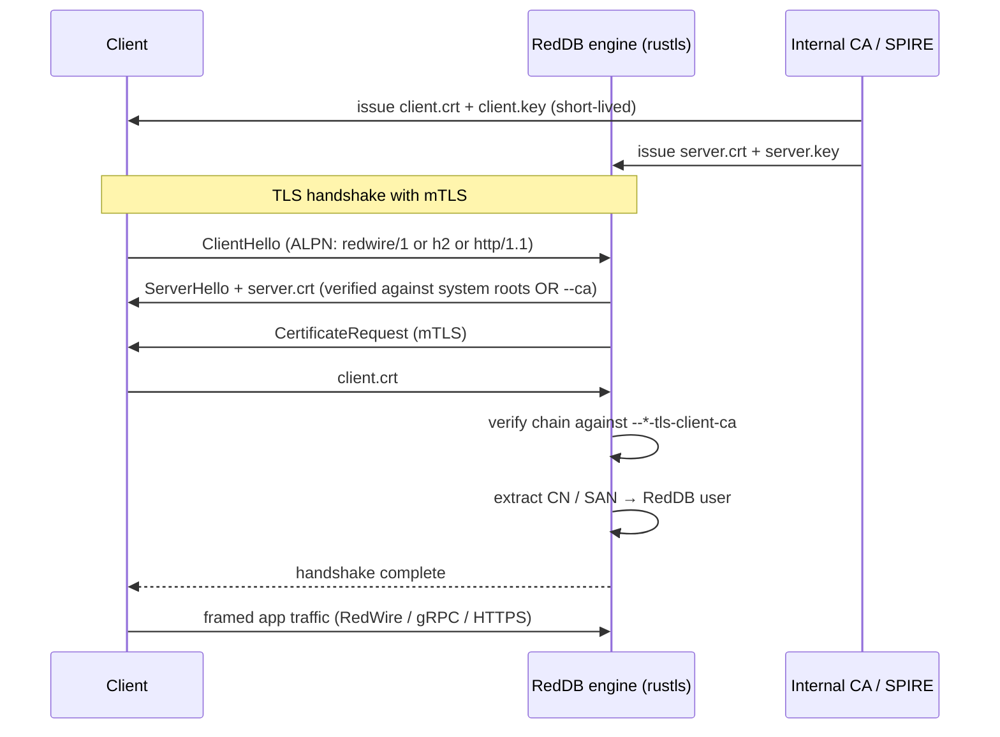

# Transport TLS

> Canonical reference for TLS posture across every RedDB transport.
> Pairs with [Vault](vault.md) (state at rest) and
> [Encryption at Rest](encryption.md) (data files at rest); this page
> is everything in flight.

## Why this doc

RedDB ships four transports — RedWire (TCP framed binary), HTTP/1.1
(REST + admin), gRPC, and embedded — and TLS works slightly
differently on each. The same cluster typically exposes three of them
in parallel, often on different ports, often behind different L4 / L7
load balancers, often with different cert lifecycles. This page is
the single source of truth on how to harden each, what env-vars and
flags exist, and which features (mTLS, OAuth/JWT, SCRAM, HMAC,
replay protection) are wired on each transport.

> [!IMPORTANT]
> Plaintext transports are for `localhost` and trusted lab networks
> only. Every production cluster MUST terminate TLS — either at the
> RedDB engine (using the flags below) or at a proxy in the same
> trust zone (nginx, Envoy, ALB; see [Reverse proxy patterns](#reverse-proxy-patterns)).

Quick navigation:

- [Posture matrix](#posture-matrix) — the one-glance comparison
- [CLI surface](#cli-surface) — flags and env vars per transport
- [Cert lifecycle](#cert-lifecycle) — issuance, rotation, file modes
- [mTLS deployment](#mtls-deployment) — when and how
- [OAuth / JWT integration](#oauth--jwt-integration) — issuer, JWKS, fallback
- [Driver compatibility](#driver-compatibility) — TLS / JWT / mTLS support per language
- [Reverse proxy patterns](#reverse-proxy-patterns) — terminate at LB vs engine
- [Threat-model coverage](#threat-model-coverage) — what TLS does and doesn't defend
- [FAQ](#faq)

---

## Posture matrix

| Transport | TLS termination | mTLS (client cert) | OAuth-JWT auth | Bearer auth | SCRAM | HMAC-signed | Replay-resistant by default |
|-----------|-----------------|--------------------|----------------|-------------|-------|-------------|-----------------------------|
| RedWire (`red://`, `reds://`)         | tokio-rustls + ALPN `redwire/1`              | no — server TLS only today           | programmatic auth path | yes | yes | no  | yes — SCRAM nonce |
| HTTP (`http://`, `https://`)          | rustls in the HTTP server                    | yes — optional `--http-tls-client-ca`| programmatic auth path | yes | no  | yes — `X-RedDB-Signature` | yes — HMAC ts skew ±5 min |
| gRPC                                  | tonic `ServerTlsConfig`                      | yes — `REDDB_GRPC_TLS_CLIENT_CA`     | programmatic auth path | yes | no  | no  | no — application-level only |
| Embedded (`red:///path`)              | n/a (no network)                              | n/a                                  | n/a                 | n/a | n/a | n/a | n/a |

**Reading the matrix**

- "TLS termination" — where the certificate is presented and the
  TLS handshake completes. RedDB always supports terminating in-process;
  you may choose to terminate at a proxy and run RedDB with plaintext
  inside the trust zone.
- "Replay-resistant by default" — does the protocol have a
  built-in mechanism to reject replays without application code.
  RedWire's SCRAM nonce and HTTP's `X-RedDB-Timestamp` + nonce achieve
  this. gRPC defers to bearer tokens; replay protection there relies
  on token short-lifetime and TLS itself.
- mTLS is optional everywhere it's listed. The flag enables it; without
  the flag, the listener accepts plain server-auth-only TLS.

---

## CLI surface

Every TLS-capable transport follows the same operational pattern, with one
surface difference: HTTP and RedWire expose CLI flags; gRPC TLS is configured
through env vars today.

1. A plaintext bind selects the non-TLS listener.
2. A TLS bind selects a parallel TLS-only listener.
3. Cert and key settings point at PEM files.
4. Optional client-CA settings enable mTLS on HTTP and gRPC.
5. Env settings support the `*_FILE` companion convention for
   Kubernetes/Docker secrets where the runtime reads the env variant.
6. Dev cert generation exists for HTTP, gRPC, and RedWire, but production
   deployments should mount explicit cert/key files.

You can run all three TLS-capable transports concurrently on
distinct ports — this is the recommended production posture.

### RedWire (shipped today)

```bash
red server \
  --wire-bind     0.0.0.0:5050 \
  --wire-tls-bind 0.0.0.0:5443 \
  --wire-tls-cert /run/secrets/wire.crt \
  --wire-tls-key  /run/secrets/wire.key
```

RedWire TLS is configured by CLI flags today:

| Flag | Purpose |
|---|---|
| `--wire-tls-bind` | TLS RedWire listener address |
| `--wire-tls-cert` | Path to cert PEM |
| `--wire-tls-key` | Path to key PEM |

> [!NOTE]
> Auto-generation kicks in when `--wire-tls-bind` is set but
> `--wire-tls-cert` and `--wire-tls-key` are both omitted. The
> generated cert is written next to the data path and reused on restart.
> RedWire mTLS is not wired today; use HTTP or gRPC when the engine must
> verify client certificates at the transport layer.

### HTTP

```bash
red server \
  --http-bind     0.0.0.0:8080 \
  --http-tls-bind 0.0.0.0:8443 \
  --http-tls-cert /run/secrets/http.crt \
  --http-tls-key  /run/secrets/http.key
```

With mTLS:

```bash
red server \
  --http-tls-bind      0.0.0.0:8443 \
  --http-tls-cert      /run/secrets/http.crt \
  --http-tls-key       /run/secrets/http.key \
  --http-tls-client-ca /run/secrets/clients-ca.pem
```

Flags and env companions:

| Setting | Purpose |
|---|---|
| `--http-tls-bind` / `REDDB_HTTP_TLS_BIND` | HTTPS listener address |
| `--http-tls-cert` / `REDDB_HTTP_TLS_CERT` / `REDDB_HTTP_TLS_CERT_FILE` | Path to cert PEM |
| `--http-tls-key` / `REDDB_HTTP_TLS_KEY` / `REDDB_HTTP_TLS_KEY_FILE` | Path to key PEM |
| `--http-tls-client-ca` / `REDDB_HTTP_TLS_CLIENT_CA` / `REDDB_HTTP_TLS_CLIENT_CA_FILE` | Trusted client-CA bundle — enables mTLS |
| `RED_HTTP_TLS_DEV` | `1` to allow an auto-generated self-signed cert when cert/key are omitted |

### gRPC

```bash
REDDB_GRPC_TLS_BIND=0.0.0.0:50052 \
REDDB_GRPC_TLS_CERT=/run/secrets/grpc.crt \
REDDB_GRPC_TLS_KEY=/run/secrets/grpc.key \
red server --grpc --grpc-bind 0.0.0.0:50051
```

With mTLS:

```bash
REDDB_GRPC_TLS_BIND=0.0.0.0:50052 \
REDDB_GRPC_TLS_CERT=/run/secrets/grpc.crt \
REDDB_GRPC_TLS_KEY=/run/secrets/grpc.key \
REDDB_GRPC_TLS_CLIENT_CA=/run/secrets/clients-ca.pem \
red server --grpc --grpc-bind 0.0.0.0:50051
```

Env settings:

| Variable | Purpose |
|---|---|
| `REDDB_GRPC_TLS_BIND` | TLS gRPC listener address |
| `REDDB_GRPC_TLS_CERT` / `REDDB_GRPC_TLS_CERT_FILE` | Path to cert PEM |
| `REDDB_GRPC_TLS_KEY` / `REDDB_GRPC_TLS_KEY_FILE` | Path to key PEM |
| `REDDB_GRPC_TLS_CLIENT_CA` / `REDDB_GRPC_TLS_CLIENT_CA_FILE` | Trusted client-CA bundle — enables mTLS |
| `RED_GRPC_TLS_DEV` | `1` to allow an auto-generated self-signed cert when cert/key are omitted |

### Run all three TLS transports together

```bash
red server \
  --vault \
  --path /var/lib/reddb/data.rdb \
  --http-tls-bind 0.0.0.0:8443 --http-tls-cert /etc/reddb/http.crt --http-tls-key /etc/reddb/http.key \
  --wire-tls-bind 0.0.0.0:5443  --wire-tls-cert /etc/reddb/wire.crt --wire-tls-key /etc/reddb/wire.key
```

Set gRPC TLS env vars alongside that command when exposing gRPCS:

```bash
export REDDB_GRPC_TLS_BIND=0.0.0.0:50052
export REDDB_GRPC_TLS_CERT=/etc/reddb/grpc.crt
export REDDB_GRPC_TLS_KEY=/etc/reddb/grpc.key
```

You usually want a wildcard or SAN-multi cert that covers all three
hostnames, so a single PEM pair fits all three flags.

### Embedded mode

Embedded mode (`red:///path/to/data.rdb`, the JS / Rust / Python
PyO3 drivers) doesn't use TLS — there's no socket. The driver speaks
to the engine via stdio JSON-RPC inside the same process tree. Trust
boundary is the OS process, so confidentiality is delegated to the
filesystem (LUKS, KMS-backed volumes, vault for the seal cert).

---

## Cert lifecycle

### Where certs come from

| Source                | When to use                                       |
|-----------------------|---------------------------------------------------|
| **cert-manager (K8s)**| Default for any cluster — automatic renewal       |
| **Let's Encrypt** (certbot) | Public hostname, no Kubernetes                    |
| **Internal CA** (step-ca, Vault PKI) | Private clusters, mesh, banking compliance |
| **AWS ACM**           | Termination at ALB / NLB only — RedDB sees plaintext from the trust zone |
| **Cloudflare**        | Edge termination only — RedDB sees plaintext     |

> [!NOTE]
> ACM-issued certs cannot be exported in PEM form — they only attach to
> AWS load balancers. If you need TLS to terminate inside the RedDB
> engine on AWS, use ACM Private CA (PCA) and issue exportable certs,
> or use cert-manager + Let's Encrypt.

### File conventions

For Kubernetes Secrets and Docker secrets, mount each cert as three
sibling files under `/run/secrets/<name>/` or `/etc/reddb/<name>/`:

```
/run/secrets/http/
  ├── tls.crt          0444   server certificate (chain OK)
  ├── tls.key          0400   private key (only the engine UID can read)
  └── ca.crt           0444   trusted client-CA bundle (mTLS only)
```

| File          | Mode  | Owner          | Notes                                     |
|---------------|-------|----------------|-------------------------------------------|
| `*.crt`       | 0444  | reddb:reddb    | Public — readable by anyone in the pod    |
| `*.key`       | 0400  | reddb:reddb    | Private — engine UID only, never world-readable |
| `*.ca`        | 0444  | reddb:reddb    | Public — pinned issuer for client certs   |

### Rotation

The recommended pattern uses an external secret manager that renews the cert
in place, then performs a rolling restart of RedDB listeners:

```bash
# After cert-manager has rewritten the secret in /run/secrets/...
systemctl restart reddb
```

or, in Kubernetes, roll the deployment and let readiness checks drain old pods.

`SIGHUP` re-reads `*_FILE` companions for per-request secrets and records a
reload audit event, but TLS listener cert material is loaded when the listener
starts. Treat TLS certificate rotation as a restart/rolling-restart operation
in this release. This keeps the public contract honest: secret values can be
re-read lazily; active rustls listener configs are not hot-swapped yet.

### Validity windows

| Cert type      | Recommended validity | Renewal trigger        |
|----------------|----------------------|------------------------|
| Server cert    | 90 days              | 30 days before expiry  |
| Client cert    | 30 days              | 7 days before expiry   |
| Internal CA    | 10 years             | Manual, every 5 years  |
| Self-signed dev| 365 days             | Re-generated each boot |

Expired server certs cause handshake failure (`certificate has expired`
or `unknown issuer`); clients reconnect cleanly after rotation.

---

## mTLS deployment

mTLS adds **client authentication** to the TLS handshake — both peers
present a certificate, both verify the other's chain.

### When to use mTLS

- **Zero-trust networks** — every service-to-service hop authenticates,
  no implicit network trust.
- **Service mesh** (Istio, Linkerd, Consul Connect) — mesh issues
  short-lived per-pod certs; RedDB is just another peer.
- **Compliance** (PCI, HIPAA, SOC2 mTLS controls) — strong proof of
  client identity at the transport layer.
- **Cross-VPC / cross-account** traffic — replaces VPC peering trust
  with cryptographic identity.

### Provisioning client certs

| Approach          | How it works                                            |
|-------------------|---------------------------------------------------------|
| **SPIFFE / SPIRE**| Workload identity API; per-workload SVIDs auto-rotated  |
| **Istio**         | Sidecar receives a cert from `istiod` every ~24h        |
| **Manual CA**     | One CA → one cert per service; rotate on a calendar     |
| **Vault PKI**     | Vault is the CA; clients fetch certs via `vault read pki/issue/...` |

### Identity mapping at the server

When mTLS is configured, RedDB extracts an identity from the verified
client cert. Two modes (configured via `AuthConfig.cert`):

- **`CommonName`** — the subject's CN is looked up against the user
  registry. CN must equal a RedDB username.
- **`SanRfc822Name`** — the cert's `subjectAltName rfc822Name`
  extension (typically the cert's email-form identity) is the username.

Optional OID-to-role mapping lets a custom X.509 extension carry the
caller's RedDB role directly, avoiding a user-registry lookup. See
[overview.md](overview.md#mtls-client-certificates) for details.

### Verifying server certs from the client side

Clients verify the server's cert in three ways:

1. **System root store** — default; works when the server cert is
   signed by a public CA (Let's Encrypt, ACM, DigiCert).
2. **Pinned CA bundle** — `--ca` (RedWire URL) / `tls.ca` (driver
   options) points at a custom CA bundle. Required for internal CAs.
3. **SHA-256 fingerprint pinning** — pin the expected cert fingerprint
   directly. Useful in dev with self-signed certs and in air-gapped
   environments.

```js
// JS driver: pinned CA + servername
const db = await connect('reds://reddb.example.com:5443', {
  tls: {
    ca: fs.readFileSync('/etc/reddb/ca.pem'),
    cert: fs.readFileSync('/etc/reddb/client.pem'),
    key: fs.readFileSync('/etc/reddb/client.key'),
    servername: 'reddb.example.com',
    rejectUnauthorized: true,                 // default — never disable in prod
  },
})
```

> [!NOTE]
> Client-side SHA-256 fingerprint pinning for HTTP and gRPC is on the roadmap
> but not in v1.0. Track in [v1.0 gate](../release/v1.0-gate.md) and the
> [Reference Features matrix](../reference/features.md).

### Trust flow



---

## OAuth / JWT integration

When `AuthConfig.oauth` is set, every TLS-capable transport accepts
`Authorization: Bearer <jwt>` and validates the token against an
external identity provider. This sits **alongside** the AuthStore
(API keys + session tokens), not instead of it — both can be enabled
on the same listener.

### Issuer and audience

A JWT is accepted only when:

- `iss` exactly equals `OAuthConfig.issuer`
- `aud` (string or array) **contains** `OAuthConfig.audience`
- `exp` is in the future (clock-injection in `validate(...)`)
- `nbf` is in the past
- The signature verifies against a JWK from the JWKS cache, matched on `kid` and `alg`

Source of truth: [`src/auth/oauth.rs`](../../src/auth/oauth.rs).

### Configuration

OAuth is configured through `AuthConfig.oauth`. The env names below are the
recommended deployment convention for wrappers and launchers that map env into
`AuthConfig`; when in doubt, the source of truth is
[`src/auth/oauth.rs`](../../src/auth/oauth.rs).

| Variable                            | Maps to                       | Notes                       |
|-------------------------------------|-------------------------------|-----------------------------|
| `RED_OAUTH_ISSUER`                  | `OAuthConfig.issuer`          | Required when OAuth enabled |
| `RED_OAUTH_AUDIENCE`                | `OAuthConfig.audience`        | Required when OAuth enabled |
| `RED_OAUTH_JWKS_URL`                | `OAuthConfig.jwks_url`        | Endpoint for key discovery  |
| `RED_OAUTH_IDENTITY_MODE`           | `OAuthConfig.identity_mode`   | `sub` / `claim:<name>`      |
| `RED_OAUTH_ROLE_CLAIM`              | `OAuthConfig.role_claim`      | Optional                    |
| `RED_OAUTH_TENANT_CLAIM`            | `OAuthConfig.tenant_claim`    | Optional tenant claim       |
| `RED_OAUTH_DEFAULT_ROLE`            | `OAuthConfig.default_role`    | Defaults to `read`          |
| `RED_OAUTH_MAP_TO_EXISTING_USERS`   | `OAuthConfig.map_to_existing_users` | `true` → look up the username in the AuthStore first |

### JWKS discovery

If your IdP exposes `/.well-known/openid-configuration`, the
`jwks_uri` field there is the canonical JWKS URL:

```bash
curl -s https://id.example.com/.well-known/openid-configuration | jq -r .jwks_uri
# https://id.example.com/.well-known/jwks.json
```

The validator caches the JWKS in memory keyed on `kid`. A background JWKS
refresh loop is not wired in v1.0; when the IdP rotates keys, restart the
engine after updating the configured JWKS source.

### Token shape detection

A bearer header is treated as a JWT when the token has **three
base64url segments separated by `.`**. Anything else is treated as an
AuthStore API key or session token.

### Fallback chain

```
Authorization: Bearer <token>
        │
        ├── token has 3 dot-separated segments?
        │       │
        │       ├── yes → OAuth validator
        │       │           ├── valid JWT → AuthSource::Oauth
        │       │           └── invalid    → fall through
        │       │
        │       └── no  → fall through
        │
        ├── AuthStore session-token lookup?
        │       ├── hit  → AuthSource::Session
        │       └── miss → fall through
        │
        ├── AuthStore API-key lookup?
        │       ├── hit  → AuthSource::ApiKey
        │       └── miss → reject (401)
```

### Status codes

| Transport | Reject status                                                       |
|-----------|---------------------------------------------------------------------|
| HTTP      | `401 Unauthorized` + `WWW-Authenticate: Bearer error="invalid_token"` |
| gRPC      | `Unauthenticated` (`code = 16`) with detail `"invalid_token"`       |
| RedWire   | `AuthError` frame with code `INVALID_TOKEN`                         |

### Audit log

`AuthSource::Oauth` vs `AuthSource::ApiKey` shows up in
[`.audit.log`](../security/tokens.md#audit-trail) so operators can
distinguish federated identities from local credentials at a glance.

```
2026-04-26T14:31:02Z  AuthOk  source=Oauth   user=alice@example.com  iss=https://id.example.com  transport=http   addr=10.0.1.42:54311
2026-04-26T14:31:08Z  AuthOk  source=ApiKey  user=svc-ingest         transport=redwire-tls       addr=10.0.1.43:62144
2026-04-26T14:31:10Z  AuthFail source=Oauth  reason=expired          transport=grpc              addr=10.0.1.44:42088
```

---

## Driver compatibility

| Driver                     | TLS         | mTLS | OAuth-JWT | HMAC-signed | Notes                                                                          |
|----------------------------|-------------|------|-----------|-------------|--------------------------------------------------------------------------------|
| `drivers/rust`             | yes         | yes  | yes       | yes         | tokio-rustls; full ALPN support                                                |
| `drivers/js` (Node, Bun)   | yes         | yes  | yes       | yes         | Native `node:tls`; ALPN fully supported                                        |
| `drivers/node`             | yes         | yes  | yes       | yes         | Same engine as `drivers/js`                                                    |
| `drivers/bun`              | yes         | yes  | yes       | yes         | Same engine as `drivers/js`                                                    |
| `drivers/python-asyncio`   | yes         | yes  | yes       | yes         | `asyncio + ssl`                                                                |
| `drivers/python` (PyO3)    | yes         | yes  | yes       | yes         | TLS via embedded engine bridge                                                 |
| `drivers/go`               | yes         | yes  | yes       | yes         | `crypto/tls`                                                                   |
| `drivers/java`             | yes         | yes  | yes       | yes         | JSSE + Bouncy Castle                                                           |
| `drivers/kotlin`           | yes (partial) | yes | yes       | yes         | ktor 2.3.12: ALPN works on JDK 11+, falls back to no-ALPN on 8                 |
| `drivers/cpp`              | yes         | yes  | yes       | yes         | OpenSSL 1.1.1+ / 3.0+                                                          |
| `drivers/dotnet`           | yes         | yes  | yes       | yes         | `SslStream`                                                                    |
| `drivers/php`              | yes         | yes  | yes       | yes         | `stream_socket_client` + `streamcontext`                                        |
| `drivers/zig`              | yes (partial) | no  | partial   | yes         | Zig 0.13 std.crypto.tls is server-side only; mTLS planned in 0.14              |
| `drivers/dart`             | yes         | yes  | yes       | yes         | `dart:io` `SecureSocket`                                                       |

> [!NOTE]
> Where ALPN support is partial, the driver still works against the
> engine on `https://` and `reds://` — it just cannot negotiate
> protocol upgrades inside a single port. Stick to one explicit
> `proto=` per URL when targeting partial drivers.

---

## Reverse proxy patterns

You have two choices: terminate TLS at a proxy in the same trust zone
(simpler ops, single cert), or terminate at the engine (one less hop,
mTLS to the engine). Both are supported.

### Terminate at the proxy (recommended for single-tenant clusters)

```
   public DNS                  trust zone
┌──────────────┐            ┌──────────────┐
│ TLS-aware LB │ HTTPS/H2   │  RedDB engine│  HTTP
│ (ALB / nginx │ ───TLS───▶ │  HTTP / gRPC │  on plaintext
│  / Envoy)    │            │  ports       │  ports
└──────────────┘            └──────────────┘
```

The proxy holds the cert. RedDB binds plaintext on a private interface.
Clients always speak TLS, and the trust zone (VPC, namespace) is the
authentication boundary for plaintext.

### Terminate at the engine (recommended for zero-trust + mTLS)

```
   public DNS                  trust zone
┌──────────────┐            ┌──────────────┐
│ L4 LB (NLB)  │ TCP        │  RedDB engine│  HTTPS
│              │ ──passthrough── ▶          │  gRPCS
│              │            │  reds://     │  reds://
└──────────────┘            └──────────────┘
```

L4 forwards TCP to the engine, which terminates TLS itself. Required
for mTLS (the LB doesn't see the client cert in L7 mode unless you
re-encrypt). Uses `--http-tls-bind`, `--wire-tls-bind`, or
`REDDB_GRPC_TLS_BIND`.

### nginx — HTTP + gRPC

```nginx
server {
  listen 443 ssl http2;
  server_name reddb.example.com;

  ssl_certificate     /etc/letsencrypt/live/reddb.example.com/fullchain.pem;
  ssl_certificate_key /etc/letsencrypt/live/reddb.example.com/privkey.pem;
  ssl_protocols       TLSv1.2 TLSv1.3;
  ssl_prefer_server_ciphers off;

  # HTTP REST API
  location / {
    proxy_pass         http://127.0.0.1:8080;
    proxy_http_version 1.1;
    proxy_set_header   Host              $host;
    proxy_set_header   X-Forwarded-For   $proxy_add_x_forwarded_for;
    proxy_set_header   X-Forwarded-Proto $scheme;
  }

  # gRPC
  location /reddb.v1. {
    grpc_pass          grpc://127.0.0.1:50051;
    grpc_set_header    Host $host;
  }
}
```

### Traefik — IngressRoute (Kubernetes)

```yaml
apiVersion: traefik.io/v1alpha1
kind: IngressRoute
metadata:
  name: reddb
spec:
  entryPoints: [websecure]
  routes:
    - match: Host(`reddb.example.com`)
      kind: Rule
      services:
        - name: reddb-http
          port: 8080
    - match: Host(`reddb.example.com`) && PathPrefix(`/reddb.v1.`)
      kind: Rule
      services:
        - name: reddb-grpc
          port: 50051
          scheme: h2c            # gRPC needs HTTP/2 cleartext to upstream
  tls:
    secretName: reddb-tls
```

### AWS ALB vs NLB

| Use case                                  | Pick |
|-------------------------------------------|------|
| HTTP only, ACM cert, L7 routing rules     | ALB  |
| HTTP + gRPC + mTLS at engine              | NLB  |
| RedWire (`reds://`) — non-HTTP            | NLB  |
| You want WAF / OIDC at the edge           | ALB  |

> [!IMPORTANT]
> ALB does **not** transparently forward client certificates — if you
> need mTLS to the engine, use NLB in pass-through (TCP) mode and let
> the engine terminate.

---

## Threat-model coverage

| Threat                              | Defence                                                    |
|-------------------------------------|------------------------------------------------------------|
| Eavesdropping on the wire           | TLS 1.2+ ciphers (rustls defaults; AEAD-only)              |
| Active MITM                         | Server cert validation (system roots or pinned `--ca`)     |
| Downgrade to plaintext              | rustls rejects pre-TLS-1.2; never accepts SSLv3 / TLS 1.0  |
| Cipher downgrade                    | rustls supports TLS 1.3 + secure TLS 1.2 suites only       |
| SNI-based routing failures          | SNI required for HTTPS; optional but supported on RedWire  |
| 0-RTT replay                        | 0-RTT not enabled (rustls server config opts out)          |
| Renegotiation attacks               | TLS 1.3 has no renegotiation; TLS 1.2 uses RFC 5746 secure renegotiation |
| Stolen API key                      | TLS confidentiality + short-lived session tokens + audit   |
| Replayed HTTP request               | `X-RedDB-Timestamp` ±5 min skew + single-use nonce         |
| Replayed JWT                        | `exp` validation + (recommended) IdP token revocation list |
| Compromised CA in chain             | Pinned `*-tls-client-ca` for mTLS; SHA-256 pinning roadmap |

> [!NOTE]
> TLS terminates at the engine or the proxy — it does not protect
> against compromised credentials or compromised hosts. Pair TLS
> with **at-rest encryption** ([encryption.md](encryption.md)),
> **vault sealing** ([vault.md](vault.md)), and **audit logging**
> ([tokens.md](tokens.md#audit-trail)) for defense in depth.

---

## FAQ

### Can I run all four transports on TLS simultaneously?

Yes. They listen on independent ports and don't share state in the TLS
config. The recommended posture is HTTP + gRPC + RedWire all on TLS;
embedded mode has no socket and is exempt.

### Do I need a separate cert for each transport?

Usually no. A single cert that covers your hostname (CN or SAN) works
for all three TLS listeners. A wildcard cert (`*.reddb.example.com`)
or a SAN-multi cert (`reddb.example.com,api.reddb.example.com`) lets
you split DNS per transport later without re-issuing.

### What happens if a cert expires?

The TLS handshake fails closed: clients see
`certificate has expired` (or, for self-signed, `unknown issuer`),
and the connection drops before the application protocol starts. No
data leaks. Once you rotate the cert and restart the listener, clients
reconnect transparently. Set up cert-manager renewal at 30-days-out to avoid
surprises.

### Can I use ACM / Cloudflare?

Yes — but they terminate at the edge. RedDB sees plaintext from the
trust zone. This is fine for HTTP + gRPC; it does NOT work for RedWire
(`reds://`) because most edge providers don't proxy arbitrary TCP. For
`reds://`, use NLB pass-through to a RedDB-terminated TLS port.

### Can I disable TLS verification on the client side?

The drivers expose `rejectUnauthorized: false` (JS) /
`tls.danger_accept_invalid_certs(true)` (Rust) for **dev only**. Never
ship that flag to production. If you need to trust a self-signed
internal cert, pin the CA bundle (`--ca`) or the SHA-256 fingerprint
instead.

### What about HTTP/3 (QUIC)?

Not supported in v1.0. HTTP/2 over TLS 1.3 covers the same use cases
for now. HTTP/3 is on the [v1.1 roadmap](../release/v1.0-gate.md).

### What about TLS for the PostgreSQL wire?

The PG wire listener supports SSL request negotiation per the PG
protocol — clients send the `SSLRequest` packet, server responds `S` to
upgrade. Configure with the same `--wire-tls-cert` / `--wire-tls-key`
flags or via the `RED_PG_TLS_*_FILE` companions. SCRAM-SHA-256 inside
TLS gives both confidentiality and replay-resistant auth on a single
port. See [postgres-wire.md](../api/postgres-wire.md#tls-ssl).

### How do I generate a dev cert manually?

`mkcert` is the easiest path:

```bash
mkcert -install
mkcert reddb.local localhost 127.0.0.1 ::1
# produces reddb.local.pem and reddb.local-key.pem
red server \
  --http-tls-bind 0.0.0.0:8443 \
  --http-tls-cert ./reddb.local.pem \
  --http-tls-key  ./reddb.local-key.pem
```

Or use `RED_HTTP_TLS_DEV=1` to let the engine generate one and print
the fingerprint to stderr — copy that into your driver's `tls.pin`.

### How do I rotate a leaked private key right now?

1. Stop accepting connections on the affected port (drain the LB or
   set the engine's `*-tls-bind` to a closed address).
2. Issue a new cert + key from your CA.
3. Replace `*.crt` and `*.key` on disk.
4. `kill -HUP` the engine (or restart).
5. Audit-log and rotate any bearer tokens that traversed the
   compromised window — a leaked key implies a leaked session.

See the [vault incident playbook](vault.md#incident-recovery) for the
full recovery flow.

---

## See also

- [Policies](policies.md) — policies cover authorization; TLS covers transport.
- [Vault (Certificate Seal)](vault.md) — auth state encryption at rest
- [Encryption at Rest](encryption.md) — pager-level + infrastructure encryption
- [Auth & Security Overview](overview.md) — RBAC, mTLS identity mapping, OAuth identity mode
- [API Keys & Tokens](tokens.md) — bearer / SCRAM / OAuth / HMAC token reference
- [Connection Strings](../clients/connection-strings.md) — `https://`, `grpcs://`, `reds://` URL syntax
- [Secret Inventory](../operations/secrets.md) — every secret in the stack, rotation matrix
- [Operator Runbook](../operations/runbook.md) — day-2 operations
- [PostgreSQL Wire](../api/postgres-wire.md#tls-ssl) — `SSLRequest` upgrade and SCRAM
- [v1.0 Gate](../release/v1.0-gate.md) — what's wired, what's roadmap
