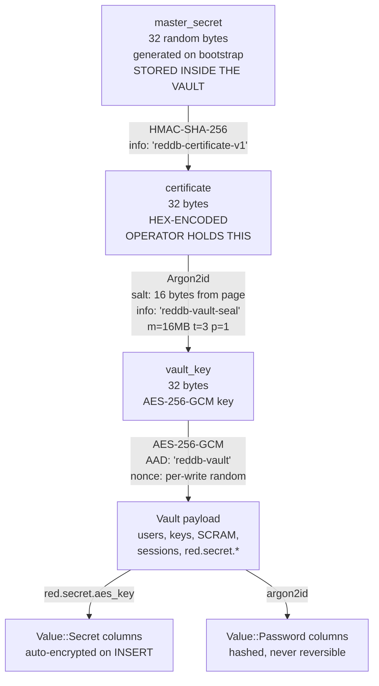

# Vault — Encrypted Auth & Secret Storage

The vault is RedDB's at-rest container for everything an attacker would want
on a stolen `.rdb` file: usernames, password hashes, SCRAM verifiers, API
key hashes, session tokens, OAuth state, and arbitrary application secrets
under the `red.secret.*` namespace. It lives **inside the same `.rdb`
file** as your data — there is no second file to back up, no second
filesystem path to protect, and no detached keystore to keep in sync.

This page is the operator reference. If you only want to bootstrap a server
once and move on, jump to [Bootstrap](#4-bootstrap-cli--http). If you're
designing a production deployment, read [Docker deploy](#7-docker-deploy)
and [Risk ranking](#11-risk-ranking) first.

> [!IMPORTANT]
> The vault is sealed by a **certificate** that you receive once, on first
> bootstrap. There is no key escrow, no recovery code, and no backdoor.
> If you lose the certificate, the database is unrecoverable except via
> a logical backup taken before the loss. Operators who skip the offline
> backup of this certificate will, eventually, lose data.

---

## 1. What the vault is

The vault occupies **reserved pages 2 and 3** of the database file. Page 2
is the live vault payload; page 3 is its mirror, written under the same
double-write discipline as every other RedDB page. Both pages are
encrypted with **AES-256-GCM** before they hit the pager's write path:

| Element             | Value                                                |
|:--------------------|:-----------------------------------------------------|
| Cipher              | AES-256-GCM (authenticated, AEAD)                    |
| AAD                 | constant `b"reddb-vault"` — bound to the page kind   |
| Nonce               | fresh 12-byte random per write (rotates every save)  |
| Salt                | 16 bytes, persisted in the page header               |
| KDF                 | Argon2id, `m=16MB`, `t=3`, `p=1`, 32-byte tag        |
| Page header layout  | `magic(4) | version(1) | salt(16) | payload_len(4)` |
| Page size           | matches the pager (default 4 KiB)                    |

The 16 MB Argon2id memory cost is intentionally lighter than the default
64 MB used for password hashing inside the vault — operators want vault
open to take a few hundred milliseconds, not seconds, on a cold start.

When the server boots:

1. The pager loads pages 2 and 3 (still ciphertext at this stage).
2. The boot sequence reads `REDDB_CERTIFICATE` (or, in legacy mode,
   `REDDB_VAULT_KEY`) and runs Argon2id over it with the salt found in
   the page header.
3. The derived 32-byte key opens the AES-GCM payload. A wrong key fails
   the GCM auth tag check — the vault refuses to open and the server
   exits with a typed error.
4. The plaintext payload is the in-memory auth store: users, API keys,
   SCRAM verifiers, sessions, and the `red.secret.*` map.

When auth state changes (a user is created, a password rotated, a key
revoked), the vault is re-encrypted with a **fresh random nonce** and
written through the pager's normal commit path. The nonce never repeats
for a given key, so the AES-GCM nonce-misuse failure mode does not apply.

---

## 2. Threat model

The vault is a defensive layer for a specific class of attacks. It is
**not** a substitute for OS-level access control, network policy, or
proper deployment hygiene.

### What the vault protects against

| Attack                                                    | Outcome with vault       |
|:----------------------------------------------------------|:-------------------------|
| Stolen `.rdb` file (lost laptop, leaked backup, dumped EBS snapshot) | Auth state and secrets remain encrypted; attacker sees ciphertext only. |
| Read-only filesystem access (compromised log scraper, SSRF that exfiltrates files) | Same — no key, no plaintext. |
| Backup tier compromise (S3 bucket, R2 prefix, Turso DB read) | Backups inherit the same encrypted bytes; restore requires the cert. |
| Casual `grep` over storage (developer, support engineer running `cat`) | Auth tables and secrets are unreadable. |
| `Secret` columns in user tables (`Value::Secret`)         | Encrypted with `red.secret.aes_key` from the same vault; sealed = `***`. |
| `Password` columns (`Value::Password`)                    | Stored as Argon2id hashes, never reversible regardless of vault state. |

### What the vault does NOT protect against

| Attack                                                         | Why the vault can't help |
|:---------------------------------------------------------------|:-------------------------|
| Memory dump of a running, unsealed RedDB process               | The plaintext key and decrypted payload are in RAM by definition. Use OS-level memory protection (`mlockall` is a future option) and minimize node access. |
| Host filesystem read by `root` while the process is running    | `root` can read `/proc/<pid>/mem` and recover the key. Use a hardened base image, non-root containers, and seccomp. |
| Leaked certificate                                             | Whoever has the cert has every secret. Treat the cert as the crown-jewel credential. |
| Coercion / lawful access / insider with cert access            | Out of scope. Use rotation, audit logging, and segregation of duties. |
| Side-channel timing attacks on a colocated tenant              | Use dedicated nodes for high-sensitivity workloads. |
| Pager-level encryption of *user data* tables                   | The vault encrypts the **auth and secret** pages (2-3). Application data lives in the pager's normal page space and uses infrastructure encryption today (LUKS, KMS-backed EBS, encrypted S3). Pager-level data encryption is a v1.1 candidate — see [`engine/encryption.md`](../engine/encryption.md). |

If your threat model includes `root` on the host, the vault buys you
forensic obfuscation and one extra step the attacker must take. It does
not buy you confidentiality against a live-process compromise.

---

## 3. Key hierarchy

Three secrets live in a strict derivation chain. Each layer is generated
by the layer above and is independent from the layers below.



| Layer            | Generated when         | Stored where                                      | Who holds it                |
|:-----------------|:-----------------------|:--------------------------------------------------|:----------------------------|
| `master_secret`  | Bootstrap (one time)   | Inside the vault payload (encrypted by `vault_key`) | The vault itself          |
| `certificate`    | Bootstrap, derived from `master_secret` | Returned once on stdout / HTTP response | **The operator** (offline + secret manager) |
| `vault_key`      | Every server start, derived from `certificate` + page salt | In RAM only, zeroed on shutdown | The running process       |
| `red.secret.aes_key` | First boot after bootstrap | Inside the vault payload                      | The running process       |

The certificate is the **only** durable secret an operator must protect.
Lose it and you cannot derive `vault_key`, so you cannot decrypt the
vault payload, so you cannot recover `master_secret`, so the chain is
broken.

> [!NOTE]
> The legacy `REDDB_VAULT_KEY` passphrase mode predates the certificate
> chain. It still works (Argon2id directly over the user-supplied
> passphrase, same salt, same AEAD parameters), but new deployments
> should use the certificate flow because passphrases are weaker and
> harder to rotate cleanly. See [Restart / unseal](#5-restart--unseal-precedence-and-_file-vars).

---

## 4. Bootstrap (CLI + HTTP)

Bootstrap initializes the vault, generates `master_secret`, derives the
certificate, and creates the first admin user. **It is a one-time
operation.** Running it again on a non-empty vault returns an error.

### Option A — CLI (`red bootstrap`)

The recommended path for new deployments. Runs in a one-off container,
emits the certificate to stdout, exits.

```bash
red bootstrap \
  --path /data/data.rdb \
  --username admin \
  --password 'change-me-now' \
  --print-certificate
```

Sample stdout:

```text
vault initialized: /data/data.rdb
admin user created: admin
api key:    rdb_k_5f1a8c0a4e1b4d2a8f7e3c2b6d9a1c0e
certificate: 4b7d1e2c3f5a6b8d9e1f2a3c5b7d9e1f2a3c5b7d9e1f2a3c5b7d9e1f2a3c5b7d
                ^^^^ store this offline + in your secret manager ^^^^
```

The certificate is **64 hex characters = 32 bytes**. Capture it from the
container's stdout, write it into your secret manager, and **do not**
log it to your CI system. The CLI prints it to stdout exactly once;
there is no `red show certificate` command on a bootstrapped database.

```bash
# Production pattern: bootstrap into a one-off container, capture stdout
docker run --rm \
  -v reddb-data:/data \
  ghcr.io/forattini-dev/reddb:latest \
  bootstrap --path /data/data.rdb \
            --username admin \
            --password "$(openssl rand -base64 24)" \
            --print-certificate \
  | tee /tmp/bootstrap.log

# Now extract the cert and ship it to AWS Secrets Manager
CERT=$(grep '^certificate:' /tmp/bootstrap.log | awk '{print $2}')
aws secretsmanager create-secret \
  --name prod/reddb/certificate \
  --secret-string "$CERT"
shred -u /tmp/bootstrap.log
```

### Option B — HTTP (`POST /auth/bootstrap`)

Available when the server is already running with `--vault` and no admin
user exists yet. Useful for managed-service deployments where you can't
run a one-off container.

```bash
curl -X POST http://127.0.0.1:8080/auth/bootstrap \
  -H 'content-type: application/json' \
  -d '{"username": "admin", "password": "change-me-now"}'
```

Response:

```json
{
  "ok": true,
  "user": { "username": "admin", "role": "admin" },
  "api_key": "rdb_k_5f1a8c0a4e1b4d2a8f7e3c2b6d9a1c0e",
  "certificate": "4b7d1e2c3f5a6b8d9e1f2a3c5b7d9e1f2a3c5b7d9e1f2a3c5b7d9e1f2a3c5b7d"
}
```

Same rules apply: capture the certificate once, never again.

> [!WARNING]
> The HTTP bootstrap endpoint is reachable from the network. In
> production, ensure the bootstrap call happens on the loopback
> interface (port-forward to the pod, SSH tunnel) or behind your auth
> proxy. Never expose `/auth/bootstrap` to the public internet during
> the bootstrap window.

After bootstrap, both endpoints refuse to run again until the vault is
re-initialized from scratch.

---

## 5. Restart / unseal (precedence and `*_FILE` vars)

On every restart the server needs to re-derive `vault_key`. It looks for
the cert (or legacy passphrase) in this exact precedence:

```text
REDDB_CERTIFICATE         > REDDB_VAULT_KEY
REDDB_CERTIFICATE_FILE    > REDDB_VAULT_KEY_FILE
```

The `*_FILE` form reads the contents of the file (trimmed of trailing
whitespace) and uses that as the secret. This is the **production**
form: the file lives on a tmpfs mount populated by Docker secrets,
Kubernetes Secrets, systemd `LoadCredential`, etc.

### Supported `*_FILE` companion variables

| Inline variable       | `*_FILE` companion          | What it carries                                    |
|:----------------------|:----------------------------|:---------------------------------------------------|
| `REDDB_CERTIFICATE`   | `REDDB_CERTIFICATE_FILE`    | 64-hex certificate produced by bootstrap           |
| `REDDB_VAULT_KEY`     | `REDDB_VAULT_KEY_FILE`      | Legacy passphrase (Argon2id input, not preferred)  |
| `REDDB_USERNAME`      | `REDDB_USERNAME_FILE`       | Auto-bootstrap admin username (fresh DB only)      |
| `REDDB_PASSWORD`      | `REDDB_PASSWORD_FILE`       | Auto-bootstrap admin password (fresh DB only)      |
| `RED_ADMIN_TOKEN`     | `RED_ADMIN_TOKEN_FILE`      | Token used by `/admin/*` endpoints                 |
| `RED_S3_ACCESS_KEY`   | `RED_S3_ACCESS_KEY_FILE`    | S3 backend creds                                   |
| `RED_S3_SECRET_KEY`   | `RED_S3_SECRET_KEY_FILE`    | S3 backend creds                                   |
| `RED_TURSO_TOKEN`     | `RED_TURSO_TOKEN_FILE`      | Turso backend token                                |
| `RED_D1_TOKEN`        | `RED_D1_TOKEN_FILE`         | Cloudflare D1 backend token                        |
| `RED_BACKEND_HTTP_AUTH` | `RED_BACKEND_HTTP_AUTH_FILE` | Generic HTTP backend bearer                     |

The `*_FILE` value **wins** when both are set — this lets you override
inline defaults from a Compose file with a real secret mounted into
`/run/secrets/`. The boot sequence reads the file once, places the
contents in the corresponding inline env var, then **strips** the
`_FILE` companion from the process environment so child processes don't
see the file path.

### Rotation without restart (`SIGHUP`)

Sending `SIGHUP` to the running process re-reads every `*_FILE`
companion in place. Used for token rotation without a pod roll:

```bash
# Rotate the admin token
echo "$NEW_TOKEN" > /run/secrets/admin-token
kill -HUP $(pgrep red)
```

The certificate itself is **not** hot-reloadable — it sealed the vault
when the process opened it, and changing it after the fact would
require closing and re-opening the vault. Cert rotation always requires
a restart (the cert in the running process matches the page salt; a
new cert with the same salt cannot exist by construction).

---

## 6. Secret KV (`red.secret.*`)

The vault exposes a key-value store for arbitrary application secrets.
Keys must use the `red.secret.*` prefix; the parser routes them to the
encrypted store rather than the plaintext `red_config` collection.

```bash
# Set a secret (over HTTP — same auth rules as any admin call)
curl -X POST http://127.0.0.1:8080/secrets/red.secret.stripe.api_key \
  -H 'Authorization: Bearer rdb_k_xxxx' \
  -H 'content-type: application/json' \
  -d '{"value": "sk_live_..."}'

# Read it back
curl http://127.0.0.1:8080/secrets/red.secret.stripe.api_key \
  -H 'Authorization: Bearer rdb_k_xxxx'

# Delete it
curl -X DELETE http://127.0.0.1:8080/secrets/red.secret.stripe.api_key \
  -H 'Authorization: Bearer rdb_k_xxxx'
```

```sql
-- Or from SQL
SET CONFIG red.secret.stripe.api_key = 'sk_live_...';
SHOW CONFIG red.secret.stripe;
```

| Key prefix              | Purpose                                              | Access in sealed mode |
|:------------------------|:-----------------------------------------------------|:----------------------|
| `red.secret.aes_key`    | 32-byte AES-256 key used by `Value::Secret` columns; auto-generated on first boot | unreadable |
| `red.secret.<your.app>.*` | Application-defined secrets (Stripe keys, OAuth client secrets, third-party tokens) | unreadable |
| `red.config.*`          | Plaintext, non-sensitive configuration               | always readable       |

### `Value::Secret` and `Value::Password` columns

Field-level encryption integrates with the same vault:

```sql
CREATE TABLE accounts (
  id BIGINT PRIMARY KEY,
  email TEXT,
  api_token  Secret,           -- encrypted with red.secret.aes_key
  password   Password           -- argon2id hash, never decrypted
);

INSERT INTO accounts VALUES (1, 'a@b.com', 'sk_live_xxx', 'hunter2');

-- Sealed vault: column rendered as ***
SELECT api_token, password FROM accounts;
-- => ('***', '***')

-- Unsealed vault: api_token decrypts on the fly; password stays masked
SELECT api_token, VERIFY_PASSWORD(password, 'hunter2') AS ok
FROM accounts WHERE id = 1;
-- => ('sk_live_xxx', true)
```

| Column type | At-rest representation       | SELECT (sealed) | SELECT (unsealed) |
|:------------|:-----------------------------|:----------------|:------------------|
| `Secret`    | AES-256-GCM(plaintext, vault key) | `***`           | plaintext         |
| `Password`  | Argon2id(plaintext) hash     | `***`           | `***` — use `VERIFY_PASSWORD()` to compare |

### Behaviour when the vault is sealed

If the server boots without a certificate (development mode, CI), the
vault is "sealed":

- `red.secret.*` reads return `vault_sealed`.
- `Secret` columns render as `***` in every SELECT, regardless of role.
- Auth endpoints return errors — there are no users to authenticate.
- `Password` columns still hash on INSERT (argon2id needs no key) but
  `VERIFY_PASSWORD()` works only after unseal.

A sealed vault is an explicit dev-mode signal, not a security failure.
For production, always pass `--vault` and a certificate.

---

## 7. Docker deploy

The production-secure pattern uses Docker secrets + a tmpfs mount + an
entrypoint that expands `*_FILE` variables. This avoids every common
secret-leakage anti-pattern.

### docker-compose.vault.yml

```yaml
# examples/docker-compose.vault.yml
services:
  reddb:
    image: ghcr.io/forattini-dev/reddb:latest
    ports:
      - "8080:8080"
      - "5050:5050"
    volumes:
      - reddb-data:/data
    environment:
      # Point at the secret file, NOT the secret value
      REDDB_CERTIFICATE_FILE: /run/secrets/reddb_certificate
      RED_ADMIN_TOKEN_FILE: /run/secrets/reddb_admin_token
    secrets:
      - reddb_certificate
      - reddb_admin_token
    command:
      - server
      - --path=/data/data.rdb
      - --vault
      - --http-bind=0.0.0.0:8080
      - --wire-bind=0.0.0.0:5050
    restart: unless-stopped
    healthcheck:
      test: ["CMD", "red", "doctor", "--bind", "127.0.0.1:8080"]
      interval: 10s
      timeout: 5s
      retries: 3

secrets:
  reddb_certificate:
    file: ./secrets/reddb_certificate.txt    # mode 0400, owned by you
  reddb_admin_token:
    file: ./secrets/reddb_admin_token.txt

volumes:
  reddb-data:
```

The Docker daemon mounts each secret at `/run/secrets/<name>` on a
**tmpfs** (RAM-backed) filesystem with mode `0400`, owner `root`. The
file is never written to the container layer, never appears in image
history, and is unmounted on container stop.

### Anti-patterns (do not do these)

| Anti-pattern                                              | Why it leaks                                      |
|:----------------------------------------------------------|:--------------------------------------------------|
| `ENV REDDB_CERTIFICATE=...` in your Dockerfile            | Baked into image layer history. Anyone who can pull the image has the cert. |
| `ARG REDDB_CERT` + `--build-arg REDDB_CERT=...`           | Saved in the image's build cache and `docker history` output. |
| `COPY ./certs/cert.txt /etc/reddb/cert`                   | Cert is now part of the image. Same leak as above. |
| `docker run -e REDDB_CERTIFICATE=$CERT ...`               | Visible in `docker inspect`, `ps -ef` (depending on host), and the daemon's audit log. |
| `kubectl run --env=REDDB_CERTIFICATE=$CERT ...`           | Same — env vars on the command line are world-readable. |
| Storing the cert in your application's repo, even encrypted | Repo history is forever; rotation requires force-pushes. |
| Logging the cert from your entrypoint script              | Container logs ship to your log aggregator and live in S3 forever. |
| Sharing one cert across dev / staging / prod              | Lateral movement: a dev-laptop compromise yields the prod database. |

### What "good" looks like

| Pattern                                                   | Why it's safe                                     |
|:----------------------------------------------------------|:--------------------------------------------------|
| Docker secret + tmpfs + `*_FILE` env var                  | Cert never hits disk in the container, never appears in `docker inspect`. |
| K8s Secret + `secretKeyRef` env var                       | Cert injected by the kubelet at pod start; etcd-encrypted at rest if cluster is configured. |
| K8s Secret + projected volume + `*_FILE`                  | Same as above, plus rotation via SIGHUP without a pod roll. |
| Cloud-provider secret manager + workload identity         | Cert never touches your manifests; the SDK fetches it at runtime over an authenticated channel. |
| Vault Agent Injector (HashiCorp Vault)                    | Same as above; PKI rotation handled by Vault itself. |

---

## 8. BuildKit secret mount

For the rare case where you need a secret **at build time** (e.g. running
`red bootstrap` inside a multi-stage build to seed an immutable image —
strongly discouraged but documented for completeness):

```dockerfile
# syntax=docker/dockerfile:1.6
FROM ghcr.io/forattini-dev/reddb:latest

RUN --mount=type=secret,id=cert,target=/run/secrets/cert \
    REDDB_CERTIFICATE_FILE=/run/secrets/cert \
    red bootstrap --path /data/data.rdb --print-certificate >/dev/null
```

```bash
DOCKER_BUILDKIT=1 docker build \
  --secret id=cert,src=./secrets/cert.txt \
  -t myimage:bootstrapped .
```

The secret is mounted into the build container, used during the `RUN`
step, and **not persisted** in any image layer. BuildKit guarantees the
secret never appears in `docker history`.

> [!WARNING]
> Build-time secrets bake the resulting database state into the image.
> If the cert later rotates, the image is stale. Prefer runtime secret
> injection — it composes with rotation, audit, and least-privilege
> from day one.

---

## 9. Kubernetes

### Plain Secret + envFrom

```yaml
apiVersion: v1
kind: Secret
metadata:
  name: reddb-vault
type: Opaque
stringData:
  REDDB_CERTIFICATE: "4b7d1e2c3f5a6b8d9e1f2a3c5b7d9e1f2a3c5b7d9e1f2a3c5b7d9e1f2a3c5b7d"
  RED_ADMIN_TOKEN: "rdb_k_xxxxxxxxxxxxxxxxxxxxxxxxxxxxxxxx"
---
apiVersion: apps/v1
kind: StatefulSet
metadata:
  name: reddb
spec:
  serviceName: reddb
  replicas: 1
  selector:
    matchLabels: { app: reddb }
  template:
    metadata:
      labels: { app: reddb }
    spec:
      securityContext:
        runAsNonRoot: true
        runAsUser: 10001
        runAsGroup: 10001
        fsGroup: 10001
        seccompProfile: { type: RuntimeDefault }
      containers:
      - name: reddb
        image: ghcr.io/forattini-dev/reddb:latest
        args:
          - server
          - --path=/data/data.rdb
          - --vault
          - --http-bind=0.0.0.0:8080
        envFrom:
          - secretRef:
              name: reddb-vault
        ports:
          - { name: http, containerPort: 8080 }
          - { name: wire, containerPort: 5050 }
        volumeMounts:
          - { name: data, mountPath: /data }
        securityContext:
          allowPrivilegeEscalation: false
          readOnlyRootFilesystem: true
          capabilities: { drop: ["ALL"] }
        livenessProbe:
          httpGet: { path: /health, port: http }
          initialDelaySeconds: 15
        readinessProbe:
          httpGet: { path: /health, port: http }
          initialDelaySeconds: 5
  volumeClaimTemplates:
    - metadata: { name: data }
      spec:
        accessModes: ["ReadWriteOnce"]
        resources: { requests: { storage: 10Gi } }
```

### Projected volume + `*_FILE` (preferred — supports SIGHUP rotation)

```yaml
spec:
  containers:
  - name: reddb
    image: ghcr.io/forattini-dev/reddb:latest
    env:
      - name: REDDB_CERTIFICATE_FILE
        value: /etc/reddb/secrets/certificate
      - name: RED_ADMIN_TOKEN_FILE
        value: /etc/reddb/secrets/admin-token
    volumeMounts:
      - name: vault-secrets
        mountPath: /etc/reddb/secrets
        readOnly: true
  volumes:
    - name: vault-secrets
      projected:
        defaultMode: 0400
        sources:
          - secret:
              name: reddb-vault
              items:
                - { key: REDDB_CERTIFICATE, path: certificate }
                - { key: RED_ADMIN_TOKEN,   path: admin-token }
```

When the Secret is updated, the kubelet rewrites the projected files
within ~60 seconds. A `SIGHUP` to the process picks up the new admin
token without a pod restart. The certificate cannot rotate this way —
it requires a full restart (see [section 12](#12-operational-hygiene)).

### Helm chart knobs

The official chart (`charts/reddb`) exposes the vault knobs under
`auth.vault.*`. See [`charts/reddb/README.md`](../../charts/reddb/README.md)
for the full schema. Highlights:

```yaml
# values.yaml
auth:
  enabled: true
  username: admin
  existingSecret: reddb-vault   # contains keys: username, password
  vault:
    enabled: true
    certificate:
      existingSecret: reddb-cert    # contains key: certificate
      key: certificate
config:
  vault: true
```

The chart wires `REDDB_CERTIFICATE_FILE` and `REDDB_USERNAME_FILE` /
`REDDB_PASSWORD_FILE` automatically when these fields are set. It does
not generate a certificate for you — bootstrap remains a one-shot
operator action.

### External Secrets Operator (ESO)

For teams using ESO with a backend like AWS Secrets Manager:

```yaml
apiVersion: external-secrets.io/v1beta1
kind: ExternalSecret
metadata:
  name: reddb-vault
spec:
  refreshInterval: 1h
  secretStoreRef:
    name: aws-secrets-manager
    kind: ClusterSecretStore
  target:
    name: reddb-vault
    creationPolicy: Owner
  data:
    - secretKey: REDDB_CERTIFICATE
      remoteRef:
        key: prod/reddb/certificate
    - secretKey: RED_ADMIN_TOKEN
      remoteRef:
        key: prod/reddb/admin-token
```

ESO syncs the cloud-managed secret into a K8s Secret on its own
schedule. Combined with the projected-volume + `*_FILE` pattern above,
you get rotation in minutes without code changes.

---

## 10. Cloud-native secret managers

The pattern is consistent across providers: store the cert in the
managed secret service, wire it into the workload through whatever
mechanism the platform offers, and use `*_FILE` whenever possible to
support SIGHUP rotation.

### AWS Secrets Manager

#### ECS Fargate task definition

```json
{
  "family": "reddb",
  "executionRoleArn": "arn:aws:iam::123456789012:role/reddb-task-execution",
  "taskRoleArn": "arn:aws:iam::123456789012:role/reddb-task",
  "networkMode": "awsvpc",
  "requiresCompatibilities": ["FARGATE"],
  "cpu": "1024",
  "memory": "2048",
  "containerDefinitions": [{
    "name": "reddb",
    "image": "ghcr.io/forattini-dev/reddb:latest",
    "portMappings": [
      { "containerPort": 8080, "protocol": "tcp" }
    ],
    "secrets": [
      {
        "name": "REDDB_CERTIFICATE",
        "valueFrom": "arn:aws:secretsmanager:us-east-1:123456789012:secret:prod/reddb/certificate-aB12cD"
      },
      {
        "name": "RED_ADMIN_TOKEN",
        "valueFrom": "arn:aws:secretsmanager:us-east-1:123456789012:secret:prod/reddb/admin-token-aB12cD"
      }
    ],
    "command": [
      "server", "--path=/data/data.rdb", "--vault",
      "--http-bind=0.0.0.0:8080"
    ]
  }]
}
```

The execution role needs `secretsmanager:GetSecretValue` on those ARNs.
ECS injects the cert as an env var on container start; rotation
requires task replacement (Fargate doesn't refresh env vars in place).

#### App Runner

```yaml
# apprunner.yaml
runtime: docker
build:
  pre-build: []
  build: []
  post-build: []
run:
  command: server --path /data/data.rdb --vault --http-bind 0.0.0.0:8080
  network:
    port: 8080
  env:
    - name: REDDB_CERTIFICATE
      value-from: "arn:aws:secretsmanager:us-east-1:123456789012:secret:prod/reddb/certificate"
```

App Runner does not support volume-mounted secrets, so the cert ships
as an env var. Rotation = redeploy.

#### Lambda (read replica only — write workloads need a lease backend)

```yaml
# template.yaml (SAM)
Resources:
  RedDBReplica:
    Type: AWS::Serverless::Function
    Properties:
      PackageType: Image
      ImageUri: ghcr.io/forattini-dev/reddb:latest
      Environment:
        Variables:
          REDDB_CERTIFICATE: '{{resolve:secretsmanager:prod/reddb/certificate}}'
          RED_BACKEND: s3
          RED_S3_BUCKET: my-reddb-state
      Policies:
        - SecretsManagerReadWrite
```

### GCP Secret Manager

#### Cloud Run

```bash
gcloud secrets create reddb-certificate \
  --data-file=./cert.txt --replication-policy=automatic

gcloud run deploy reddb \
  --image=ghcr.io/forattini-dev/reddb:latest \
  --port=8080 \
  --service-account=reddb-runtime@PROJECT.iam.gserviceaccount.com \
  --update-secrets=REDDB_CERTIFICATE=reddb-certificate:latest \
  --command=server \
  --args=--path=/data/data.rdb,--vault,--http-bind=0.0.0.0:8080
```

The runtime service account needs `roles/secretmanager.secretAccessor`.
Cloud Run mounts secrets as env vars by default; mount them as files
with `--update-secrets=/etc/reddb/cert=reddb-certificate:latest` and
set `REDDB_CERTIFICATE_FILE=/etc/reddb/cert` to enable SIGHUP rotation.

#### GKE (Workload Identity + Secret Manager CSI driver)

```yaml
apiVersion: secrets-store.csi.x-k8s.io/v1
kind: SecretProviderClass
metadata:
  name: reddb-vault
spec:
  provider: gcp
  parameters:
    secrets: |
      - resourceName: projects/PROJECT/secrets/reddb-certificate/versions/latest
        path: certificate
      - resourceName: projects/PROJECT/secrets/reddb-admin-token/versions/latest
        path: admin-token
---
spec:
  containers:
  - name: reddb
    env:
      - name: REDDB_CERTIFICATE_FILE
        value: /mnt/secrets/certificate
    volumeMounts:
      - name: vault
        mountPath: /mnt/secrets
        readOnly: true
  serviceAccountName: reddb-runtime  # bound to GCP SA via Workload Identity
  volumes:
    - name: vault
      csi:
        driver: secrets-store.csi.k8s.io
        readOnly: true
        volumeAttributes:
          secretProviderClass: reddb-vault
```

#### Cloud Functions (gen2)

Same pattern as Cloud Run — Cloud Functions gen2 is built on Cloud Run.
Use `--set-secrets` on `gcloud functions deploy`.

### Azure Key Vault

#### Container Apps

```bash
az containerapp secret set \
  --name reddb \
  --resource-group rg-reddb \
  --secrets \
    "reddb-certificate=keyvaultref:https://kv-reddb.vault.azure.net/secrets/reddb-certificate,identityref:/subscriptions/.../identities/reddb-mi"

az containerapp update \
  --name reddb \
  --resource-group rg-reddb \
  --set-env-vars REDDB_CERTIFICATE=secretref:reddb-certificate
```

The container app's user-assigned managed identity needs Key Vault
"Secrets User" RBAC on the vault.

#### AKS (Key Vault CSI driver + Workload Identity)

```yaml
apiVersion: secrets-store.csi.x-k8s.io/v1
kind: SecretProviderClass
metadata:
  name: reddb-vault
spec:
  provider: azure
  parameters:
    usePodIdentity: "false"
    clientID: "xxxxxxxx-xxxx-xxxx-xxxx-xxxxxxxxxxxx"  # Workload Identity client ID
    keyvaultName: kv-reddb
    objects: |
      array:
        - |
          objectName: reddb-certificate
          objectType: secret
    tenantId: "yyyyyyyy-yyyy-yyyy-yyyy-yyyyyyyyyyyy"
```

### HashiCorp Vault

#### Vault Agent Injector (K8s)

```yaml
apiVersion: apps/v1
kind: StatefulSet
metadata:
  name: reddb
spec:
  template:
    metadata:
      annotations:
        vault.hashicorp.com/agent-inject: "true"
        vault.hashicorp.com/role: "reddb-prod"
        vault.hashicorp.com/agent-inject-secret-certificate: "secret/data/reddb/certificate"
        vault.hashicorp.com/agent-inject-template-certificate: |
          {{- with secret "secret/data/reddb/certificate" -}}
          {{ .Data.data.value }}
          {{- end }}
    spec:
      serviceAccountName: reddb
      containers:
      - name: reddb
        env:
          - name: REDDB_CERTIFICATE_FILE
            value: /vault/secrets/certificate
```

The Vault Agent sidecar renders the secret to `/vault/secrets/certificate`
and re-renders on rotation, which combined with SIGHUP gives you fully
automatic short-lived secrets.

#### Nomad

```hcl
job "reddb" {
  group "db" {
    task "reddb" {
      driver = "docker"
      config {
        image = "ghcr.io/forattini-dev/reddb:latest"
        args  = ["server", "--path", "/data/data.rdb", "--vault",
                 "--http-bind", "0.0.0.0:8080"]
      }
      template {
        data        = "{{ with secret \"secret/data/reddb/certificate\" }}{{ .Data.data.value }}{{ end }}"
        destination = "secrets/certificate"
        change_mode = "signal"
        change_signal = "SIGHUP"
      }
      env {
        REDDB_CERTIFICATE_FILE = "${NOMAD_SECRETS_DIR}/certificate"
      }
    }
  }
}
```

### Fly.io

```bash
# Set the secret (encrypted at rest by Fly)
fly secrets set REDDB_CERTIFICATE=4b7d1e2c... -a my-reddb

# fly.toml
[env]
  RED_HTTP_BIND_ADDR = "0.0.0.0:8080"

[[mounts]]
  source = "reddb_data"
  destination = "/data"
```

Fly secrets are env vars at runtime. Rotation = `fly secrets set` then
`fly machines restart`.

### Doppler

```bash
doppler secrets set REDDB_CERTIFICATE="4b7d1e2c..." \
  --project reddb --config prd

# In your container's entrypoint:
doppler run -- red server --path /data/data.rdb --vault \
                          --http-bind 0.0.0.0:8080
```

### 1Password Connect

1Password Connect runs as a sidecar inside K8s and exposes a local API
that resolves `op://vault/item/field` references to live values. Mount
the secret into a tmpfs file via the 1Password Operator and point
`REDDB_CERTIFICATE_FILE` at it.

---

## 11. Risk ranking

From most to least secure. Pick the most-secure tier your platform
allows; do not drop below tier 4 in production.

| Rank | Pattern                                                            | Leak vectors                          | Rotation cost |
|:-----|:-------------------------------------------------------------------|:--------------------------------------|:--------------|
| 1    | Cloud KMS / Secret Manager fetched at runtime via workload identity, no env var ever set | Cloud audit log + IAM only; cert never touches your manifests, CI, or container image | Minutes (rotate in cloud, app re-fetches) |
| 2    | Docker / K8s secret on tmpfs read via `*_FILE`                     | Pod spec, kubelet, etcd (encrypt-at-rest)     | Minutes (Secret update + SIGHUP) |
| 3    | Env var injected by orchestrator (`docker compose env_file`, K8s `secretKeyRef`) | `docker inspect`, kubelet logs, no SIGHUP rotation | Hours (pod restart) |
| 4    | Env var on operator shell (`docker run -e CERT=...`)               | `ps aux`, daemon log, shell history       | Hours (manual restart) |
| 5    | ❌ Anything baked into the image (`ENV`, `ARG`, `COPY cert`)        | Image registry, image layer history, anyone with `docker pull` | Image rebuild + redeploy |

**Rule of thumb:** if `git grep` of your repo could find the cert,
you're at tier 5. If the cert appears in a Helm `values.yaml` checked
into git, even in a private repo, you're at tier 5.

---

## 12. Operational hygiene

### Backup the cert offline

The cert is the **only** thing you need to recover the vault. Once
generated:

1. Write it to your cloud secret manager (primary copy).
2. Print it, seal it in a tamper-evident envelope, store it in your
   physical safe (offline copy).
3. Optionally — split it via Shamir's Secret Sharing (3-of-5) for
   high-stakes deployments.
4. Document who has access in your secrets registry.
5. Verify the offline copy quarterly: read the envelope, compare the
   first/last 4 hex chars to the live secret manager, re-seal.

### Rotation procedure

The certificate is a **bootstrap-time** secret. Rotating it is a
re-bootstrap from a logical backup, not an in-place key rotation.

```bash
# 1. Take a logical backup of the running primary
curl -X POST http://primary:8080/admin/backup \
  -H "Authorization: Bearer $RED_ADMIN_TOKEN"

# 2. Bring up a fresh staging instance with a NEW certificate
docker run --rm -v staging-data:/data ghcr.io/forattini-dev/reddb:latest \
  bootstrap --path /data/data.rdb \
            --username admin \
            --password "$STAGING_ADMIN_PW" \
            --print-certificate
# capture the new cert

# 3. Restore the logical backup into staging
curl -X POST http://staging:8080/admin/restore \
  -H "Authorization: Bearer $STAGING_ADMIN_TOKEN" \
  -d '{"snapshot_id":"<from step 1>"}'

# 4. Verify staging works against your test workload

# 5. Cut over: stop primary, swap volumes, point traffic at the
#    new instance with the new cert in your secret manager.

# 6. Decommission the old volume and rotate every API key minted
#    under the old vault — they're invalid in the new vault anyway.
```

| Cadence guidance | Driver                                      |
|:-----------------|:--------------------------------------------|
| Quarterly        | Compliance regimes (SOC2, ISO27001)         |
| On personnel change | Whenever an operator with cert access leaves |
| On suspected leak | Immediately — see [section 13](#13-recovery-from-a-lost-or-leaked-certificate) |
| Never            | Acceptable for hobbyist / single-operator deployments, **with offline backup** |

### Audit access

Every entity that can read the cert should be in a registry. For a
cloud secret manager: who has the IAM permission, when did they last
fetch the secret, who approved their grant. AWS, GCP, and Azure all
emit audit events for `GetSecretValue`-class operations — wire those
into your SIEM.

### Segregation of duties

The operator who can restart the database (kubectl rollout, ECS update)
should **not** also have read access to the cert in the secret manager.
This prevents a single compromised account from bringing the vault up
in a forensic environment to extract the data.

A practical pattern:

| Role             | Can restart the pod | Can read the cert | Notes                    |
|:-----------------|:-------------------:|:-----------------:|:-------------------------|
| Primary operator |         ✅          |        ❌         | Day-to-day ops           |
| Secrets custodian |         ❌          |        ✅         | Audited, infrequent use  |
| Break-glass account |       ✅          |        ✅         | Both — under a dedicated approval workflow + alert |

### Audit logging

```bash
# RedDB ships every /admin/* call to the audit log
curl 'http://reddb:8080/admin/audit?since=24h' \
  -H "Authorization: Bearer $RED_ADMIN_TOKEN"
```

Cross-reference with your secret-manager access log. A
`/auth/bootstrap` call with no preceding `GetSecretValue` is suspicious
— someone is operating outside the documented procedure.

---

## 13. Recovery from a lost or leaked certificate

### Lost cert (no offline backup)

**There is no recovery.** The cert is the only material that derives
`vault_key`; without it, the AES-GCM auth tag check on pages 2-3 will
fail, and the vault refuses to open. The auth state, SCRAM verifiers,
API key hashes, and `red.secret.*` payloads are **gone**.

You have one option: restore the **user data** from a logical backup
(`/admin/backup` snapshots include user collections; they do not
include vault state) into a freshly bootstrapped database. This loses:

- All user accounts (re-create them from your IdP).
- All API keys (re-issue them).
- All session tokens (users re-authenticate).
- All `red.secret.*` values (re-set them from your secret manager).
- All `Value::Secret` columns (re-encrypted with the new vault key —
  the old ciphertexts in the backup are unrecoverable).

Practical steps:

```bash
# 1. Bootstrap a new instance with a NEW cert
docker run --rm -v reddb-new:/data ghcr.io/forattini-dev/reddb:latest \
  bootstrap --path /data/data.rdb --print-certificate

# 2. Restore user collections only (skip auth state)
curl -X POST http://new:8080/admin/restore \
  -d '{"snapshot_id":"...","skip_vault":true}' \
  -H "Authorization: Bearer $NEW_ADMIN_TOKEN"

# 3. Re-issue user accounts, API keys, secrets
```

### Leaked cert (still have control)

Treat as a security incident. The leak window is from cert issuance to
the moment you fully cut over.

1. **Isolate.** Lock down network access to the affected database. If
   the cert is also the entry point to your prod cluster, rotate
   workload identities first.
2. **Verify backups.** Ensure you have a recent logical backup. If you
   don't, take one immediately — the leaked cert still works.
3. **Plan the cutover window.** This is the rotation procedure from
   [section 12](#rotation-procedure), executed under incident response.
4. **Bootstrap fresh.** New cert, fresh vault, restored user data.
5. **Decommission old volume.** Wipe the old disk; do not retain it
   for forensics unless legally required (the leaked cert can decrypt
   it forever).
6. **Rotate every secret** that lived in the old vault — the leak
   exposes `red.secret.*` and any `Value::Secret` columns.
7. **Post-mortem.** Identify the leak vector, close it, document.

### Why there is no "key rotation" in place

The vault's `master_secret` is encrypted with `vault_key`, which is
derived from `certificate`. Rotating `certificate` would require
decrypting the vault with the old key and re-encrypting with the new
one — but that's exactly what bootstrap does, with the side effect of
dropping `master_secret` and starting over. There is no shortcut. This
design is deliberate: it makes "rotate the cert" indistinguishable from
"compromise the cert" from an attacker's perspective, which means there
is no asymmetric advantage to grabbing one cert and waiting for the
next one to be issued.

---

## 14. Cross-references

- [Encryption at Rest](./encryption.md) — pager-level encryption status, infrastructure-level recommendations (LUKS, KMS, bucket encryption).
- [Transport TLS](./transport-tls.md) — in-flight encryption posture across HTTP / gRPC / RedWire: cert flags, mTLS, OAuth/JWT.
- [Auth & Security Overview](./overview.md) — RBAC, RLS, multi-tenancy.
- [Auth Methods, Tokens & Keys](./tokens.md) — API keys, session tokens, SCRAM, OAuth, HMAC, mTLS.
- [Multi-Tenancy](./multi-tenancy.md) — `SET TENANT`, `TENANT BY (col)`, auto-RLS.
- [Secret Inventory & Operations](../operations/secrets.md) — every secret in the stack, rotation matrix, incident response.
- [Docker Quickstart & Production](../getting-started/docker.md) — copy-pasteable Docker patterns.
- [Helm Chart README](../../charts/reddb/README.md) — chart-specific values for the vault.
- [Operator Runbook](../operations/runbook.md) — day-2 operations.
- [Engine Encryption Notes](../engine/encryption.md) — what's wired today, what's v1.1.

---

> [!NOTE]
> The vault is one of three layers of confidentiality protection RedDB
> ships:
> 1. **Vault** (this page) — auth state and `red.secret.*` payloads.
> 2. **`Value::Secret` / `Value::Password` columns** — field-level
>    encryption keyed by the vault.
> 3. **Infrastructure encryption** — LUKS / KMS / bucket-side AES on
>    the volume holding the `.rdb` file. Pager-level data encryption
>    is a v1.1 candidate, not a v1.0 promise.
>
> Use all three for production. Skipping any layer creates a documented
> exposure that you must accept in writing.
