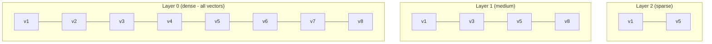

# HNSW Index

Hierarchical Navigable Small World (HNSW) is RedDB's primary index for approximate nearest neighbor (ANN) search.

## Overview

HNSW builds a multi-layer graph where:

- Layer 0 contains all vectors
- Higher layers contain exponentially fewer vectors
- Search starts at the top layer and descends
- Each layer uses greedy search to approach the query



## When to Use

| Scenario | Recommendation |
|:---------|:---------------|
| < 10K vectors | Flat index (exact) is sufficient |
| 10K - 1M vectors | HNSW provides the best speed/recall trade-off |
| > 1M vectors | Consider IVF or tiered search |

## Parameters

| Parameter | Default | Description |
|:----------|:--------|:------------|
| `M` | 16 | Max connections per node per layer |
| `ef_construction` | 200 | Size of dynamic candidate list during build |
| `ef_search` | 50 | Size of dynamic candidate list during search |

- Higher `M` = more connections = better recall, more memory
- Higher `ef_construction` = better index quality, slower build
- Higher `ef_search` = better recall, slower queries

## Performance

| Metric | Typical Value |
|:-------|:-------------|
| Build time | O(n log n) |
| Search time | O(log n) |
| Memory overhead | ~1.5x vector data size |
| Recall@10 | 95-99% (depends on parameters) |

## Usage

HNSW is the default index for vector similarity search:

```bash
curl -X POST http://127.0.0.1:8080/search/similar \
  -H 'content-type: application/json' \
  -d '{
    "collection": "embeddings",
    "vector": [0.12, 0.91, 0.44],
    "k": 10
  }'
```

## Distance Metrics

HNSW supports multiple distance metrics:

| Metric | Formula | Use Case |
|:-------|:--------|:---------|
| Cosine | 1 - cos(a, b) | Text embeddings, normalized vectors |
| Euclidean | L2 distance | Image features, spatial data |
| Dot Product | -dot(a, b) | Recommendation scores |
