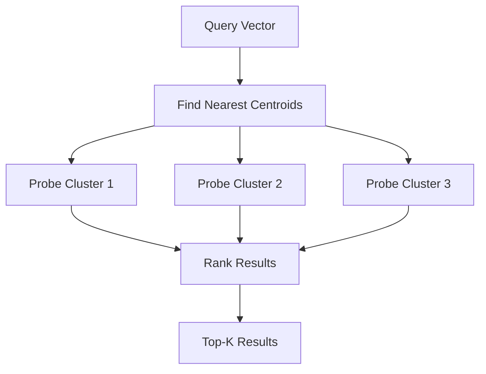

# IVF Index

Inverted File Index (IVF) partitions vectors into clusters using k-means, enabling fast approximate search on large datasets.

## How It Works

1. **Training**: Run k-means to partition vectors into `n_lists` clusters
2. **Assignment**: Each vector is assigned to its nearest cluster centroid
3. **Search**: Only probe `n_probes` nearest clusters instead of all vectors



## Parameters

| Parameter | Default | Description |
|:----------|:--------|:------------|
| `n_lists` | 100 | Number of clusters (Voronoi cells) |
| `n_probes` | 3 | Number of clusters to search |
| `n_training` | 10x n_lists | Vectors used for k-means training |

- Higher `n_lists` = finer partitions = faster search, slower build
- Higher `n_probes` = better recall, slower search

## When to Use

| Dataset Size | Recommendation |
|:-------------|:---------------|
| < 100K | HNSW is faster and simpler |
| 100K - 10M | IVF provides good speed/recall balance |
| > 10M | IVF + PQ (product quantization) for memory efficiency |

## Usage

For SQL clients, use the same parameterized similarity form and let the engine
choose the available vector index:

```ts
const rows = await db.query(
  "SEARCH SIMILAR $1 COLLECTION large_embeddings LIMIT $2",
  [new Float32Array([0.12, 0.91, 0.44, 0.33, 0.67]), 10],
);
```

Bind vectors and user-selected limits through `db.query(sql, params)` rather
than building SQL strings. The parameterized query design is tracked in
[ADR #352](https://github.com/reddb-io/reddb/issues/352) until the local ADR
lands.

Use the typed HTTP endpoint when you need explicit IVF probe tuning:

```bash
curl -X POST http://127.0.0.1:8080/collections/large_embeddings/ivf/search \
  -H 'content-type: application/json' \
  -d '{
    "vector": [0.12, 0.91, 0.44, 0.33, 0.67],
    "k": 10,
    "n_probes": 5
  }'
```

## IVF Training

K-means training happens on demand when the first IVF search is executed. Subsequent searches reuse the trained centroids.

For large datasets, you can trigger training explicitly via the index management API:

```bash
grpcurl -plaintext \
  -d '{"collection": "large_embeddings"}' \
  127.0.0.1:50051 reddb.v1.RedDb/RebuildIndexes
```
