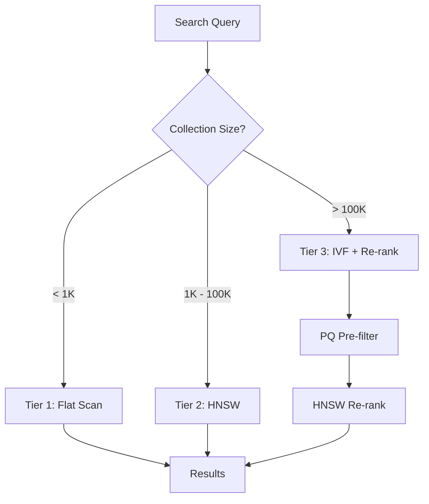

# Tiered Search

RedDB's tiered search system automatically selects the best search strategy based on collection size, available indexes, and query parameters.

## Tiers

| Tier | Collection Size | Strategy | Recall |
|:-----|:---------------|:---------|:-------|
| 1 | < 1,000 | Flat brute-force scan | 100% (exact) |
| 2 | 1K - 100K | HNSW approximate search | 95-99% |
| 3 | > 100K | IVF pre-filter + HNSW re-rank | 90-98% |

## How It Works

1. **Query arrives** with a target vector and `k`
2. **Engine checks** collection size and available indexes
3. **Selects tier** based on the decision tree
4. **Executes search** with the selected strategy
5. **Returns top-K** results ranked by similarity score

## Automatic Index Selection

The tiered system considers:

- Available index types (flat, HNSW, IVF, PQ)
- Index build status (only `Ready` indexes are used)
- Collection size
- Query parameters (`k`, `min_score`, `n_probes`)

## Hybrid Integration

Tiered search integrates with hybrid queries that combine:

- Vector similarity (from any tier)
- Text matching
- Metadata filters
- Structured column filters

The fusion layer combines scores from different sources into a unified ranking.

## Performance Characteristics

| Collection Size | Latency (p99) | Strategy |
|:---------------|:-------------|:---------|
| 100 vectors | < 1ms | Flat |
| 10K vectors | 2-5ms | HNSW |
| 100K vectors | 5-15ms | HNSW |
| 1M vectors | 10-30ms | IVF + re-rank |

> [!NOTE]
> These are approximate numbers for 768-dimensional vectors on modern hardware. Actual performance depends on vector dimensions, hardware, and index parameters.
